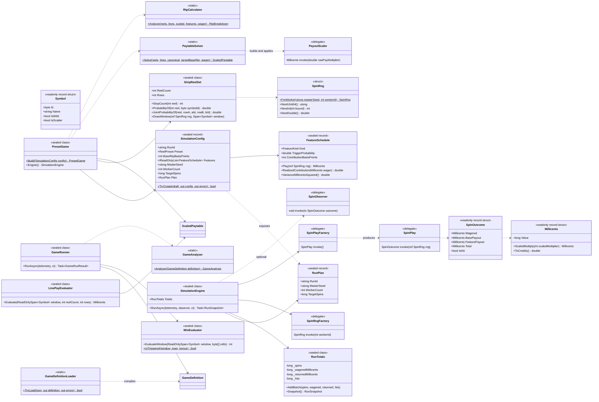
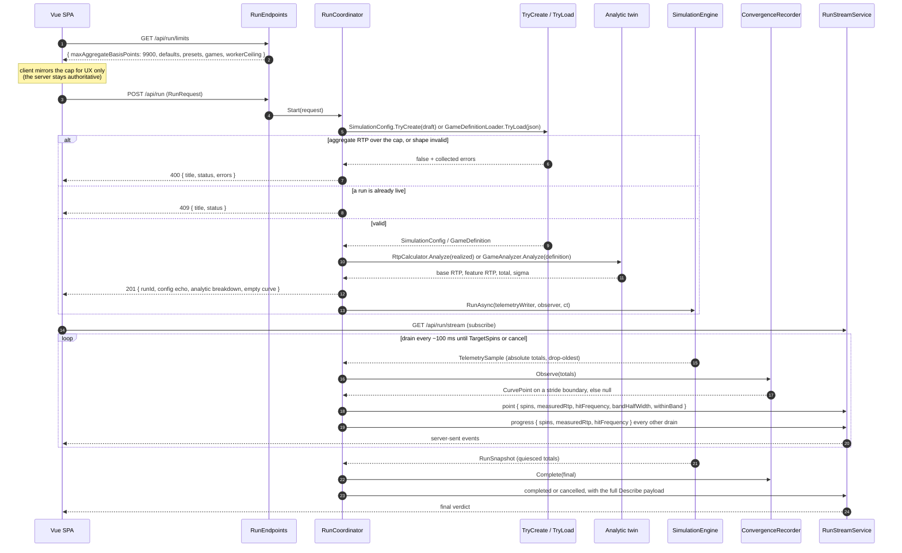

# Architecture — MMP.SlotDemo

**Status:** Shipped. This document describes the system as built. **Target:** .NET 10 / C# 14.
**Companions:** `PRD.md` (the harness this repo grew out of), `par-orca-dive.md` (the
reference game's math and its public provenance), `articles/` (the eight-part series that
draws its invariant list and ADR from this page).
Where this document says *invariant*, that word is load-bearing: a change that breaks one
is a design change rather than a bug fix.

---

## 1. Project layout

```
CSharp/MMP.SlotDemo.slnx
├── src/MMP.SlotGame.Core/       net10.0 — engine. Zero ASP.NET, zero Herald.
├── src/SlotDemo.Server/         net10.0 — ASP.NET host, SSE, Herald wiring, chapter labs.
├── web/                         Vue 3 + Vite + TypeScript SPA (outside the .slnx).
├── games/                       game definitions as DATA: Orca Dive, Classic Three Reel, and Two-Line Tide.
├── tests/MMP.SlotGame.Tests/    engine: unit, statistical, concurrency, fuzz, ground truth.
└── tests/SlotDemo.Server.Tests/ host: endpoints, Herald wiring, HTTP fuzz.
```

The engine keeps the assembly name it was born with, `MMP.SlotGame.Core`, while the host,
the solution, and the site carry the SlotDemo name. The engine arrived here verbatim from
the original repo, and a stable assembly name keeps the article series' code listings valid.

**Core takes no logging dependency at all**, including Herald. It reports through returned
values and an optional `SpinObserver` delegate (§4). The Server owns every I/O concern:
HTTP, SSE, logging. Core runs in a console with no host, and the 10M-spin statistical tests
never start ASP.NET.

`games/*.json` is content, copied to both the server's and the test project's output, so
the suite loads the same bytes a deployment does.

Namespaces mirror the domain rather than the tech: `Reels`, `Paytables`, `Paylines`,
`Features`, `Simulation`, `Rtp`, `Games`. There is no `Services`, `Helpers`, or `Managers`.

---

## 2. Spin pipeline — flow

```mermaid
flowchart LR
    subgraph Core["MMP.SlotGame.Core (no I/O)"]
        W1["Worker 0<br/>SpinRng.ForWorker(seed, 0)"]
        W2["Worker 1<br/>SpinRng.ForWorker(seed, 1)"]
        WN["Worker N-1<br/>SpinRng.ForWorker(seed, N-1)"]
        LA["Local longs<br/>per-worker batch of 4096"]
        W1 --> LA
        W2 --> LA
        WN --> LA
        LA -->|"Interlocked.Add<br/>per batch"| CTR[["RunTotals<br/>spins / wagered / returned / hits<br/>EXACT, integer millicents"]]
        CTR -->|"absolute snapshot<br/>TryWrite, DropOldest"| CH[["Channel&lt;TelemetrySample&gt;<br/>bounded 1024"]]
    end

    subgraph Server["SlotDemo.Server"]
        CH --> PUMP["RunCoordinator.PumpAsync<br/>single reader, ~100 ms drain"]
        PUMP --> REC["ConvergenceRecorder<br/>one curve point per stride<br/>+ z·σ/√N half-width"]
        REC --> RS["RunStreamService"]
        API["RunEndpoints + chapter labs"] -.->|"run lifecycle"| HLOG
        HLOG["Herald StructuredLogger"] --> SC["Console sink"]
        HLOG --> FS["File sink (NDJSON, rolling)"]
        HLOG --> HS["HttpJson sink"]
        HS --> ING["POST /api/logs/ingest"]
        ING --> LS["LogStreamService"]
    end

    RS -->|"SSE: GET /api/run/stream"| SPA["Vue 3 SPA<br/>chart + counters"]
    LS -->|"SSE: GET /api/logs/stream"| SPAL["Vue 3 SPA<br/>log viewer"]
    SPA -->|"REST: POST /api/run"| API
    API --> Core
```



Two paths, deliberately different. **Math is exact and lossless**: `Interlocked` on integer
counters, with nothing dropped. **Telemetry is lossy and bounded**: a drop-oldest channel,
because the UI can live without every sample, and backpressure onto the workers would
corrupt the throughput being measured.

Every telemetry sample carries **absolute** cumulative totals rather than a delta, so a
dropped sample leaves no hole for anything downstream to repair.

---

## 3. Money — the invariant

> **INVARIANT M1.** Every monetary quantity is a `long` count of **millicents**
> (1 credit = 100 000 millicents). No `double`, `float`, or `decimal` appears in any
> accumulation, payout, or comparison path. Floating point appears in two places:
> probabilities and RTP *ratios* inside the analytic calculators, and display formatting at
> the SPA boundary.

`Millicents` is a `readonly record struct` over `long` with `+`, `-`, and integer-scalar
`*`, and it has no implicit conversion to any floating type. The compiler enforces M1
through that missing conversion. The one sanctioned exit is the named `ToCredits()`,
which is display-only and easy to grep for.

Fractional pay multipliers ride the same integer discipline. A multiplier is carried as the
real multiplier times `Millicents.ScaleFactor` (100), so 225 means 2.25× the total spin
wager, and `ScaledMultiply` divides that scale back out. It throws when the wager is not a
whole multiple of the scale, which keeps every award landing on whole millicents.

> **INVARIANT M2 (partition invariance).** Integer addition is associative and commutative,
> so an N-worker run's totals equal a 1-worker run's totals over the same seeded partition,
> bit for bit.

RTP throughout this pipeline means return relative to the **total** amount wagered per spin.
Every payline and every feature scales against that same total, and the engine carries no
concept of a per-line share of it.

---

## 4. Public surface — classes, records, delegates

The engine reaches for concrete types and one-behavior delegates rather than an interface
per role.



### Two subjects, one engine

`SimulationEngine` schedules workers, partitions quotas, batches counters, and publishes
telemetry. What a spin *means* arrives as a `SpinPlayFactory`. That single seam lets two
very different subjects share every scheduling and determinism guarantee:

- **A solved preset.** `PresetGame.Build` compiles a validated `SimulationConfig` into
  strips plus an integer paytable, and the engine's stock play draws a window, runs
  `LinePayEvaluator`, and adds each independent `FeatureSchedule`.
- **A loaded game document.** `GameRunner` supplies a play that draws the window, runs
  `WinEvaluator` over the compiled pay categories (wilds, groups, best-win-per-line), and
  plays the scatter-triggered bonus inline on the same worker stream.

A factory rather than one shared instance, because each worker's play owns its own scratch
buffers: the window array, the cell array, the pick-bonus scratch.

### Why those are delegates rather than interfaces

A delegate is the idiomatic seam when the thing abstracted is **one behavior with no
identity and no lifetime**. Wrapping any of these in an interface adds a type, a file, and a
registration for no gain.

- **`PayoutScaler`** — `PaytableSolver` produces one. The solver computes
  `paytableScaleFactor = targetBaseRtp / unscaledBaseGameEv` and closes over that ratio.
  Callers compose scalers for free; an interface would want a decorator class.
- **`SpinRngFactory`** — the seeding policy. Production passes
  `workerId => SpinRng.ForWorker(masterSeed, workerId)`; a determinism test passes a factory
  returning a scripted stream. One line, no mock framework.
- **`SpinPlay` / `SpinPlayFactory`** — one spin, and one per-worker builder for it. The RNG
  arrives `ref` so the stream advances in the caller's worker (R3, §8).
- **`SpinObserver`** — an optional per-spin hook, `null` by default and therefore free. It
  is how Core stays logging-free while the Server can still tap individual spins during a
  small diagnostic run. Telemetry, rather than the observer, carries a 10M-spin run.

`FeatureSchedule` is a record rather than a delegate, because a feature has a name, a
trigger probability, a declared contribution, an award table, and behavior — identity plus
state.

---

## 5. Sequence — configure, validate, run, observe



A browser that connects mid-run reads `GET /api/run/current` once (the config echo, the
analytic prediction, the newest totals, and the whole accumulated curve) and then follows
the stream, so a late arrival sees the same chart as an early one.
`POST /api/run/cancel` stops the active run and answers 409 when there is none.

The recorder consolidates because a 10M-spin run produces roughly 2 400 batch snapshots per
worker. It keeps the newest snapshot for the live readout and appends one curve point each
time the run crosses a stride boundary — 50 000 spins by default, which puts about 200
points on a 10M run. Each point carries its own confidence half-width, z·σ/√N, computed
server-side from the analytic σ, so the SPA draws one number rather than reimplementing
the statistics.

---

## 6. ADR-001 — In-proc Channels + Server-Sent Events, no broker

**Status:** Accepted and shipped.

**Context.** One process, one machine, millions of events per second from N producers, one
fan-out point to a browser. The events are ephemeral telemetry; the authoritative result is
an integer counter rather than a message. The browser's role during a run is to watch: it
starts the run over REST and then only reads.

**Decision.** `System.Threading.Channels` for producer-to-consumer inside the process.
Server-Sent Events over plain HTTP for process-to-SPA. REST for config and control. No
broker.

**Why SSE carries the process-to-SPA leg.** The traffic is one-way telemetry, and the SPA
issues no client-to-server calls mid-run — start, cancel, and the mid-run catch-up read are
all ordinary REST endpoints. SSE gives that shape a text framing every browser implements
natively via `EventSource`, automatic reconnect, and a handler that is a `MapGet` writing
`data:` lines. A duplex transport would add a connection lifecycle, a hub abstraction, and a
package reference to buy a return channel nothing sends on.

**Alternatives considered.**

| Option | Why not |
|---|---|
| SignalR (WebSocket) | Buys duplex, hub method dispatch, and transport fallback. The run surface sends nothing upstream over the socket, so all three go unused while the hub type, client package, and connection lifecycle stay. |
| MassTransit / Wolverine + RabbitMQ | Serialize, hop the loopback, deserialize — per event, at MHz rates. Adds a deployment dependency and an ops story to a single-process sample. Buys durability and cross-process routing, which this needs from neither. |
| System.Reactive (Rx) | In-proc and expressive, but push-based with no native backpressure. Drop-oldest would be hand-rolled on top; Channels ships it as `BoundedChannelFullMode.DropOldest`. |
| `BlockingCollection<T>` | Pre-async design; blocks a thread per consumer and allocates per item. Channels supersedes it. |
| Workers publish to the socket directly | Deletes the coalescing point. N workers at MHz into one connection is a denial of service against the browser; the 100 ms drain and the stride consolidation exist to prevent that. |

**Consequences.** Telemetry can be dropped, which is accepted and designed for, because the
math counters never are. There is no cross-process or replay story; adding one later means
putting a broker behind `ChannelWriter<TelemetrySample>`, which is already the seam. The
engine does not change. SSE holds one HTTP response open per subscriber, and each subscriber
gets its own bounded drop-oldest channel in `RunStreamService`, so a browser that falls
behind loses its own oldest events while the others keep up.

The log relay uses the identical shape: Herald's HttpJson sink POSTs to `/api/logs/ingest`,
`LogStreamService` fans out, and `GET /api/logs/stream` is the SSE endpoint the log viewer
reads. One transport, two streams, no shared state between them.

---

## 7. Threading model

- **N worker `Task`s** on the thread pool, `WorkerCount` from the request and capped at 64.
  Each owns a `SpinRng` from `SpinRngFactory(workerId)` — an `xoshiro256**` generator whose
  four state words are expanded by SplitMix64 from `masterSeed ^ workerId`. Never shared,
  never locked.
- **Quotas are fixed and deterministic**: `TargetSpins / WorkerCount` each, with worker 0
  absorbing the remainder, so the quotas cover the target exactly for any combination.
  Same seed plus same worker count reproduces the run. A *different* worker count changes
  the RNG partition and therefore the sequence, which the SPA states on the page.
- **Accumulation is two-tier.** Each worker sums into local `long`s for a batch of up to
  4096 spins, then issues four `Interlocked.Add` calls. Contention drops by the batch
  factor and exactness is untouched (M2).
- **Snapshot reads are atomic per counter, and not across the set.** A mid-run `RunSnapshot`
  can pair a `wagered` from batch *n+1* with a `returned` from batch *n*. The ratio error is
  bounded by one batch and is display-only; the **final** snapshot is taken after
  `Task.WhenAll`, so acceptance assertions see a quiesced state. Adding a lock here would
  put a lock on the hot path to improve a number nothing asserts on. The recorder keeps the
  highest reading it has seen, so a snapshot that appears to move backwards leaves the curve
  steady.
- **Cancellation** is one `CancellationToken` from the endpoint through `RunAsync` into
  every worker loop, checked per batch rather than per spin. Workers notice at a batch
  boundary and return normally, so a cancelled run usually completes without throwing.
  The token is what tells the coordinator why the run stopped.
- **Component tallies are per-worker.** `GameRunner` gives each worker its own
  `ComponentTally` for the line and bonus split, and sums them after the workers join, so
  nothing on the spin path is shared and nothing extra is interlocked.
- **Shared game data is read-only after construction.** `StripReelSet` copies the caller's
  strips at construction, so every worker reads byte-identical geometry from one instance
  while the scratch window stays per-worker.
- **Server-side run state is single-writer.** `RunCoordinator` holds one active run behind a
  `Lock`, and the run task is assigned inside that lock so `IsRunning` never observes a run
  without its task. A second start while a run is live is refused with 409 rather than
  queued, because the finale page draws one chart.

---

## 8. The analytic twins and the validation boundaries

Every run has an analytic reference computed before a single spin, and the chart is the
measured curve converging onto it. There are two ways to get that reference, matching the
two kinds of subject.

### Closed form — the solved preset

For a left-to-right N-of-a-kind payline, with per-reel symbol probabilities `p(r, s)` from
`StripReelSet.ProbabilityOf`:

```
P(exactly k leading) = ( PRODUCT over r < k of p(r, symbol) ) * (1 - p(k, symbol))
                       ... where the trailing factor is 1 when k == ReelCount

EV_line = SUM over symbol, SUM over k in 3..ReelCount  of  pay(symbol, k) * P(exactly k)
EV_base = SUM over lines of EV_line / wager
```

Cost is `O(reels * symbols)` per line, microseconds rather than an S^5 enumeration, which
is why the analytic path can run on every config change without a job queue.

EV uses per-reel marginals, because one payline reads one cell per reel and reels are
independent. **Variance needs more**: two lines share reels, and rows within a reel are
correlated by strip adjacency, so `AnalyticMath.SigmaPerUnitWagered` builds the line-pair
covariance from the per-reel *joint* row-pair distribution, enumerating the S stops per
reel. Sigma from this path is the source of the convergence band; the empirical Welford
estimate is a cross-check.

### Exhaustive enumeration — the loaded game

For a single-payline `GameDefinition`, `GameAnalyzer` enumerates **symbol tuples** weighted
by how many stops produce them, rather than every stop tuple. For Orca Dive that is tens of
thousands of tuples instead of 14 781 416 stops. The scatter rides the same enumeration as a
second weight per reel: stops showing that payline symbol and a scatter in the window.

For a multi-payline definition, one symbol per reel cannot describe every line. The analyzer
instead sums the compiled physical outcome table. Each entry already contains the combined
line multiplier and feature trigger for one stopped window. Squaring that combined award
keeps line-to-line covariance; the line-times-trigger sum keeps line-to-bonus covariance.

Reel count is a loop bound rather than a constant. The weighted recursive descent analyzes
a 3-reel classic and a 5-reel video game. `MaxEnumeration` (200 000 000) bounds that route;
the compiled physical table has its own 100 000 000-window construction limit.

### The scalar

`paytableScaleFactor = targetBaseRtp / unscaledBaseGameEv`, applied **once**, at paytable
construction, producing a `ScaledPaytable` of integer millicents. Rounding is half-even,
which removes the low bias truncation would introduce. Each pay rounds independently, so
the realized total drifts a hair from the target. `AnalyticMath.RealizedBaseRtp`,
recomputed from the rounded table, is the authoritative number.

> **INVARIANT R1.** The analytic calculator and the spin evaluator read the *same*
> `ScaledPaytable` instance. Rounding to millicents therefore yields a shared residual
> rather than a divergence between the two computations. Neither one ever re-rounds.

> **INVARIANT R2.** `E[FeatureSchedule.Play] / wager == RealizedContribution`. The award
> table is a 3-point set whose mean is its middle value in integer millicents, and
> `RealizedContribution` returns `p * m / wager`. `FeatureScheduleTests` asserts the table
> mean, the realized contribution against the configured basis points, and a fixed-seed
> empirical mean.

> **INVARIANT R3.** Randomness enters a function only through its signature, as a
> `ref SpinRng` parameter. No field stores a generator; no method creates one; nothing calls
> `Random.Shared` or `Guid.NewGuid()` on a spin path. `NoAmbientRngTests` enforces this, and
> it is what makes a run replayable from game definition, code version, master seed, worker
> count, and target spin count alone.

### Features

A `FeatureSchedule` supplies a target contribution `c` in basis points. The preset kind
fixes the trigger probability `p` (1/120 for free spins, 1/150 for the pick bonus) and the
solver derives the mean award `m = c * wager / p`. One unknown, one equation. The kind is a
skin over an identical money contract, which is why one record covers both.

### Where validation lives

There are two entry doors and each has one boundary.

**`SimulationConfig.TryCreate`** is the only way to construct a `SimulationConfig`. A
`SimulationConfig` that exists is one satisfying `base + SUM(features) <= 9900` basis
points — integer arithmetic, so the 99.00% boundary is exact and there is no floating-point
ambiguity at the edge. The invariant rides on the type, so nothing downstream re-checks
it. Rejection is explicit, with the errors collected into
one list and returned as 400. Nothing is ever silently clamped. `RunCoordinator` adds one
more gate after the solver runs: it re-checks the *realized* breakdown against the cap,
because a paytable that rounds its way over 99% is a bug the page must never render as
success.

**`GameDefinitionLoader.TryLoad`** is the same boundary for imported games. Errors are
collected rather than thrown one at a time, because someone hand-transcribing a PAR sheet
wants the whole list. The checks are the ones a transcription actually gets wrong: a strip
that does not match its declared length, a symbol count that does not match the published
table, a pay table naming a symbol absent from every reel, a payline row off the bottom of
the window, a scatter on a reel that never carries it.

The SPA's client-side check is a UX affordance rather than a second authority. It reads the
cap and the defaults from `GET /api/run/limits`, so the number keeps one home.

---

## 9. Herald.OSS wiring (Server only)

The Server runs Herald in **native mode** with a custom **10-level** event set, built once
at startup and disposed on exit.

```csharp
var heraldBuilder = QuickLogBuilder.Create("slotdemo")
    .WithConsoleSink()
    .WithFileSink("logs/slotdemo-.ndjson", interval: "daily",
                  maxBytes: 10 * 1024 * 1024, maxRetainedFiles: 5)
    .WithCustomLevel(SlotDemoLevels.SysVerbose, "SysVerbose")
    .WithCustomLevel(SlotDemoLevels.SysDebug, "SysDebug")
    .WithCustomLevel(SlotDemoLevels.SysInformation, "SysInformation")
    .WithCustomLevel(SlotDemoLevels.SysWarning, "SysWarning")
    .WithAsyncLogging()
    .WithLevelOrder(SlotDemoLevels.Order)
    .WithMinimumLevel(SlotDemoLevels.SysInformation)
    .WithCustomFilter(/* level floor + ingest-path loop guard */);

if (!string.IsNullOrWhiteSpace(ingestUrl))
    heraldBuilder = heraldBuilder.WithHttpJsonSink(ingestUrl);

var herald = heraldBuilder.BuildAndCommit();

builder.Logging.ClearProviders();
builder.Logging.AddProvider(new SystemAwareHeraldProvider(herald.Logger));
```

**The 10 levels interleave two families.** System-origin events, meaning any `Microsoft.*`
or `System.*` category, log at the `sys.` variant of their level; application events log at
the plain variant. The rank order is `sys.verbose, verbose, sys.debug, debug,
sys.information, information, sys.warning, warning, error, fatal`, so one minimum-level
threshold keeps application signal while dropping framework noise of the same nominal
severity. Error and fatal stay shared between the two families.
`SlotDemoLevels.Order` is the single home of that ordering.

`SystemAwareHeraldProvider` is the harness-owned `ILoggerProvider` that performs the
routing. Herald's stock MEL provider maps to the standard level set, and this one speaks the
custom set; `SlotDemoLevels.IsSystemCategory` makes the call.

**Two filters guard the relay.** `SlotDemoLevels.AtOrAbove` enforces the minimum-level floor
across the full 10-level order — a documented workaround, reported upstream, for the engine
skipping its own minimum-level check on events carrying custom levels. Alongside it, a
predicate drops any event whose message names `/api/logs/ingest`, which breaks the feedback
loop where request logs about the ingest endpoint would be posted back to it forever.
Result-writer chatter fires on every response without naming the path, so it is cut at the
MEL layer with `AddFilter("Microsoft.AspNetCore.Http.Result", LogLevel.Warning)`.

**Three sinks, all real.** A rendered console sink for the terminal, a rolling NDJSON file
sink (one JSON object per line, with the extension driving the format), and the HttpJson
sink posting to this server's own `/api/logs/ingest`, which relays over SSE into the SPA log
viewer. The relay URL comes from `SLOTDEMO_LOG_INGEST_URL`; setting it to an empty string
drops that sink and leaves console plus file intact, which is what the in-process test host
does. A host without the ingest route would leave the sink posting into a void, backing up
the async drain and holding request-time lines out of the file.

`await herald.DisposeAsync()` in the `finally` around `app.Run()` drains the pipeline, so a
buffered sink still holding events at shutdown reaches disk.

Log volume: per-spin logging is off. The Server logs run lifecycle — start with subject,
analytic RTP, sigma, spins, workers and seed; the completion verdict with measured against
analytic and the band — plus whatever the chapter labs emit as they narrate a step, and
whatever a `SpinObserver` emits during an explicit diagnostic run.

---

## 10. CUPID / DRY notes, and the seams left open

The configuration boundary follows the same rule for strips and paylines. `Payline`
and `StripReelSet` hold the data used during play. `GameDefinitionBuilder` validates
explicit PAR-sheet transcriptions and builds those types directly. The historical
demo recipes live separately in `StandardPaylines` and `StandardReelPresets`.
Loaded games may therefore use a payline absent from the catalog and a different
stop count on every reel. The evaluator does not need to know which source produced
the data.

**Composable.** Core has no host, no logger, no ASP.NET. `SimulationEngine`'s constructors
take what they need and nothing they might want. The telemetry contract is a
`ChannelWriter<T>` the caller owns and the caller closes.

`StripReelSet` accepts one read-only symbol list per reel and copies those lists into a
private snapshot. A run may combine 26-, 29-, and 36-stop reels. Changing geometry means
constructing a new snapshot for a later run, not mutating arrays shared by active workers.

**Unix philosophy.** `StripReelSet` produces windows and reports probabilities.
`LinePayEvaluator` and `WinEvaluator` turn a window into money. `FeatureSchedule`
contributes RTP. `PaytableSolver` finds one scalar. `ConvergenceRecorder` turns a flood of
snapshots into a curve. Each does one job.

**Predictable.** Every surprising behavior above is a named invariant — M1, M2, R1, R2,
R3 — with a test attached. Telemetry drops are declared. Config rejection is loud and
collected. The worker-count and seed interaction is disclosed in the UI. Terminal run status
lands only after the final snapshot is in the recorder, so a poller that sees `completed`
sees the finished totals with it.

**Idiomatic.** `Channels`, `Interlocked`, `readonly record struct`, `Span<T>`, `Lock`,
`CancellationToken`, minimal APIs, delegates for one-behavior seams. No DI container
inside Core.

**Domain-based.** `Reels`, `Paytables`, `Paylines`, `Features`, `Millicents`, `RunTotals`,
`RtpBreakdown`, `PayCategory`, `CurvePoint`. The vocabulary is a gaming mathematician's.

**DRY, on the third occurrence.** Presets share `ReelPreset`; the count-only demo
presets share `EvenlySpacedStripBuilder` rather than copying its ordering policy into
five classes. Exact PAR strips bypass that policy. The RTP cap has one home (§8) and the SPA reads it. The paytable has
one scaled instance (R1). The level order has one home (§9). Both feature kinds share
`FeatureSchedule` because they share the money contract, while a free-spin session and a
pick-until-terminator round remain separate knowledge in the loaded-game path. `SpinRng` and
`Millicents` exist a second time under `SlotDemo.Server/Chapters/` on purpose: the chapter
labs teach an early, simplified version of each type, and merging them with Core's shipped
versions would erase the lesson.

**AIF seams — doors left open, rooms not built.**

| Future | The seam, today | Cost now |
|---|---|---|
| A game with its own spin rules | `SpinPlayFactory` — supply a play, inherit determinism, quotas, batching, telemetry | 0 lines; Orca Dive is the first user |
| New games without a deploy | `games/*.json` plus `GameDefinitionLoader` — the game is data | 0 lines |
| Ways-pays, cascading reels | The same `SpinPlayFactory` seam; a ways evaluator loops internally over `DrawWindow` | 0 lines |
| Multi-line exact analysis | `GameAnalyzer` raises `NotSupportedException` today, and the line-pair covariance already exists in `AnalyticMath` for the preset path | the known limit is written down |
| Persisted run history | `RunPlan.RunId` is a stable id stamped on every telemetry sample and log line beside `MasterSeed` | 1 field |
| Multiple concurrent runs | `RunCoordinator` holds one `ActiveRun` behind a `Lock`; the type already carries per-run state | the 409 is the deliberate policy |
| Cross-process or replayable telemetry | `ChannelWriter<TelemetrySample>` is the boundary a broker sits behind | 0 lines |
| A taller window | `StripReelSet` takes `rows` as an argument and validates 3..5; geometry is data throughout | already parameterized |

None of these gets an abstract base class, a plugin loader, or a config flag today.

---

## 11. Notes for a maintainer

1. **Tests are tiered by a skip, and never by a weakened assertion.** `SlowFactAttribute`
   and `StressFactAttribute` skip unless `SLOTGAME_SLOW_TESTS=1`; a gated test that runs
   asserts what it would assert in CI. Fast tests carry `[Trait("Category", "Fast")]`.
2. **The realized-RTP recompute is the first thing to check when a number looks wrong.**
   `AnalyticMath.RealizedBaseRtp` reads the rounded table (R1). If it disagrees with the
   target, the rounding residual is the explanation and the recompute is the authority.
3. **Ground truth comes from enumeration.** `ExhaustiveGroundTruthTests` and
   `OrcaDiveParSheetTests` check the analyzer against the combination counts published in
   `par-orca-dive.md`, so the simulation, the analytic twin, and the source document all
   have to agree before anything ships.
4. **`Millicents` keeps no implicit conversion.** Adding one would delete M1's compiler
   enforcement in a single line.
5. **Core builds with `TreatWarningsAsErrors` and `latest-recommended` analysis**, so its
   build stays clean by construction.
6. **The RNG is simulation-grade.** An `xoshiro256**` generator seeded via SplitMix64 is
   reproducible and well-distributed. Real-money play requires a certified gaming RNG;
   this is not one.
