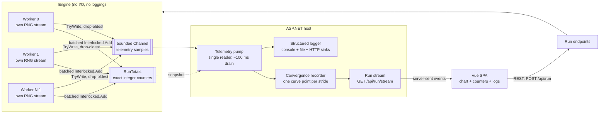
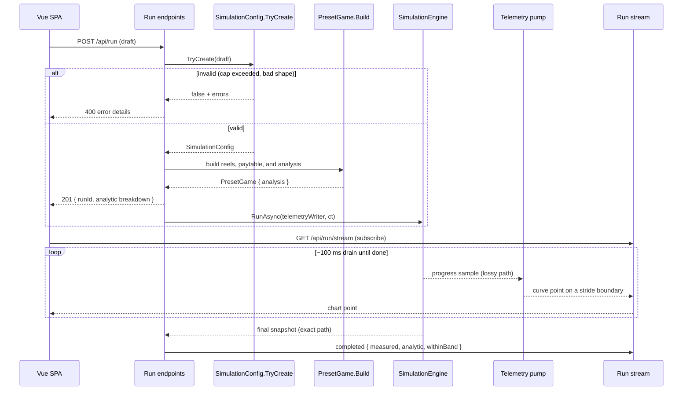

# System Design: A Slot-Game RTP Simulator

*Part 1 of an eight-part series on building a slot game engine in C#. This one covers
the system design: requirements, the high-level shape, and the decisions that make
the rest of the series possible. It closes with a map of what each later article
builds and what you can run at the end of it.*

Commercial slot games are built from detailed mathematics: reel strips or outcome
weights, paytables, feature rules, theoretical return, and volatility. That material
is often collected in a **PAR sheet** or a larger mathematics package. For regulated
releases, manufacturers commonly submit this kind of material to a regulator or
independent test lab; it is not necessarily a public document that physically
"ships with" each casino cabinet.

One headline number is **Return to Player**, or **RTP**: the expected share of all
wagered money that the game returns over a very large number of plays. A theoretical
RTP of 98% means this: if the game receives \$100 in wagers over and over across a
huge sample, its mathematical average return is \$98 and its mathematical average
hold is \$2. It does **not** promise that one player who wagers \$100 will leave with
\$98. That player could win a jackpot or lose the whole \$100.

This series builds a teaching system that takes an RTP target, scales a paytable
toward that target, calculates the resulting theoretical return, and checks the
implementation by simulating many spins while a live chart follows the measured
return. Along the way it covers fixed-point money, replayable parallel randomness,
probability on reel strips, and the difference between data that must be preserved
and display updates that may be skipped.

### Check your understanding

Suppose a game has a 98% RTP. A player wagers $100 once and loses all of it. Does that
single result disprove the 98% figure?

<details><summary>Answer</summary>

No. RTP is the average over a very large number of wagers. It does not predict one player's
result. To test the 98% claim, we need many spins and a reasonable range around the expected
average.

</details>

> 🧪 **Try it live.** The series ships a companion site that runs this engine's own
> code in the browser: start it with `dotnet run` from `CSharp/src/SlotDemo.Server`
> and open <http://localhost:5090>. Articles 2 through 8 each have a matching lab
> page at `#/ch02` … `#/ch08`. Three more pages belong to the series as a whole: the
> live PAR sheet at `#/par`, the source library at `#/library`, and the proving
> ground at `#/finale`, which runs ten million spins while the chart watches the
> measured RTP settle into its band.

## Five terms to know first

| Term | Junior-high version |
|---|---|
| **Wager** | The amount bet on one spin. |
| **Payout** | The amount the game returns for a winning result. |
| **RTP** | The long-run average payout divided by the long-run average wager. |
| **Hold** | The other side of RTP. Ignoring special accounting details, 98% RTP corresponds to 2% theoretical hold. |
| **PAR sheet / math package** | The game's math recipe: probabilities, pays, feature contributions, and calculated results. |

Think of RTP like the expected average of repeatedly rolling dice, not like a refund
policy. We can know the long-run average before rolling, but we cannot use that
average to predict the next roll.

## Requirements

**Functional:**

1. Configure a game: pick a reel layout, set a base-game RTP and up to two bonus
   feature contributions, all as percentages.
2. Run a simulation of N spins (millions to tens of millions) across multiple CPU
   cores.
3. Show live progress in a browser: spin count, measured RTP, and a convergence
   chart with a statistical confidence band.
4. Report a final check: did the measured RTP land inside a statistically expected
   range around the analytic result?

**Non-functional:**

1. **Exactness.** Within the supported run-size and payout limits, the final wagered
   and returned totals must be exact, rather than accurate to floating-point
   precision. Money that drifts by rounding is money you can't audit.
2. **Determinism.** Same seed, same worker count, same result, bit for bit.
3. **Throughput.** Run enough spins quickly to make large statistical checks
   practical on a desktop CPU. Speed does not make the math true; it buys more
   outcomes per hour of testing.
4. **Clear error messaging.** A configuration that violates the rules (aggregate RTP
   above the 99% cap) is rejected with a message that says why. Nothing is silently
   clamped.

**Explicit non-goals:** this is not a certified gaming RNG or a real-money system.
The stock preset's two feature schedules are simplified RTP contributions; they do
not launch a stateful free-spin round or re-enter the base game. Each of those
non-goals removes a subsystem from the build.

## Back-of-envelope numbers

Before drawing boxes, size the problem.

A typical preset spin is: draw one random stop per reel, read a visible window from
precomputed strips, evaluate several paylines, and sometimes add a feature award.
That is small, CPU-bound work: a few hundred nanoseconds on a desktop core, which
puts a sixteen-core box somewhere near ten million spins per second. Actual speed
depends on the processor, reel shape, line count, feature rules, worker count, and
build mode, so this chapter does not quote a spins-per-second number. The estimate
is good enough for the decision it has to make: the intended runs fit in one desktop
process, and the design needs no distributed job system.

The telemetry has a different scale. A browser chart can use about ten updates per
second. Write those two numbers next to each other, ten million events produced
against ten consumed, and the gap between them is seven orders of magnitude wide.
Every structural decision below is an answer to it.

## Two kinds of data, two sets of rules

The system has two kinds of data, and they get opposite treatment:

- **The run totals are exact and lossless within their numeric range.** Totals
  accumulate in integer counters, every spin counted, nothing dropped. Article 7
  checks the accumulator budget, because even a `long` has a maximum value.
- **The telemetry is lossy and bounded.** Progress samples flow through a bounded
  queue that drops the oldest entry when full. A dropped sample removes one chart
  point and leaves the counters alone.

The analytic probability calculations are a third concern: they use `double`, so
they are high-precision calculations rather than exact integer counters.

Conflating the first two is the easiest way to get this system wrong. Push exact
totals through the lossy path and the audit numbers are garbage. Make the telemetry
lossless and backpressure from the browser stalls the workers, which corrupts the
throughput being measured.

> 💡 **Quick picture.** A bank's core ledger and its mobile-app balance display run
> on the same two rules. The ledger never drops a transaction, because that is
> money. The balance shown on your phone can lag by a few seconds during a network
> hiccup, and nobody's account is actually wrong when it does; the display just
> catches up on the next refresh. One system, two guarantees, matched to what each
> number is for.

## High-level design

<!-- EXPORT: render this Mermaid block to PNG before publishing (mermaid.live or mmdc) -->


Three tiers:

- **Core**: a class library with the engine. No ASP.NET, no logging framework, no
  I/O of any kind. It reports through returned values, integer counters, and a
  channel writer the caller hands in. Because Core has no host, the statistical
  tests run ten-million-spin simulations without starting a web server.
- **Server**: an ASP.NET host. REST for configuration and control, server-sent
  events for pushing progress to the browser, structured logging across three sinks.
  All the I/O lives here.
- **SPA**: a Vue 3 dashboard: configure, start, and compare the measured RTP with
  the expected range on a live chart.

That split makes the engine **composable**: it can be placed inside a test harness,
console program, or web host without also pulling in the web server. The motor is
separate from the dashboard, and different callers reuse the same motor.

## The API

The API surface is deliberately small:

```
GET  /api/run/limits    → { maxAggregateBasisPoints: 9900, defaults, presets, games, workerCeiling }
POST /api/run           → 201 { runId, config echo, analytic breakdown }  |  400 errors  |  409 run already live
GET  /api/run/stream    → server-sent events: point { spins, measuredRtp, bandHalfWidth, withinBand }, progress, completed
GET  /api/run/current   → the config echo, the analytic prediction, and the whole accumulated curve
POST /api/run/cancel    → 202, or 409 when nothing is running
```

That limits response carries the stock reel presets, five of them: `Classic3`
(3 reels, 22 stops, 5 lines), `Video3` (3 reels, 32 stops, 5 lines), `Line4`
(4 reels, 72 stops, 9 lines), `Video5x64` and `Video5x128` (5 reels, 64 and 128
stops, 9 lines). A configuration names one of them, and an unknown name comes back
as a rejection listing the valid ones.

`GET /api/run/current` is what lets a browser arrive in the middle of a run and draw
the same chart as one that was there from the first spin: it returns the accumulated
curve in one read, and the stream carries it from there.

The SPA reads the 99% RTP cap from `GET /api/run/limits` rather than hardcoding it.
The client validates as a courtesy to the user; the server validates as the
authority. Duplicating the enforcement would produce two authorities that can
disagree, while duplicating the presentation costs nothing.

## Where validation lives

The engine's configuration type has one construction path:

```csharp
// The only way to obtain a SimulationConfig. If one exists, it is valid.
public static bool TryCreate(ConfigDraft draft, out SimulationConfig? config, out IReadOnlyList<string> errors)
```

RTP terms arrive as **integer basis points** (one basis point is 0.01 percentage
point, so 7,500 = 75.00%), and the cap check is integer arithmetic:

```csharp
var aggregate = (long)draft.BaseRtpBasisPoints + draft.FreeSpinsRtpBasisPoints + draft.PickBonusRtpBasisPoints;
if (aggregate > MaxAggregateBasisPoints)
    errs.Add($"Aggregate RTP {aggregate} bp exceeds the {MaxAggregateBasisPoints} bp (99.00%) cap. Rejected, never clamped.");
```

`MaxAggregateBasisPoints` is 9,900. There is no floating-point boundary ambiguity at
99.00%, because 9,900 is a whole number and so is every basis-point term being
summed against it. This is the same no-floats reasoning article 2 covers for money:
a value a boundary check depends on carries the risk of landing on 9899.9999999997
the moment it becomes a `double`. If the draft fails, the caller gets every error at
once rather than just the first, and the HTTP layer returns them in a
ProblemDetails-shaped JSON response. The current endpoint uses `Results.Json`; it
does not emit the formal `application/problem+json` response produced by ASP.NET's
`Results.Problem` helper.

`TryCreate` returns a plain `bool`, and the config and the error list both come out
through `out` parameters. That shape says what "invalid" means here: a
player-submitted configuration failing validation is an expected, everyday outcome,
so the caller writes an `if` rather than a `try`. It is the pattern .NET's own
`int.TryParse` uses, for the same reason. `SimulationConfig` has no public
constructor at all, because construction can fail for a reason the type cannot
prevent at compile time. The caller chose three numbers, and they sum to something
the cap forbids.

A request for 99.5% is rejected rather than rounded down to 99%, with the aggregate
and the limit both named in the message, so the caller knows what to change and by
how much. Silent adjustment would make the requested game and the analyzed game
disagree, which is bad for debugging and worse for auditability.

Downstream code does not need to revalidate the **request**. The invariant rides on
the type. When a `SimulationConfig` shows up as a parameter three layers deep, its
existence is evidence that the draft passed validation, like a driver's license
showing that its owner passed the required test. The server does perform a different
check later: after integer payout rounding, it verifies that the **realized game
math** still respects the cap and remains close to the requested RTP.

The default suggestion is itself concrete: `SimulationConfig` ships
`DefaultBaseRtpBasisPoints = 7500`, `DefaultFreeSpinsRtpBasisPoints = 1300`, and
`DefaultPickBonusRtpBasisPoints = 1000`, three constants that sum to 9,800 basis
points, comfortably under the 9,900 cap, alongside `DefaultPresetName = "Video5x64"`.
`/api/run/limits` suggests these to a new SPA session, and the test harness derives
its own defaults from the same three values, so a "default config" test exercises
the numbers a real session actually starts with.

## One cap, two checks, one constant

A cap that lives in one place only stays that way if every consumer reads the same
constant, and this system has two consumers. `SimulationConfig.TryCreate` enforces
the cap on the *requested* terms, in basis points, at 9,900. `RunCoordinator`, the
server-side class that starts and tracks a run, checks the *realized* RTP again
after the paytable solver has rounded every award to a whole millicent.

That second check is the one with a trap in it. Written as a hand-typed `0.99` in a
different file, it would agree with the first check today and drift the first time
somebody changes the cap in one file and forgets the other. Nothing would fail: the
two numbers are close enough that no test tells them apart. So the realized check
reads the same symbol:

```csharp
if (analytic.TotalRtp > SimulationConfig.MaxAggregateBasisPoints / 10_000.0)
    return (500, new { title = "Solver produced a realized RTP above the cap", status = 500, analytic.TotalRtp });
```

There is one 9,900 in the codebase, and both checks read it. Article 7 meets the
same hazard in a statistical form, one quantile constant carried at two roundings by
two call sites, and it takes the same fix. A comment claiming a value has one home
does not give it one; the constant has to be the same symbol.

## Exact money in parallel

Every accumulated monetary quantity in the engine is a `long` counting
**millicents**, one hundred-thousandth of a credit. The authoritative wagered and
returned totals do not accumulate in `double`. A snapshot converts those integer
totals to `double` only when it calculates a display ratio such as measured RTP.
Article 2 covers this type in full.

Integer addition can be regrouped without changing the answer. Combined with fixed
worker quotas and one deterministic RNG stream per worker, that makes a run
replayable: the same game definition, code version, spin target, seed, and worker
count produce the same totals, bit for bit. Changing the worker count changes the
RNG partition, so a 1-worker run and a 16-worker run are **not** expected to return
the same payout total. They should still converge toward the same theoretical RTP.
The concurrency and determinism tests assert these two different promises.

The accumulation itself is two-tier: each worker sums a batch of up to 4,096 spins
into local `long`s, then issues four `Interlocked.Add` calls. "Atomic" is the word
for what `Interlocked.Add` buys here. An ordinary `total += batch` on a shared field
is really three separate steps under the hood (read the old value, add to it, write
the new value back), and two threads can interleave those steps and silently lose
one thread's contribution. `Interlocked.Add` performs the read-add-write as one step
the processor guarantees cannot be split apart, no matter how many threads call it
at the same instant. Contention drops by the batch factor, and exactness is
untouched, because integer addition does not care how the terms are grouped.

## The telemetry path cannot change the final totals

Workers `TryWrite` progress samples into a bounded channel (capacity 1,024,
drop-oldest). `System.Threading.Channels.Channel<T>` is the .NET type for a
thread-safe pipe between producers and a consumer, and it is the choice here rather
than a plain `Queue<T>` behind a lock for two reasons the plain queue doesn't give
for free: a bounded capacity, so the queue itself enforces a hard ceiling instead of
growing without limit if the consumer falls behind, and a configurable full policy,
`DropOldest` in this case, so the channel decides what to do when that ceiling is
hit without the caller writing that logic by hand. When it is full, the channel
accepts the newer sample and evicts an older one.

A single reader drains that channel about ten times a second. It hands every sample
it finds to the convergence recorder, which appends one curve point each time the
run crosses a stride boundary, 50,000 spins by default, or roughly two hundred
points on a ten-million-spin run. A live counter readout goes out every other drain.
Two design rules keep the lossy path safe:

1. **Samples carry absolute snapshots, never deltas.** If a sample says "14.2M
   spins, RTP 0.9807," dropping the previous fifty samples costs nothing; the next
   one has the whole truth. Deltas would turn every drop into permanent error.
2. **Workers never wait for telemetry capacity.** `TryWrite` returns immediately.
   The simulation does not wait for the browser to catch up.

Missing the final telemetry sample does not erase the end of the run, because the
exact total and the telemetry sample are not the same read. `RunAsync` takes the
final quiesced snapshot from `RunTotals` after every worker has joined, outside the
channel entirely, and that is the number the acceptance tests and the completion
message use. The channel can lose a chart point. It cannot lose a counted spin,
because the counted spins never lived in the channel to begin with.

Every progress event here is temporary, every producer and consumer is in one
process, and the authoritative result is an integer counter rather than a message.
A broker would add serialization, networking, and a deployment dependency without
improving the final totals. The browser-facing leg is one-way traffic, which is what
server-sent events are for: a `MapGet` that writes `data:` lines, native
`EventSource` support, automatic reconnect, and no duplex machinery to maintain for
a return channel nothing sends on. The decision is recorded as ADR-001: in-process
`System.Threading.Channels`, SSE to the browser, no broker. If a cross-process story
ever appears, a broker slots in behind the existing `ChannelWriter<TelemetrySample>`
parameter, and the engine would not need to change.

## The math must predict the expected range

A statistical check saying "98% ± something" is only as good as the *something*.
The UI calls its shaded area a **confidence band**. The formal name is a
normal-approximation expected range for the measured sample RTP, centered on the
analytic RTP. It comes from a combinatorial calculation that computes not just
expected RTP but the per-spin standard deviation σ from the reel strips and
paytable. The implementation stores these probability results in `double`, so
"analytic" is more accurate than calling every resulting bit exact. Under the normal
approximation, a two-sided 99% band has half-width `z·σ/√N`. This is a statistical
expectation rather than a guarantee that every seed will land inside the band.
Article 4 explains the assumptions and the rare-win caveat.

The architectural point is that **the analytic calculator and the simulator reach
the result by different paths.** One combines probabilities; one plays sampled
spins. They share the paytable and reel definitions (the *data*) but use different
calculation code. Agreement is strong evidence that both paths interpret the game
the same way, short of mathematical proof that every possible bug is absent.
Article 7 adds exhaustive checks for the game shapes small enough to enumerate.

## The sequence, end to end

<!-- EXPORT: render this Mermaid block to PNG before publishing -->


The analytic breakdown is calculated before the background run is scheduled, and
the start response includes it. The run may already be starting while that HTTP
response travels to the browser, and the SPA has the analytic target as soon as it
processes the response.

## How the design meets the requirements

Walking back through the requirements:

- **Exactness**: integer `Millicents` on the authoritative counter path, subject to
  the accumulator limits checked in article 8.
- **Replayability**: seeded per-worker streams, fixed work partition, and integer
  accumulation, verified by repeatable tests.
- **Throughput**: worker-local work inside each batch, four batched atomic adds, and
  telemetry that cannot apply backpressure.
- **Clear error messaging**: one draft-validation boundary, loud rejection, errors
  named as data, a separate realized-math safeguard, and one shared cap constant.

Each non-functional requirement traces to a named mechanism, which is what makes it
reviewable: "each worker accumulates locally and performs four atomic adds per batch
of up to 4,096 spins" is something a reader can measure and argue with.

## What the rest of the series builds

Every box in that diagram gets its own article, in the order a person would build
them. Articles 2 through 6 stand alone if you want one of them by itself; read front
to back and each one hands the next its foundation.

**Article 2, *Money You Can Trust*,** starts at the bottom of the stack, with the
two smallest types in the codebase and about a hundred lines between them.
`Millicents` is an integer money struct with no conversion to any floating type
anywhere on it, so the exactness requirement is something the compiler checks rather
than something a reviewer remembers; `ScaledMultiply` carries fractional pay
multipliers as hundredths, so a 2.25× award still lands on whole millicents. The
second type is `SpinRng`, a per-worker `xoshiro256**` stream seeded through
SplitMix64, and it is what makes a run replayable. Banker's rounding gets its one
boundary here, along with the total-spin-wager convention every later multiplier is
quoted against. Its lab page resolves millicent arithmetic on wagers you type,
draws per-worker streams from a seed you choose, and charts modulo bias next to the
rejection method that avoids it.

Ask a programmer to model a reel and you'll usually get a weighted die. **Article 3,
*Reels Are Strips, Not Dice*,** shows what that costs: every single-symbol
probability comes out right and every two-symbol probability comes out wrong,
because a reel is an ordered cyclic strip stopped once per spin, so the cells
visible in one column are neighbors rather than independent draws. Out of that come
`StripReelSet`, paylines as data, and the five steps from a stopped reel to a paid
line, with four- and five-row windows handled by the same code. The lab walks a spin
one stop at a time so you can watch the window slide along the strip, then counts a
symbol's stops and compares that census against the odds the engine derives from the
same strip.

With the geometry settled, the return can be computed without playing anything, and
that is **article 4, *The PAR-Sheet Math in Code***. It builds the exactly-k-leading
probability, the expected value that sums out of it, a solver that scales a
canonical paytable toward a requested RTP with one scalar, and the per-spin standard
deviation, including the covariance that correlated rows force between paylines
sharing cells. That σ is where the chart's confidence band comes from, priced before
the first spin runs. The lab solves a paytable to a target you pick and turns σ into
a band half-width at a ladder of spin counts.

**Article 5, *Counting Every Outcome Without Playing Every Spin*,** slows down at
`GameAnalyzer`. It groups repeated reel stops by symbol, carries their counts as weights,
and turns those weighted outcomes into exact RTP and variance. A 24-outcome example makes
the recursion visible before the production code handles a five-reel game.

**Article 6, *A Replayable Parallel Simulation Engine*,** builds the machine that
plays the spins. Determinism turns out to be mostly a scheduling property: fixed
pre-assigned worker quotas, one seeded stream each, 4,096-spin batches published
through four `Interlocked.Add` calls into exact integer totals, and the bounded
drop-oldest telemetry channel that can lose a chart point and never a counted spin.
Its lab re-runs a configuration and compares the totals down to the millicent,
including what changing the worker count does to them, then lets you starve the
telemetry lane on purpose and watch the counters stay exact.

The main examples to that point use generated games. Article 5 previews the loaded-game
analyzer to teach its counting method, but it does not yet explain how a JSON file becomes
a validated game. **Article
7, *Games as Data*,** closes that loop by moving the game out of code and into a
validated JSON file: a loader that reports every error at once, a `payUnit` schema
that compiles fractional pays to integers, an evaluator that handles wilds, group
wins, and scatters with no game-specific flags, a pick-until-you-lose bonus with a
symmetry argument for its expected value, and `GameAnalyzer` enumerating symbol
tuples. The demonstration game is Orca Dive, a fictional game invented for this
series whose math reproduces a published third-party PAR deconstruction of a real
commercial machine. Hand the lab any definition you like and read back the whole
error list at once.

A simulator that verifies itself is a circular argument, so **article 8, *Proving
the Machine*,** brings in a referee: exhaustive enumeration, which shares *data* with
the analytic and simulated paths and *code* with neither. It also itemizes the
overflow budget for both the money and squared-payout accumulators, gives the normal
quantile one home, tiers the slow and stress tests by cost, and asserts
bit-for-bit equality with `==` where a concurrency test can usually only check that
nothing crashed. Its lab runs the census and shows a simulation walking toward those
exact counts.

Three pages on the companion site belong to no single article. `#/par` computes Orca
Dive's complete PAR sheet live by walking all 14,781,416 stop combinations, with every
label clickable for its explanation. `#/library` lists the books, papers, and
standards the series draws its claims from. And `#/finale` is the proving ground:
ten million spins, one chart, the measured RTP walking into the analytic band while
the band narrows with √N.

## Industry references

- [GLI: game-mathematics and RTP analysis](https://gaminglabs.com/services/igaming/game-mathematics-percentage-return-to-player-rtp-analysis/)
  describes RTP as a long-run expected percentage and lists base-game, feature,
  jackpot, and volatility analysis.
- [GLI: software submission requirements](https://gaminglabs.com/getting-started/submit-new-software/)
  lists percentage calculations, reel strips, paytables, source code, and RNG evidence
  among common submission materials.
- [Nevada Technical Standard 1](https://www.gaming.nv.gov/siteassets/content/home/features/TechnicalStandard1.pdf)
  is a useful example of jurisdiction-specific requirements for gaming devices and
  random selection. This teaching simulator is not a claim of compliance or
  certification.

*Source for this series: the repository's architecture document carries
the full invariant list and ADR-001.*

## Optimization notebook

Record likely hot paths now: random selection, window construction, evaluation, and shared
counters. Do not optimize them in the architecture chapter. The first system needs stable
contracts and independent correctness checks before a faster version has a trustworthy
answer to compare against. Episode 9 returns to this list with measurements.
