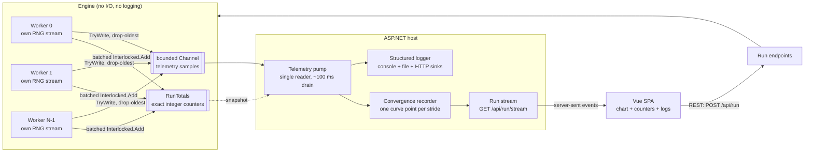

# System Design: A Slot-Game RTP Simulator

*Part 1 of a nine-part series on building a slot game engine in C#. This one covers
the system design: the requirements, the high-level structure, and the decisions the
rest of the series rests on. It closes with a map of what each later article builds
and what you can run at the end of it.*

A commercial slot game starts as math on paper: reel strips or outcome weights, a
paytable, feature rules, a theoretical return, and a volatility figure. That material
usually lives in a **PAR sheet** or a larger math package. For a regulated release,
the manufacturer submits it to a regulator or an independent test lab. It is not
necessarily a public document, and it does not necessarily travel inside the cabinet.

The headline number in that package is **Return to Player**, or **RTP**. RTP is the
share of wagered money a game gives back over a very large number of plays. Say a
game is rated at 98%. Feed it \$100 in wagers, over and over, across a huge sample,
and its mathematical average return is \$98 and its average hold is \$2. It promises
nothing about one player who wagers \$100. That player might hit a jackpot, or might
lose all of it.

This series builds a teaching system around that number. You give it an RTP target.
It scales a paytable toward the target, works out the theoretical return, then checks
its own work by simulating millions of spins while a live chart follows the measured
return. Along the way we cover fixed-point money, replayable parallel randomness,
probability on reel strips, and which data has to survive and which can be dropped.

## Nobody is playing this game

"Simulate" here means something narrower than what happens at a casino, so let's
settle it before any design work.

This system never spins a picture of a reel. It never waits for a button press or
shows a win animation. It has no player, no bankroll, and no session. A **spin** in
this codebase is one small piece of math. Draw a random stop for each reel. Read
which symbols land in the visible window. Check the paylines against the paytable.
Write down two numbers: what was wagered, and what came back.

The simulation is millions of those, run as fast as the CPU allows, with every
outcome added into running totals. No single spin matters. What matters is how the
spins pile up: across ten million of them, what fraction of the wagered money came
back? That measured fraction is the thing we hold up against the RTP the math
predicted. So when this series says "play a spin," read it as "score one random
outcome and add it to the tally."

### Check your understanding

Suppose a game has a 98% RTP. A player wagers $100 once and loses all of it. Does that
single result disprove the 98% figure?

<details><summary>Answer</summary>

No. RTP is the average over a very large number of wagers. It does not predict one player's
result. To test the 98% claim, we need many spins and a reasonable range around the expected
average.

</details>

> 🧪 **Try it live.** The series ships a companion site that runs this engine's own
> code in the browser: start it with `dotnet run` from `CSharp/src/SlotDemo.Server`
> and open <http://localhost:5090>. Articles 2 through 9 each have a matching lab
> page at `#/ch02` … `#/ch09`. Three more pages belong to the series as a whole: the
> live PAR sheet at `#/par`, the source library at `#/library`, and the proving
> ground at `#/finale`, which runs ten million spins while the chart watches the
> measured RTP settle into its band.

## Seven terms to know first

| Term | Junior-high version |
|---|---|
| **Spin** | One unit of simulated math: draw random stops, read the window, score the paylines, record wagered and returned. No graphics, no player. |
| **Wager** | The amount bet on one spin. |
| **Payout** | The amount the game returns for a winning result. |
| **RTP** | The long-run average payout divided by the long-run average wager. |
| **Hold** | The other side of RTP. Ignoring special accounting details, 98% RTP corresponds to 2% theoretical hold. |
| **PAR sheet / math package** | The game's math recipe: probabilities, pays, feature contributions, and calculated results. |
| **Telemetry** | Progress reports the simulation sends out while it runs — "so far: this many spins, this measured RTP" — so a chart can watch the run live. |

RTP behaves like the average of many dice rolls. You can know the long-run average
before you roll anything, and you cannot use it to call the next roll.

Telemetry is one of those seven terms. It pairs with a term the table leaves out:
the counter. Between them those two carry most of this design, so here is what each
one looks like in the flesh.

A **counter** is a number in memory that only ever gets added to. This system keeps
four: spins played, money wagered, money returned, and winning spins. Every spin
bumps them. Nothing else touches them. When the run ends, those four numbers **are**
the result.

Picture a stadium on game night. An usher stands at each gate with a metal tally
clicker and clicks it once per person walking through. That clicker is the counter.
It catches every person, once each, and at the end of the night the clickers hold
the true attendance.

Every few minutes each usher also keys the radio: "Gate 3, four thousand two hundred
so far." That radio call is **telemetry**, and the control room uses it to watch the
crowd build on a screen. Now suppose a call gets garbled, or the channel is busy.
*Everyone still gets counted.* The clicker in the usher's hand holds the real number,
and the next call carries the running total all over again: "forty-six hundred so
far," rather than "four hundred more since last time." A lost report costs the screen
one update. The attendance is untouched.

Swap the stadium for the simulation and the picture holds piece for piece. The
workers are the ushers, the integer totals are the clickers, the progress samples
are the radio calls, and the live chart is the control-room screen. The "Two kinds
of data" section below writes this scene out as engineering rules.

## Requirements

**Functional:**

1. Configure a game: pick a reel layout, set a base-game RTP and up to two bonus
   feature contributions, all as percentages.
2. Run a simulation of N spins (millions to tens of millions) across multiple CPU
   cores.
3. Show live progress in a browser: spin count, measured RTP, and a convergence
   chart with a statistical confidence band.
4. Report a final check: did the measured RTP land inside a statistically expected
   range around the analytic result?

**Non-functional:**

1. **Exactness.** Within the supported run-size and payout limits, the final wagered
   and returned totals must be whole numbers, correct to the last unit. Money that
   drifts by a rounding error is money you can't audit.
2. **Determinism.** Same seed, same worker count, same result, bit for bit.
3. **Throughput.** Run enough spins quickly to make large statistical checks
   practical on a desktop CPU. Speed does not make the math true; it buys more
   outcomes per hour of testing.
4. **Clear error messaging.** A configuration that breaks the rules (aggregate RTP
   outside the solver's RTP limits) comes back rejected, with a message saying why.
   Nothing gets clamped in silence.

**Explicit non-goals:** this is not a certified gaming RNG or a real-money system.
The stock preset's two feature schedules are simplified RTP contributions; they do
not launch a stateful free-spin round or re-enter the base game. Each of those
non-goals removes a subsystem from the build.

## Back-of-envelope numbers

Size the problem before drawing any boxes.

A typical preset spin does four things:

- draw one random stop per reel,
- read a visible window from precomputed strips,
- evaluate several paylines,
- and sometimes add a feature award.

That is small CPU work, a few hundred nanoseconds on a desktop core, which puts a
sixteen-core box somewhere near ten million spins per second. Real speed depends on
the processor, reel shape, line count, feature rules, worker count, and build mode,
so this chapter quotes no spins-per-second figure. The estimate only has to settle
one question, and it settles it: the runs we intend fit in a single desktop process,
so the design can skip a distributed job system.

Telemetry lives at a completely different scale. A browser chart can absorb about
ten updates per second. Put the two numbers side by side, ten million events
produced against ten consumed, and the gap is seven orders of magnitude. Most of
the structure below exists to bridge it.

## Two kinds of data, two sets of rules

The system has two kinds of data, and they get opposite treatment:

- **The run totals are exact and lossless within their numeric range.** Totals
  accumulate in integer counters, every spin counted, nothing dropped. Article 8
  checks the accumulator budget, because even a `long` has a maximum value.
- **The telemetry is lossy and bounded.** Progress samples flow through a bounded
  queue that drops the oldest entry when full. A dropped sample removes one chart
  point and leaves the counters alone.

The analytic probability calculations are a third concern: they use `double`, so
they are high-precision calculations rather than exact integer counters.

Mixing up the first two is the easiest way to get this system wrong. Push exact
totals through the lossy path and the audit numbers turn to garbage. Make the
telemetry lossless instead, and a slow browser pushes back on the workers and warps
the very throughput we set out to measure.

> 💡 **Quick picture.** A bank's core ledger and its mobile-app balance display run
> on the same two rules. The ledger never drops a transaction, because that is
> money. The balance shown on your phone can lag by a few seconds during a network
> hiccup, and nobody's account is actually wrong when it does; the display just
> catches up on the next refresh. One system, two guarantees, matched to what each
> number is for.

## High-level design

<!-- EXPORT: render this Mermaid block to PNG before publishing (mermaid.live or mmdc) -->


Three tiers:

- **Core**: a class library with the engine. No ASP.NET, no logging framework, no
  I/O of any kind. It reports through returned values, integer counters, and a
  channel writer the caller hands in. Because Core has no host, the statistical
  tests run ten-million-spin simulations without starting a web server.
- **Server**: an ASP.NET host. REST for configuration and control, server-sent
  events for pushing progress to the browser, structured logging across three sinks.
  All the I/O lives here.
- **SPA**: a Vue 3 dashboard: configure, start, and compare the measured RTP with
  the expected range on a live chart.

That split makes the engine **composable**. Drop it into a test harness, a console
program, or a web host, and none of those callers drags a web server along with it.
The motor and the dashboard come apart.

## One run, step by step

Here is the process end to end, with the part that does each step named. Every one
of those parts gets its own article later. This list is the skeleton they hang on.

1. **You press Run.** The Vue page posts one JSON request: a preset name, an
   RTP split, a seed, a worker count, and a spin target. (SPA — this article)
2. **The request is checked.** `SimulationConfig.TryCreate` validates it. Outside
   the solver's RTP limits (75% floor, 99% ceiling)? Rejected, with every error
   named. Nothing gets clamped. (Config — this article)
3. **The game is built.** `PresetGame.Build` turns the preset into reel strips
   (`StripReelSet`), paylines (`Payline`), and a paytable that
   `PaytableSolver` scales to your requested RTP. (Reels — article 3;
   paytable — article 4)
4. **The answer is predicted before any spin.** The analytic math computes the
   expected RTP and the per-spin standard deviation σ from the strips and the
   paytable alone. That σ prices the chart's confidence band up front.
   (Math — articles 4 and 5)
5. **The workers spin.** `SimulationEngine` gives each worker a fixed quota of
   spins and its own seeded random stream (`SpinRng`). Each spin draws a
   window, evaluates the paylines (`LinePayEvaluator`), plays the features,
   and returns an outcome in integer millicents (`Millicents`).
   (Money and randomness — article 2; engine — article 6)
6. **Totals stay exact.** Each worker sums 4,096 spins locally, then adds them
   to the shared `RunTotals` with four atomic adds. Every spin is counted.
   (Engine — article 6)
7. **Progress flows on a separate, lossy lane.** After each batch the worker
   drops an absolute snapshot into a bounded channel. Full channel? The oldest
   sample is evicted. The chart may lose a point; the totals lose nothing.
   (Engine — article 6)
8. **The server draws the curve.** A pump drains that channel about ten times
   a second and appends one chart point per 50,000 spins, each with its own
   band half-width `z·σ/√N`. The points stream to the browser as server-sent
   events. (Server — this article)
9. **The run ends with a verdict.** The final totals are read directly from
   the counters, never from the channel. Measured RTP inside the band around
   the analytic RTP? The two independent methods agree. (Proof — article 8)
10. **A loaded game can replace the preset.** A JSON game document (Orca Dive)
    goes through a validating loader, an exhaustive enumerator for its exact
    RTP, and the same engine. (Games as data — article 7; speed — article 9)

## The API

The API surface is deliberately small:

```
GET  /api/run/limits    → { maxAggregateBasisPoints: 9900, defaults, presets, games, workerCeiling }
POST /api/run           → 201 { runId, config echo, analytic breakdown }  |  400 errors  |  409 run already live
GET  /api/run/stream    → server-sent events: point { spins, measuredRtp, bandHalfWidth, withinBand }, progress, completed
GET  /api/run/current   → the config echo, the analytic prediction, and the whole accumulated curve
POST /api/run/cancel    → 202, or 409 when nothing is running
```

That limits response carries the stock reel presets, five of them: `Classic3`
(3 reels, 22 stops, 5 lines), `Video3` (3 reels, 32 stops, 5 lines), `Line4`
(4 reels, 72 stops, 9 lines), `Video5x64` and `Video5x128` (5 reels, 64 and 128
stops, 9 lines). A configuration names one of them, and an unknown name comes back
as a rejection listing the valid ones.

`GET /api/run/current` is what lets a browser show up halfway through a run and draw
the same chart as one that watched from the first spin. It returns the accumulated
curve in a single read, and the stream carries the picture forward from there.

The SPA reads the solver's RTP limits (75.00% floor, 99.00% ceiling) from
`GET /api/run/limits` instead of hardcoding them. The client validates as a courtesy
to the user. The server validates as the authority. Copy the enforcement into both
places and you get two authorities that can disagree; copying the presentation costs
nothing.

## Where validation lives

The engine's configuration type has one construction path:

```csharp
// The only way to obtain a SimulationConfig. If one exists, it is valid.
public static bool TryCreate(ConfigDraft draft, out SimulationConfig? config, out IReadOnlyList<string> errors)
```

RTP terms arrive as **integer basis points** (one basis point is 0.01 percentage
point, so 7,500 = 75.00%), and the limits check is integer arithmetic:

```csharp
var aggregate = (long)draft.BaseRtpBasisPoints + draft.FreeSpinsRtpBasisPoints + draft.PickBonusRtpBasisPoints;
if (aggregate > MaxAggregateBasisPoints)
    errs.Add($"Aggregate RTP {aggregate} bp exceeds the solver's {MaxAggregateBasisPoints} bp (99.00%) ceiling. Rejected, never clamped.");
if (aggregate < MinAggregateBasisPoints)
    errs.Add($"Aggregate RTP {aggregate} bp is below the solver's {MinAggregateBasisPoints} bp (75.00%) floor. Rejected, never clamped.");
```

`MaxAggregateBasisPoints` is 9,900. The comparison at 99.00% is unambiguous, because
9,900 is a whole number and so is every basis-point term summed against it. Article 2
makes the same argument about money. Turn a boundary value into a `double` and it can
land on 9899.9999999997.

A failing draft hands the caller every error at once rather than the first one it
hit, and the HTTP layer returns them as ProblemDetails-shaped JSON. The current
endpoint uses `Results.Json`, so it emits ordinary JSON rather than the formal
`application/problem+json` response ASP.NET's `Results.Problem` helper produces.

`TryCreate` returns a plain `bool`. The config and the error list both come back
through `out` parameters. That signature says something about what "invalid" means
here: somebody submitting a configuration the limits forbid is an ordinary Tuesday,
so the caller writes an `if` instead of a `try`. .NET's own `int.TryParse` reads the
same way for the same reason. `SimulationConfig` has no public constructor,
because construction can fail for a reason the compiler cannot catch. The caller
picked three numbers, and the three sum to something the limits forbid.

Ask for 99.5% and the request comes back rejected, with the aggregate and the limit
both named so you know what to change and by how much. Rounding it down to 99% in
silence would leave the game you asked for and the game we analyzed disagreeing with
each other, which is bad for debugging and worse for an audit.

The word "limit" invites a wrong picture, so here is the job these two actually do.
The solver's RTP limits **bound one input parameter**: the RTP target you may hand
the solver when it builds a game, no lower than 75.00% and no higher than 99.00%.
That is all of it. They say nothing about the simulation, and no check during or
after a run ever reads them. Suppose a valid 98% game measured high over its run.
Nothing would stop, trim, or re-spin anything. The run would finish, land outside
its band, and report the disagreement. Limits gate what may be *built*, and the
spins answer for themselves.

The pair is there so the simulator behaves the way a casino floor does. A test lab
applies no such limit when it validates, because its simulation answers one question
only: does the implemented game match its submitted math package? RTP limits get
enforced earlier, at the **approval** step, on paper. Our floor borrows the legal
minimum most jurisdictions set, since Nevada requires at least 75% theoretical
payback. Our ceiling stands in for the commercial maximum every operator keeps,
because a game paying out more than it takes in is a losing product. Same mechanism
and same timing as the real thing: before deployment, never during validation.

## Scale once, then freeze it

"Hit the RTP target" can be read two ways, and this system only does one of them.

**Clamping** would mean adjusting values while the run is going. Nudge a payout
here, shave a probability there, until the measured number lands where we wanted it.
Nothing in this system does that, and the reason runs through every article here: we
are checking a model against a simulation, and a check means something only when
neither side gets touched along the way.

What happens instead is **one scaling value, applied once, then frozen**.
`PaytableSolver` computes a single factor, the target RTP divided by the canonical
paytable's unscaled expected value. It multiplies every pay by that factor, rounds
each pay to whole millicents (half-even), and freezes the result. From that moment
the paytable is fixed data.

Each pay rounds on its own, so the frozen table's true RTP can drift a hair off the
target. So the math gets recomputed **from the rounded table**, and that realized
number is the one the game actually pays. It is what the chart's band centers on and
what the simulation is measured against. The request sets the target. The frozen
table is the truth. Nothing in between touches a value to make the answer look
better.

The industry works the same way. A commercial slot ships as a small set of
**approved payback versions**, say 87%, 90%, and 94%. Each version is a fixed
paytable with its own PAR sheet, submitted as-is. The operator picks one from the
approved set, and nobody tunes numbers out on the floor. Independent test labs (GLI
and its peers) then verify the *submitted* paytable: they enumerate or simulate
every combination from the provided data and confirm the theoretical return, with
large-scale simulation agreeing inside a tight tolerance. A lab that "helpfully"
clamped its inputs would be certifying a game nobody submitted. Reject at the gate,
scale once, measure the realized table: that is the same discipline in miniature.

The proving ground reports that yardstick directly. Beside the statistical band
verdict, the finale page shows an **industry check**: the measured RTP must sit
within ±0.5 percentage points of the analytic RTP over at least ten million spins,
the fixed tolerance certification practice quotes. The band is the stronger test,
since it narrows as √N. The industry check is the one a lab would recognize on
sight.

Downstream code can take the **request** as already validated, because the invariant
rides on the type. When a `SimulationConfig` turns up as a parameter three layers
deep, its existence proves the draft passed, the way a driver's license proves its
owner passed the test. The server runs a different check later: after integer payout
rounding, it confirms that the **realized game math** still respects the solver's
RTP limits and sits close to the requested RTP.

Even the defaults are concrete numbers. `SimulationConfig` ships
`DefaultBaseRtpBasisPoints = 7500`, `DefaultFreeSpinsRtpBasisPoints = 1300`, and
`DefaultPickBonusRtpBasisPoints = 1000`, which sum to 9,800 basis points, comfortably
inside the solver's RTP limits. `DefaultPresetName = "Video5x64"` rides along with
them. `/api/run/limits` offers these to a new SPA session, and the test harness
derives its own defaults from the same three constants, so a "default config" test
exercises the numbers a real session starts with.

## Two checks, one constant

A limit lives in one place only when every consumer reads the same constant, and
this system has two consumers. `SimulationConfig.TryCreate` enforces the limits on
the *requested* terms, in basis points (floor 7,500, ceiling 9,900). `RunCoordinator`,
the server-side class that starts and tracks a run, checks the *realized* RTP again
after the paytable solver has rounded every award to a whole millicent.

The second check is where the trap sits. Hand-type it as `0.99` in a different file
and it agrees with the first check today, then drifts the day somebody edits one
file and forgets the other. Nothing breaks loudly. The two numbers sit close enough
that no test can tell them apart. So the realized check reads the same symbol:

```csharp
if (analytic.TotalRtp > SimulationConfig.MaxAggregateBasisPoints / 10_000.0)
    return (500, new { title = "Solver produced a realized RTP above the ceiling", status = 500, analytic.TotalRtp });
```

There is one 9,900 in the codebase, and both checks read it. Article 8 meets the same
hazard in statistical dress, one quantile constant carried at two roundings by two
call sites, and applies the same fix. A comment claiming a value has one home does
not give it one. The constant has to be the same symbol.

## Exact money in parallel

Every accumulated monetary quantity in the engine is a `long` counting
**millicents**, one hundred-thousandth of a credit. The authoritative wagered and
returned totals do not accumulate in `double`. A snapshot converts those integer
totals to `double` only when it calculates a display ratio such as measured RTP.
Article 2 covers this type in full.

Integer addition can be regrouped without changing the answer. Add fixed worker
quotas and one deterministic RNG stream per worker, and a run becomes replayable:
the same game definition, code version, spin target, seed, and worker count produce
the same totals, bit for bit. Change the worker count and the RNG partition changes
with it, so a 1-worker run and a 16-worker run land on different payout totals by
design. Both should converge toward the same theoretical RTP. The concurrency and
determinism tests assert those two separate promises.

Accumulation runs in two tiers. Each worker sums a batch of up to 4,096 spins into
local `long`s, then issues four `Interlocked.Add` calls.

"Atomic" is the word for what `Interlocked.Add` buys. An ordinary `total += batch`
on a shared field is three steps under the hood: read the old value, add to it,
write the new value back. Two threads can interleave those steps, and one thread's
contribution quietly disappears. `Interlocked.Add` does the read-add-write as one
step the processor guarantees cannot be split apart, however many threads call it at
the same instant. Contention drops by the batch factor, and exactness survives,
because integer addition does not care how the terms are grouped.

## The totals live outside the telemetry path

Workers `TryWrite` progress samples into a bounded channel, capacity 1,024, set to
drop-oldest. `System.Threading.Channels.Channel<T>` is the .NET type for a
thread-safe pipe running from several producers to one consumer. It beats a plain
`Queue<T>` behind a lock on two counts here. Capacity is bounded, so the queue
enforces its own ceiling instead of growing forever when the consumer falls behind.
And the full policy is configurable, `DropOldest` in this case, so the channel
decides what happens at that ceiling and the caller writes no eviction logic by
hand. When it fills, the channel takes the newer sample and evicts an older one.

A single reader drains that channel about ten times a second. It hands every sample
it finds to the convergence recorder, which appends one curve point each time the
run crosses a stride boundary, 50,000 spins by default, or roughly two hundred
points on a ten-million-spin run. A live counter readout goes out every other drain.
Two design rules keep the lossy path safe:

1. **Samples carry absolute snapshots, never deltas.** If a sample says "14.2M
   spins, RTP 0.9807," dropping the previous fifty samples costs nothing; the next
   one has the whole truth. Deltas would turn every drop into permanent error.
2. **Workers never wait for telemetry capacity.** `TryWrite` returns immediately.
   The simulation does not wait for the browser to catch up.

Losing the last telemetry sample leaves the end of the run intact, because the exact
total and the telemetry sample come from two different reads. `RunAsync` takes the
final quiesced snapshot from `RunTotals` after every worker has joined, outside the
channel entirely, and that snapshot is what the acceptance tests and the completion
message use. The channel can lose a chart point. A counted spin was never in the
channel to lose.

Now, why no message broker? Every progress event here is temporary, every producer
and consumer lives in one process, and the authoritative result is an integer counter
rather than a message. A broker would add serialization, networking, and a deployment
dependency, and the final totals would be no better for it.

The browser-facing leg is one-way traffic, which is what server-sent events are for.
A `MapGet` writes `data:` lines, browsers support `EventSource` natively and
reconnect on their own, and there is no duplex machinery to maintain for a return
channel nobody sends on. ADR-001 records the decision: in-process
`System.Threading.Channels`, SSE to the browser, no broker. If a cross-process story
ever shows up, a broker slots in behind the existing
`ChannelWriter<TelemetrySample>` parameter and the engine stays as it is.

## The math must predict the expected range

A statistical check saying "98% ± something" is only as good as the *something*.
The UI calls its shaded area a **confidence band**. Its formal name is a
normal-approximation expected range for the measured sample RTP, centered on the
analytic RTP. It comes out of a combinatorial calculation that produces the expected
RTP and the per-spin standard deviation σ together, from the reel strips and the
paytable. The implementation stores those probability results in `double`, which is
why "analytic" is the right word for them rather than "exact." Under the normal
approximation, a two-sided 99% band has half-width `z·σ/√N`. Treat that as a
statistical expectation. Some seeds will land outside the band. Article 4 covers the
assumptions and the rare-win caveat.

**The analytic calculator and the simulator reach the result by different paths.**
One combines probabilities. The other plays sampled spins. They share the paytable
and reel definitions, the *data*, and run on separate calculation code. When the two
agree, that is strong evidence both paths read the game the same way. It falls short
of proof that no bug exists. Article 8 adds exhaustive checks for the game shapes
small enough to enumerate.

## The sequence, end to end

<!-- EXPORT: render this Mermaid block to PNG before publishing -->


The analytic breakdown gets calculated before the background run is scheduled, and
the start response carries it. The run may already be under way while that HTTP
response travels to the browser, so the SPA has its analytic target the moment it
reads the response.

## How the design meets the requirements

Walking back through the requirements:

- **Exactness**: integer `Millicents` on the authoritative counter path, subject to
  the accumulator limits checked in article 8.
- **Replayability**: seeded per-worker streams, fixed work partition, and integer
  accumulation, verified by repeatable tests.
- **Throughput**: worker-local work inside each batch, four batched atomic adds, and
  telemetry that cannot apply backpressure.
- **Clear error messaging**: one draft-validation boundary, loud rejection, errors
  named as data, a separate realized-math safeguard, and one shared constant per limit.

Every non-functional requirement traces to a named mechanism, and that is what makes
it reviewable. "Each worker accumulates locally and performs four atomic adds per
batch of up to 4,096 spins" is a claim a reader can measure and argue with.

## What the rest of the series builds

Every step in the run above gets its own deep dive, in the order a person would
build the parts. Articles 2 through 9 each stand alone if you want one by itself.
Read front to back and each one hands the next its foundation.

Here is the map in one table. Each row names the step it deep-dives, the code it
builds, and what you can run when you finish it.

| # | Article | Deep-dives this step | Builds | Lab |
|---|---|---|---|---|
| 2 | Money You Can Trust | Step 5: exact money, replayable randomness | `Millicents`, `SpinRng` | `#/ch02` |
| 3 | Reels Are Strips, Not Dice | Step 3: reel geometry and paylines | `StripReelSet`, `Payline`, `LinePayEvaluator` | `#/ch03` |
| 4 | The PAR-Sheet Math in Code | Step 4: predicted RTP and σ | `Paytable`, `PaytableSolver`, `AnalyticMath` | `#/ch04` |
| 5 | Counting Every Outcome | Step 4: the exact count behind the prediction | `GameAnalyzer` (weighted enumeration) | `#/ch05` |
| 6 | A Replayable Parallel Simulation Engine | Steps 5–7: workers, totals, telemetry | `SimulationEngine`, `RunTotals` | `#/ch06` |
| 7 | Games as Data | Step 10: a JSON game through the same engine | `GameDefinition`, `WinEvaluator`, `GameRunner`, Orca Dive | `#/ch07` |
| 8 | Proving the Machine | Step 9: the referee and the verdict | exhaustive enumeration, the acceptance suite | `#/ch08` |
| 9 | Optimize the Machine You Proved | After the proof: speed, measured honestly | byte windows, paired benchmarks | `#/ch09` |

And here is what each one covers, in a little more depth.

**Article 2, *Money You Can Trust*** — the two smallest types in the codebase,
about a hundred lines between them. `Millicents` is an integer money struct that
carries no conversion to any floating type, so the compiler checks exactness on
every build and no reviewer has to remember it. `ScaledMultiply` carries fractional
pay multipliers as hundredths, so a 2.25× award still lands on whole millicents.
`SpinRng` is a per-worker `xoshiro256**` stream seeded through SplitMix64, and it is
what makes a run replayable. Banker's rounding gets its one boundary here. *The lab*
resolves millicent arithmetic on wagers you type, draws per-worker streams from a
seed you choose, and charts modulo bias beside the rejection method that removes it.

**Article 3, *Reels Are Strips, Not Dice*** — ask a programmer to model a reel and
you will usually get a weighted die. This article prices that mistake. Every
single-symbol probability comes out right and every two-symbol probability comes out
wrong, because a reel is an ordered cyclic strip stopped once per spin. Out of that
come `StripReelSet`, paylines as data, and the five steps from a stopped reel to a
paid line. *The lab* walks a spin one stop at a time so you can watch the window
slide along the strip, then holds a symbol's stop census up against the odds the
engine derives from that same strip.

**Article 4, *The PAR-Sheet Math in Code*** — with the geometry settled, the return
can be computed without playing anything at all. This one builds the
exactly-k-leading probability, the expected value, a solver that scales a canonical
paytable toward a requested RTP with a single scalar, and the per-spin standard
deviation σ, covariance between paylines that share cells included. That σ is where
the chart's confidence band comes from, priced before the first spin runs. *The lab*
solves a paytable to a target you pick and turns σ into a band half-width at a
ladder of spin counts.

**Article 5, *Counting Every Outcome Without Playing Every Spin*** — slows down at
`GameAnalyzer`. It groups repeated reel stops by symbol, carries their counts as
weights, and turns those weighted outcomes into exact RTP and variance. A 24-outcome
example makes the recursion visible before the production code takes on a five-reel
game.

**Article 6, *A Replayable Parallel Simulation Engine*** — the machine that plays
the spins. Determinism turns out to be mostly a scheduling property: fixed
pre-assigned worker quotas, one seeded stream each, 4,096-spin batches published
through four `Interlocked.Add` calls into exact integer totals, and the bounded
drop-oldest telemetry channel that can lose a chart point and never a counted spin.
*The lab* re-runs a configuration and compares the totals down to the millicent,
then lets you starve the telemetry lane on purpose and watch the counters hold.

**Article 7, *Games as Data*** — moves the game out of code and into a validated
JSON file. A loader reports every error at once. A `payUnit` schema compiles
fractional pays to integers. An evaluator handles wilds, group wins, and scatters
with no game-specific flags, alongside a pick-until-you-lose bonus and `GameAnalyzer`
enumerating symbol tuples. The demonstration game is Orca Dive, a fictional game
invented for this series whose math reproduces a published third-party PAR
deconstruction of a real commercial machine. *The lab* takes any definition you hand
it and reads the error list back in one pass.

**Article 8, *Proving the Machine*** — a simulator that verifies itself is a
circular argument, so this article brings in a referee. Exhaustive enumeration
shares *data* with the analytic and simulated paths and shares *code* with neither.
The article also itemizes the overflow budget for the accumulators, gives the normal
quantile one home, and asserts bit-for-bit equality with `==` where a concurrency
test usually settles for "it didn't crash." *The lab* runs the census and shows a
simulation walking toward those exact counts.

**Article 9, *Optimize the Machine You Proved*** — speed comes after proof, and this
is where it comes. Strips extended by one window so a spin reads a contiguous slice.
A byte-ID view for the workers, beside the symbol view the UI still needs. Lemire's
rejection threshold computed once per reel, and a dense payout array. The failed
experiments get itemized next to the winners. *The lab* runs both draw
implementations from one seed, alternating which goes first, and reports a speedup
only when the two checksums agree.

Three pages on the companion site belong to no single article. `#/par` computes Orca
Dive's complete PAR sheet live by walking all 14,781,416 stop combinations, every
label clickable for its explanation. `#/library` lists the books, papers, and
standards the series draws its claims from. And `#/finale` is the proving ground:
ten million spins, one chart, the measured RTP walking into the analytic band while
the band narrows with √N.

## Industry references

- [GLI: game-mathematics and RTP analysis](https://gaminglabs.com/services/igaming/game-mathematics-percentage-return-to-player-rtp-analysis/)
  describes RTP as a long-run expected percentage and lists base-game, feature,
  jackpot, and volatility analysis.
- [GLI: software submission requirements](https://gaminglabs.com/getting-started/submit-new-software/)
  lists percentage calculations, reel strips, paytables, source code, and RNG evidence
  among common submission materials.
- [Nevada Technical Standard 1](https://www.gaming.nv.gov/siteassets/content/home/features/TechnicalStandard1.pdf)
  is a useful example of jurisdiction-specific requirements for gaming devices and
  random selection. This teaching simulator is not a claim of compliance or
  certification.

*Source for this series: the repository's architecture document carries
the full invariant list and ADR-001.*

## Optimization notebook

Record likely hot paths now: random selection, window construction, evaluation, and shared
counters. Do not optimize them in the architecture chapter. The first system needs stable
contracts and independent correctness checks before a faster version has a trustworthy
answer to compare against. Article 9 returns to this list with measurements.
