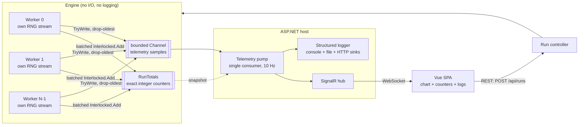
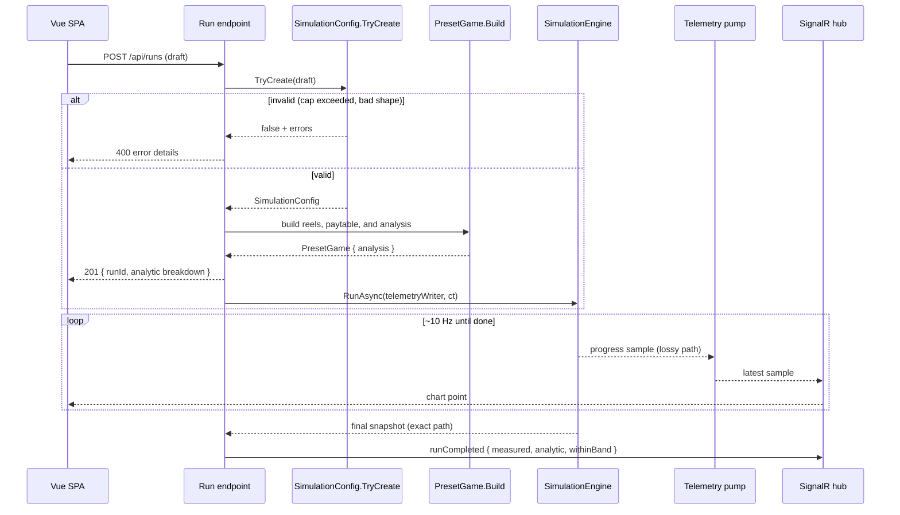

# System Design: A Slot-Game RTP Simulator

*Part 1 of a seven-part series on building a slot game engine in C#. This one covers
the system design: requirements, the high-level shape, and the decisions that make
the rest of the series possible.*

Commercial slot games are built from detailed mathematics: reel strips or outcome
weights, paytables, feature rules, theoretical return, and volatility. That material
is often collected in a **PAR sheet** or a larger mathematics package. For regulated
releases, manufacturers commonly submit this kind of material to a regulator or
independent test lab; it is not necessarily a public document that physically
"ships with" each casino cabinet.

One headline number is **Return to Player**, or **RTP**: the expected share of all
wagered money that the game returns over a very large number of plays. A theoretical
RTP of 98% means this: if the game receives \$100 in wagers over and over across a
huge sample, its mathematical average return is \$98 and its mathematical average
hold is \$2. It does **not** promise that one player who wagers \$100 will leave with
\$98. That player could win a jackpot or lose the whole \$100.

This series builds a teaching system that takes an RTP target, scales a paytable
toward that target, calculates the resulting theoretical return, and checks the
implementation by simulating many spins while a live chart follows the measured
return. Along the way it covers fixed-point money, replayable parallel randomness,
probability on reel strips, and the difference between data that must be preserved
and display updates that may be skipped.

> 🧪 **Try it live.** The series ships a companion site that runs this engine's own
> code in the browser: start it with `dotnet run` from `CSharp/src/SlotDemo.Server`
> and open <http://localhost:5090>. Each later chapter has a matching lab page, and
> the finale at `#/finale` runs ten million spins while the chart watches the
> measured RTP settle into its band.

## Five terms to know first

| Term | Junior-high version |
|---|---|
| **Wager** | The amount bet on one spin. |
| **Payout** | The amount the game returns for a winning result. |
| **RTP** | The long-run average payout divided by the long-run average wager. |
| **Hold** | The other side of RTP. Ignoring special accounting details, 98% RTP corresponds to 2% theoretical hold. |
| **PAR sheet / math package** | The game's math recipe: probabilities, pays, feature contributions, and calculated results. |

Think of RTP like the expected average of repeatedly rolling dice, not like a refund
policy. We can know the long-run average before rolling, but we cannot use that
average to predict the next roll.

We will start with requirements, sketch the high-level picture, and then examine
the decisions that carry the most correctness risk.

## Requirements

**Functional:**

1. Configure a game: pick a reel layout, set a base-game RTP and up to two bonus
   feature contributions, all as percentages.
2. Run a simulation of N spins (millions to tens of millions) across multiple CPU
   cores.
3. Show live progress in a browser: spin count, measured RTP, and a convergence
   chart with a statistical confidence band.
4. Report a final check: did the measured RTP land inside a statistically expected
   range around the analytic result?

**Non-functional:**

1. **Exactness.** Within the supported run-size and payout limits, the final wagered
   and returned totals must be exact, not
   "accurate to floating-point precision." Money that drifts by rounding is money
   you can't audit.
2. **Determinism.** Same seed, same worker count, same result. Bit for bit. A
   simulation you can't reproduce is a simulation you can't debug.
3. **Throughput.** Run enough spins quickly to make large statistical checks
   practical on a desktop CPU. Speed does not make the math true, but it lets us
   test more outcomes in a reasonable time.
4. **Clear error messaging.** A configuration that violates the rules (aggregate RTP
   above the 99% cap) is rejected with a message that says why. Nothing is silently
   clamped.

**Explicit non-goals:** this is not a certified gaming RNG or a real-money system.
The stock preset's two feature schedules are simplified RTP contributions; they do
not launch a stateful free-spin round or re-enter the base game. Naming what you're
not building is half of scoping.

## Back-of-envelope numbers

Before drawing boxes, size the problem.

A typical preset spin is: draw one random stop per reel, read a visible window from
precomputed strips, evaluate several paylines, and sometimes add a feature award.
That is small, CPU-bound work. Actual speed depends on the processor, reel shape,
line count, feature rules, worker count, and build mode, so this chapter does not
promise a particular spins-per-second number. The intended runs fit comfortably in
one desktop process; the design does not need a distributed job system.

The telemetry has a different scale. Sending one browser message for every spin
would create an enormous stream that a chart neither needs nor can use. The engine
instead publishes one sample after each worker batch, and the server coalesces those
samples to about ten browser updates per second. The important design question is:
how do we preserve every money total while deliberately skipping most screen
updates?

## Two kinds of data, two sets of rules

The system has two kinds of data, and they get opposite treatment:

- **The run totals are exact and lossless within their numeric range.** Totals
  accumulate in integer counters, every spin counted, nothing dropped. Chapter 7
  checks the accumulator budget because even a `long` has a maximum value.
- **The telemetry is lossy and bounded.** Progress samples flow through a bounded
  queue that drops the oldest entry when full. A dropped sample removes one chart
  point but does not affect the counters.

The analytic probability calculations are a third concern: they use `double`, so
they are high-precision calculations rather than exact integer counters.

Conflating those two is the easiest way to get this system wrong. Push exact totals
through the lossy path and the audit numbers are garbage. Make the telemetry
lossless and backpressure from the browser stalls the workers, which corrupts the
throughput being measured. The two paths need different guarantees.

> 💡 **Quick picture.** A bank's core ledger and its mobile-app balance display run
> on the same two rules. The ledger never drops a transaction, because that is
> money. The balance shown on your phone can lag by a few seconds during a network
> hiccup, and nobody's account is actually wrong when it does; the display just
> catches up on the next refresh. One system, two guarantees, matched to what each
> number is for.

## High-level design

<!-- EXPORT: render this Mermaid block to PNG before publishing (mermaid.live or mmdc) -->


Three tiers:

- **Core**: a class library with the engine. No ASP.NET, no logging framework, no
  I/O of any kind. It reports through returned values, integer counters, and a
  channel writer the caller hands in. Because Core has no host, the statistical
  tests run ten-million-spin simulations without starting a web server.
- **Server**: an ASP.NET host. REST for configuration and control, SignalR for
  pushing progress to the browser, structured logging across three sinks. All the
  I/O lives here.
- **SPA**: a Vue 3 dashboard: configure, start, and compare the measured RTP with
  the expected range on a live chart.

That split makes the engine **composable**: it can be placed inside a test harness,
console program, or web host without also pulling in the web server. In simpler
words, the motor is separate from the dashboard. There is one engine that schedules
and counts spins, and different callers can reuse it.

## The API

The API surface is deliberately small:

```
GET  /api/config/limits     → { maxAggregateBasisPoints: 9900, presets: [...], defaults: {...} }
POST /api/runs              → 201 { runId, analytic breakdown }  |  400 error details
WS   /hubs/simulation       → runProgress { spins, measuredRtp }, runCompleted { ciHalfWidth, withinBand }
```

That limits response also carries the stock reel presets, five of them: `Classic3`
(3 reels, 22 stops, 5 lines), `Video3` (3 reels, 32 stops, 5 lines), `Line4`
(4 reels, 72 stops, 9 lines), `Video5x64` and `Video5x128` (5 reels, 64 and 128
stops, 9 lines). A configuration names one of them, and an unknown name comes back
as a rejection listing the valid ones.

The SPA reads the 99% RTP cap from `GET /api/config/limits` rather than hardcoding
it. The client validates as a courtesy to the user; the server validates as the
authority. The rule lives in one place and is merely *displayed* in two, which is
what DRY actually asks for. Duplicating the enforcement would produce two
authorities that can disagree; duplicating the presentation is fine.

## Where validation lives

The engine's configuration type has one construction path:

```csharp
// The only way to obtain a SimulationConfig. If one exists, it is valid.
public static bool TryCreate(
    ConfigDraft draft,
    out SimulationConfig? config,
    out IReadOnlyList<string> errors)
```

RTP terms arrive as **integer basis points** (one basis point is 0.01 percentage
point, so 7,500 = 75.00%), and the cap check is integer arithmetic:

```csharp
var aggregate = (long)draft.BaseRtpBasisPoints + draft.FreeSpinsRtpBasisPoints + draft.PickBonusRtpBasisPoints;
if (aggregate > MaxAggregateBasisPoints)
    errs.Add($"Aggregate RTP {aggregate} bp exceeds the {MaxAggregateBasisPoints} bp (99.00%) cap. Rejected, never clamped.");
```

`MaxAggregateBasisPoints` is 9,900. There is no floating-point boundary ambiguity at
99.00%, because 9,900 is a whole number and so is every basis-point term being
summed against it. This is the same no-floats reasoning article 2 covers for money:
a value a boundary check depends on shouldn't be a `double`, because a `double`
carries the risk of landing on 9899.9999999997 instead of 9900. If the draft fails,
the caller gets every error at once, not just the first, and the HTTP layer returns
them in a ProblemDetails-shaped JSON response. The current endpoint uses
`Results.Json`; it does not emit the formal `application/problem+json` response
produced by ASP.NET's `Results.Problem` helper.

Look back at `TryCreate`'s signature: it returns a plain `bool`, and the config and
the error list both come out through `out` parameters instead of a return value.
That shape, rather than throwing an exception on a bad draft, is a choice about
what "invalid" means here. A player-submitted configuration failing validation is
an expected, everyday outcome, not a surprise; exceptions in C# carry a real
runtime cost to throw and are meant for the unexpected case, not for "the form the
user filled out has a mistake in it." `TryCreate`'s two-`out` shape mirrors the
pattern .NET's own `int.TryParse` uses, for the same reason: reading a number that
might not parse is routine, not exceptional. The `bool` return is what lets a
caller check success with a plain `if`, no `try`/`catch` needed for ordinary,
expected failure.

Step back from the individual keywords and the whole signature reads as one
decision: `TryCreate` exists as a function, rather than `SimulationConfig` having
a public constructor, because construction here can fail for reasons
the type itself cannot prevent at compile time (a config sums three numbers the
caller chose). A constructor that throws would work, but it would put the
exceptional-case machinery in the caller's way for the common case of a bad
draft. A function named `TryCreate`, returning a plain success flag with the
result and the reasons handed back through `out`, tells the caller what shape of
code to write around it, an `if`, not a `try`, before they've read a single line
of the body.

A request for 99.5% is rejected rather than silently
rounded down to 99%. It gets rejected, with the exact aggregate and the exact limit
named in the message, so the caller knows what to change and by how much. Silent changes
would make the requested game and the analyzed game disagree, which is bad for both
debugging and auditability.

Downstream code does not need to revalidate the **request**. The
invariant rides on the type. When a `SimulationConfig` shows up as a parameter three
layers deep, its existence is evidence that the draft passed validation, like a
driver's license showing that its owner passed the required test. The server does
perform a different check later: after integer payout rounding, it verifies that the
**realized game math** still respects the cap and remains close to the requested RTP.

The default suggestion is itself concrete: `SimulationConfig` ships
`DefaultBaseRtpBasisPoints = 7500`, `DefaultFreeSpinsRtpBasisPoints = 1300`, and
`DefaultPickBonusRtpBasisPoints = 1000`, three constants that sum to 9,800 basis
points, comfortably under the 9,900 cap, alongside `DefaultPresetName = "Video5x64"`.
`/api/config/limits` suggests these to a new SPA session, and the test harness derives its own defaults from the same three
values, so a "default config" test exercises the numbers a real session actually
starts with.

## Where the cap check nearly drifted

A cap that lives in one place only stays that way if every consumer reads the same
constant. `RunCoordinator`, the server-side class that starts and tracks a run, once
re-validated the realized RTP after the paytable solver ran, using a bare `0.99`
literal sitting next to a comment that said the cap "keeps ONE home." The comment
and the code disagreed.

`RunCoordinator` is declared `public sealed class RunCoordinator`. `sealed` means
no other class may inherit from it, which states in the type itself how this class
is meant to be used: it owns the one active run for this server process,
and nothing about that job calls for a subclass overriding part of its behavior.
Marking it `sealed` also gives the JIT compiler one more fact it can use, since a
sealed class can never be extended, a call through it can sometimes skip the
lookup a virtual call would otherwise need. Whether that particular call actually
gets faster is a JIT decision made at run time, not a promise the source code can
make; the reason to write `sealed` here is the design statement, not a guaranteed
speed-up. `SimulationConfig.TryCreate` enforces the cap on the
*requested* terms, in basis points, at 9,900; `RunCoordinator`'s second check, on the
*realized* terms after rounding, compared against a hand-typed `0.99` in a different
file. Two numbers, meant to be the same number, one of them a magic literal that a
future edit to the cap could change in one spot and forget in the other.

The fix reads `SimulationConfig.MaxAggregateBasisPoints` instead:

```csharp
if (analytic.TotalRtp > SimulationConfig.MaxAggregateBasisPoints / 10_000.0)
    return (500, new { title = "Solver produced a realized RTP above the cap", status = 500, analytic.TotalRtp });
```

Now there is exactly one 9,900 in the codebase, and both checks, the one on the
request and the one on the realized game, read it. This is the same failure mode
article 2 covers for a statistical constant (two call sites carrying the same
quantile at two different roundings) and the same fix: a comment promising "one
home" is not the same thing as one home. The constant has to actually be the same
symbol, or the promise is just a sentence sitting next to the bug.

## Exact money in parallel

Every accumulated monetary quantity in the engine is a `long` counting
**millicents**, one hundred-thousandth of a credit. The authoritative wagered and
returned totals do not accumulate in `double`. A snapshot converts those integer
totals to `double` only when it calculates a display ratio such as measured RTP.
Article 2 covers this type in full.

Integer addition can be regrouped without changing the answer. Combined with fixed
worker quotas and one deterministic RNG stream per worker, that makes a run
replayable: the same game definition, code version, spin target, seed, and worker
count produce the same totals, bit for bit. Changing the worker count changes the
RNG partition, so a 1-worker run and a 16-worker run are **not** expected to return
the same payout total. They should still converge toward the same theoretical RTP.
The concurrency and determinism tests assert these two different promises.

The accumulation itself is two-tier: each worker sums a batch of up to 4,096 spins
into local `long`s, then issues four `Interlocked.Add` calls. "Atomic" is the word
for what `Interlocked.Add` buys here: an ordinary `total += batch` on a shared
field is really three separate steps under the hood (read the old value, add to
it, write the new value back), and two threads can interleave those steps and
silently lose one thread's contribution. `Interlocked.Add` performs the
read-add-write as one step the processor guarantees cannot be split apart by
another thread, no matter how many threads call it at the same instant. Contention
drops by the batch factor; exactness is untouched, because integer addition does
not care how the terms are grouped.

## The telemetry path cannot change the final totals

Workers `TryWrite` progress samples into a bounded channel (capacity 1,024,
drop-oldest). `System.Threading.Channels.Channel<T>` is the .NET type for a
thread-safe pipe between producers and a consumer, and it's the choice here rather
than a plain `Queue<T>` behind a lock for two reasons the plain queue doesn't give
for free: a bounded capacity, so the queue itself enforces a hard ceiling instead
of growing without limit if the consumer falls behind, and a configurable full
policy, `DropOldest` in this case, so the channel decides what to do when that
ceiling is hit without the caller writing that logic by hand. When it is full, the
channel accepts the newer sample and evicts an older one. A single consumer reads
it, coalesces to about 10 Hz, sends progress to the SignalR hub, and writes a
progress log about once per second. Two design rules keep this path safe to be
lossy:

1. **Samples carry absolute snapshots, never deltas.** If a sample says "14.2M
   spins, RTP 0.9807," dropping the previous fifty samples costs nothing; the next
   one has the whole truth. Deltas would turn every drop into permanent error.
2. **Workers never wait for telemetry capacity.** `TryWrite` returns immediately.
   The simulation does not wait for the browser to catch up.

Missing the final telemetry sample does not erase the end of the run, because the exact total
and the telemetry sample are not the same read. `RunAsync` takes the final quiesced
snapshot from `RunTotals` after every worker has joined, outside the channel
entirely, and that is the number the acceptance tests and the completion message
use. The channel can lose a chart point. It cannot lose a counted spin, because the
counted spins never lived in the channel to begin with.

Every progress event here is temporary, every producer and
consumer is in one process, and the authoritative result is an integer counter, not
a message. A broker would add serialization, networking, and a deployment dependency
without improving the final totals. The decision is recorded as ADR-001: in-process
`System.Threading.Channels`, SignalR to the browser, no broker.
If a cross-process story ever appears, a broker slots in behind the existing
`ChannelWriter<TelemetrySample>` parameter; the engine would not need to change.

## The math must predict the expected range

A statistical check saying "98% ± something" is only as good as the *something*.
The UI calls its shaded area a **confidence band**. The formal name is a
normal-approximation expected range for the measured sample RTP, centered on the
analytic RTP. It comes from a
combinatorial calculation that computes not just expected RTP but the per-spin
standard deviation σ from the reel strips and paytable. The implementation stores
these probability results in `double`, so "analytic" is more accurate than calling
every resulting bit exact. Under the normal approximation, a two-sided 99% band has
half-width `z·σ/√N`. This is a statistical expectation, not a guarantee that every
seed will land inside the band. Article 4 explains the assumptions and the rare-win
caveat.

The architectural point is that **the analytic calculator and the simulator
reach the result by different paths.** One combines probabilities; one plays sampled
spins. They share the paytable and reel definitions (the *data*) but use different
calculation code. Agreement is strong evidence that both paths interpret the game
the same way; it is not mathematical proof that every possible bug is absent.
Article 7 adds exhaustive checks for the game shapes small enough to enumerate.

## The sequence, end to end

<!-- EXPORT: render this Mermaid block to PNG before publishing -->


The analytic breakdown is calculated before the background run is scheduled, and
the start response includes it. The run may already be starting while that HTTP
response travels to the browser, but the SPA has the analytic target as soon as it
processes the response.

## How the design meets the requirements

Walking back through the requirements:

- **Exactness**: integer `Millicents` on the authoritative counter path, subject to
  the accumulator limits checked in Chapter 7.
- **Replayability**: seeded per-worker streams, fixed work partition, and integer
  accumulation, verified by repeatable tests.
- **Throughput**: worker-local work inside each batch, four batched atomic adds, and
  telemetry that cannot apply backpressure.
- **Clear error messaging**: one draft-validation boundary, loud rejection, errors
  named as data, a separate realized-math safeguard, and one shared cap constant.

Each non-functional requirement traces to a specific, named mechanism. That
traceability is what a design review should demand: "it's fast" is a claim; "each
worker accumulates locally and performs four atomic adds per batch of up to 4,096
spins" is a design that can be measured.

Next in the series: the two smallest types in the codebase, a money type and a
random number generator, and why these small foundation types deserve careful
design.

## Industry references

- [GLI: game-mathematics and RTP analysis](https://gaminglabs.com/services/igaming/game-mathematics-percentage-return-to-player-rtp-analysis/)
  describes RTP as a long-run expected percentage and lists base-game, feature,
  jackpot, and volatility analysis.
- [GLI: software submission requirements](https://gaminglabs.com/getting-started/submit-new-software/)
  lists percentage calculations, reel strips, paytables, source code, and RNG evidence
  among common submission materials.
- [Nevada Technical Standard 1](https://www.gaming.nv.gov/siteassets/content/home/features/TechnicalStandard1.pdf)
  is a useful example of jurisdiction-specific requirements for gaming devices and
  random selection. This teaching simulator is not a claim of compliance or
  certification.

*Source for this series: the repository's architecture document carries
the full invariant list and ADR-001.*
