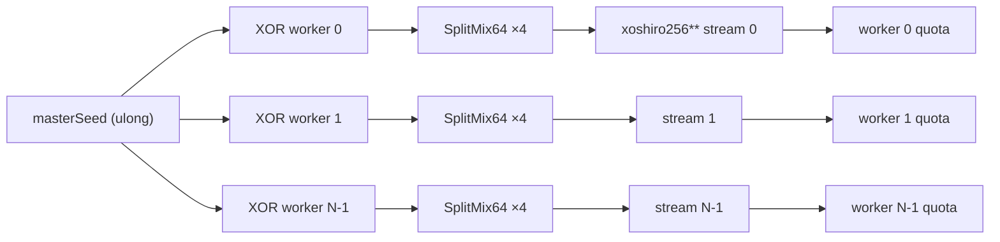

# Money You Can Trust: Integer Millicents and Deterministic Randomness

*Part 2 of a series on building a slot game engine in C#. Part 1 covered the system
design. This chapter builds the money and random-number types used by every spin.*

Type this into any C# REPL: `0.1 + 0.2 == 0.3`. It returns `false`. The fix for what
that hides is a unit change, and the safest place to put it is in the types themselves,
where ordinary code obeys it without remembering a checklist.

## Why floating-point money fails quietly

Try this in any C# REPL:

```csharp
0.1 + 0.2 == 0.3   // false
```

That single line hides three separate failure modes, and a slot simulator runs
into all three.

### Check your understanding

Imagine adding one million wagers of 0.1 credit. Which total is safer: a `double` that stores
`0.1`, or an integer that stores each wager as `10,000` millicents?

<details><summary>Answer</summary>

The integer total. Every addition uses a whole number. The `double` begins with an
approximation of 0.1, and repeated addition can collect rounding error.

</details>

**Failure 1: representation error.** Binary floating point stores numbers as
fractions with a power-of-two denominator, the same way you can write 1/4 or 3/8
exactly but not 1/3. Most decimal fractions, including 0.1 and 0.2, have no exact
binary form. The computer stores the closest binary value it can, and that value is
already slightly wrong before any arithmetic even starts.

**Failure 2: accumulated drift.** Picture a grocery receipt where every line has a
tiny rounding error, a fraction of a cent too high or too low. One line, nobody
notices. Ten million lines, and the register total drifts away from the true total
by a real, measurable amount. A slot simulator runs millions of spins to check
whether the game pays back 86.111% of the money wagered or something else. If the
accounting itself drifts by even a hundredth of a percent, that drift is
indistinguishable from the bug you are trying to find. You cannot tell a real
defect from your own arithmetic noise.

**Failure 3: order dependence.** `double` addition is not associative. `(a + b) + c`
can produce a different bit pattern than `a + (b + c)`, because each addition
rounds, and rounding twice in a different order rounds to a different place. That
sounds academic until the totals come from parallel workers summing millions of
spins each. Two runs with the same seeds, the same spins, the same everything, can
land on two different totals just because the worker threads finished in a
different order. That is a race condition living inside plain arithmetic.

## The floating point fix is a unit change

The fix predates computers. Count in a unit small enough that every quantity you
care about is a whole number, and whole numbers add, subtract, and compare without
any of the three failures above. Banks already do this: a price tag reads \$19.99,
but the register adds 1999 cents, not 19.99 dollars.

A slot game may need awards smaller than one cent, especially when a published
multiplier contains tenths or hundredths. This engine therefore counts
**millicents**: one credit equals 100,000 millicents. The scale controls payout
resolution; it does not determine how many decimal places the RTP calculation can
show. RTP also depends on outcome probabilities. Every wager, payout, and running
total is an integer count of millicents, while the separate analytic layer combines
those integer awards with probabilities.

## The Millicents type

```csharp
/// <summary>
/// A monetary quantity stored as an integer count of millicents
/// (1 credit = 100,000 millicents). Run totals use this representation so addition and
/// comparison do not introduce floating-point rounding. Conversion to credits is reserved
/// for display and ratio calculations.
/// </summary>
public readonly record struct Millicents(long Value) : IComparable<Millicents>
{
    public const long PerCredit = 100_000;

    /// <summary>
    /// Pay multipliers are stored as the real multiplier times this scale. At 100,
    /// 225 represents 2.25 times the total spin wager. Parsers, analyzers, and payout code
    /// read the same value so the internal unit has one authority.
    /// </summary>
    public static readonly long ScaleFactor = 100;

    public static readonly Millicents Zero = new(0);

    public static Millicents FromCredits(long credits) => new(credits * PerCredit);

    public static Millicents operator +(Millicents a, Millicents b) => new(a.Value + b.Value);
    public static Millicents operator -(Millicents a, Millicents b) => new(a.Value - b.Value);
    public static Millicents operator *(Millicents a, long multiples) => new(a.Value * multiples);

    public static bool operator >(Millicents a, Millicents b) => a.Value > b.Value;
    public static bool operator <(Millicents a, Millicents b) => a.Value < b.Value;
    public static bool operator >=(Millicents a, Millicents b) => a.Value >= b.Value;
    public static bool operator <=(Millicents a, Millicents b) => a.Value <= b.Value;

    public int CompareTo(Millicents other) => Value.CompareTo(other.Value);

    /// <summary>
    /// Applies a multiplier expressed in <see cref="ScaleFactor"/>ths of the total spin
    /// wager. At the current scale, 225 means 2.25 times the wager. The wager must be
    /// divisible by the scale so the conversion has no remainder.
    /// </summary>
    public Millicents ScaledMultiply(int scaledMultiplier)
    {
        if (Value % ScaleFactor != 0)
            throw new InvalidOperationException(
                $"{this} ({Value} millicents) is not a multiple of {ScaleFactor} millicents. Pay "
                + $"multipliers are carried internally as the real multiplier × {ScaleFactor}, so the "
                + $"wager must divide evenly by {ScaleFactor} for a fractional multiplier to "
                + "convert to exact millicents.");

        return new Millicents(Value / ScaleFactor * scaledMultiplier);
    }

    /// <summary>The type's only conversion to floating point. Display and ratio math; run totals stay in millicents.</summary>
    public double ToCredits() => (double)Value / PerCredit;

    public override string ToString() => $"{ToCredits():0.#####}cr";
}
```

Four choices matter here:

**It is a `readonly record struct`.** Money behaves like a number, so value
semantics fit: copying a `Millicents` copies its value, equality compares values,
and no object allocation is required for an ordinary local. `readonly` also prevents
the amount from changing after construction. The exact machine code remains a JIT
decision, so this chapter doesn't quote an instruction count.

**`IComparable<Millicents>` gives the type a normal ordering.** Framework methods
such as sorting, minimum, and maximum can compare two amounts without converting
them to another unit.

**Multiplication takes a `long`, not another `Millicents`.** Money times money is
dimensionally meaningless (millicents squared is not a currency), and money times a
fraction is a rounding decision someone should have to make explicitly. Scaling by
an integer, a payout multiplier or a line count, is the only multiplication the
domain needs, so it's the only one that compiles by plain `*`.

**The missing conversion.** There is no implicit conversion to `double`. Write
`total + spinPayout` and it compiles. Write `total * 0.98` and it doesn't. The
invariant, no floating point in any accumulation path, is called M1 in the
architecture document, and the compiler enforces it on every build. The one exit,
`ToCredits()`, is named, documented as display-only, and easy to grep for.

> 🧪 **Try it live.** The companion site's chapter 2 page (<http://localhost:5090>,
> then `#/ch02`) opens with **Lab 1 — Money as an integer**: type a wager and a
> multiplier and watch the millicent arithmetic resolve, including the wagers that
> trip the divisibility guard. The same server code shown above answers every click.

Integer addition also lets workers contribute the same set of subtotals in different
orders without changing the sum. This is invariant **M2, partition invariance**.
It does not mean that changing the worker count produces the same spins; worker count
changes the RNG partition. Chapter 5 separates those two ideas.

## Fractional multipliers without fractional money

A payout multiplier like 1.25X or 2.25X is a fraction, and `Millicents` keeps
fractions out of the accounting. The fix is the same move as before: when the quantity
you're holding isn't a whole number, change its unit until it is.

A multiplier like 1.25X becomes 125 in a unit called **hundredths of the total
spin wager**. 1.75X becomes 175. 2.25X becomes 225. The multiplier is now an integer, and
integers are what Millicents already knows how to handle.

This is fixed-point arithmetic: the code stores an implied decimal place instead
of storing a fraction.
Applying a fraction p/100 to a wager W produces a whole number of millicents only
when 100 divides W evenly. `ScaledMultiply` checks that fact once, with a guard
clause, and every calculation downstream of the check stays a plain integer. The
100 itself lives in one named constant, `Millicents.ScaleFactor`, and every
conversion in the engine derives from it. Changing the scale would still require a
review of imported game data, wager divisibility, accumulator limits, and tests; a
shared constant prevents drift but does not make that domain change free.
Hundredths works for the wager denominations supported by this project, including a
one-penny wager (1,000 millicents). A finer multiplier scale could require a new
rounding policy for denominations that no longer divide evenly.

At a 1-credit wager, or 100,000 millicents, the arithmetic is:

```
1.25X:  100,000 / 100 * 125  =  1,000 * 125  =  125,000 millicents
1.75X:  100,000 / 100 * 175  =  1,000 * 175  =  175,000 millicents
2.25X:  100,000 / 100 * 225  =  1,000 * 225  =  225,000 millicents
```

The division in `100,000 / 100` is safe only because the code checks its remainder
first. An integer division is dangerous
in one specific way: it truncates. `7 / 2` gives 3 and silently throws away the 1.
So the engine only performs a division it has already proven will truncate nothing:

```csharp
if (Value % ScaleFactor != 0)        // remainder must be zero, or refuse to compute
    throw new InvalidOperationException(...);
return new Millicents(Value / ScaleFactor * scaledMultiplier);
```

The `%` operator returns the remainder. Dividing 100,000 by 100 produces a quotient
of 1,000 and a remainder of zero. That zero proves the division
that follows will be like breaking a \$100 bill into a hundred \$1 bills, a change of
form with nothing lost. A nonzero remainder means the wager cannot be cut into 100
equal millicent pieces. In that case the guard throws. The operation either returns
an exact amount or reports that the multiplier cannot be represented in millicents.

Dividing first also avoids making the intermediate value larger than necessary.
Both orders give 125,000 here, but after
the guard, `Value / 100` is a whole number of millicents, one hundredth of the bet,
and integer multiplication can never introduce error. In that order it reads as what
it is: cut the bet into 100 exact pieces, take 125 of them.

No fraction is ever formed, so there is nothing to round. `MillicentsTests` pins this case:
`ScaledMultiply_TwoAndAQuarterXAtOneCredit_IsExactMillicents` asserts the
2.25X result above and stays green.

`ScaledMultiply` is a method on `Millicents` itself, called as
`wager.ScaledMultiply(225)`, rather than a static helper living in some other
class, called as `MoneyMath.Scale(wager, 225)`. The difference is where the
divisibility rule lives. If scaling were a separate static function, any code
anywhere could still construct a `Millicents` and add to it, multiply it, compare
it, without ever routing through the one function that knows the guard clause
exists. Putting `ScaledMultiply` on the type itself means the rule and the data
travel together: the only way around `Value % ScaleFactor != 0` is to skip the
method entirely.

Games declare their multipliers in whatever unit reads naturally in the source PAR
sheet, "units" for whole multipliers, "tenths" for something like 1.5X kept mainly
for files written before hundredths existed, or "hundredths" for a multiplier
tenths cannot state such as 2.25X. Whichever unit a file declares, the loader
rejects any pay that needs more precision than that unit can carry, naming the
finest unit the file can declare in its error rather than silently truncating.
The JSON schema for `payUnit`, and the full reasoning behind it, live in
`docs/game-definition-schema.md`. Internally, the engine compiles every pay to
multiplier × ScaleFactor before `ScaledMultiply` ever runs, so the guard clause above is the
only place a fractional multiplier meets the money type, no matter which unit the
source file used.

This engine operates on a basic rule: **every multiplier is a multiple of the
total spin wager.** Getting this wrong misreads every number in the series.
The engine has no concept of a per-line share of the bet.
When several paylines win on one spin, each line's multiplier scales against the
whole wager and the results add (`LineBetVsTotalBetTests` pins this: two lines
paying 5X and 3X on a 1-credit wager award 800,000 millicents, the summed 8X,
never a split). Traditional multiline paytables are often published the other
way, quoting awards in line-bet units where a 10-line machine divides the stake
across lines first. Transcribe such a PAR sheet's line pays directly into a
multi-payline game file here and the simulated RTP reads many times too high.
Real game data must convert to the total-wager basis on the way in. Orca
Dive in article 7 is a single-line game, where the two conventions coincide
and the difference is invisible; a multi-line transcription is where it bites.

## Millicents always works in whole numbers

Every calculation inside the type resolves to a whole number. Two operations turn
a wager into a payout: `operator *(Millicents, long)` for whole-number scaling (a
wager times a whole-unit bonus award or a whole spin count), and
`ScaledMultiply(int)` for fractional pays, whose divisibility guard catches a
malformed wager before it can produce a silently wrong number. Addition,
subtraction, and comparison are plain integer operations. Nothing in the type can
produce a fraction.

Floating point exists only outside the type. There is no conversion to `double`
anywhere in `Millicents` (invariant M1), so external systems receive accurate
integer values and convert to floats only at the last moment, usually when a
payout is being formatted for display through `ToCredits()`.

## Banker's rounding at the paytable boundary

Millicents refuses fractions everywhere except one place: building the paytable
itself. `PaytableSolver` starts from a canonical paytable, whose payouts are
dimensionless ratios, and scales it by a single factor, `paytableScaleFactor`, toward a target RTP such
as 86.111%. That scaling step produces a real number before it produces a
millicent, because the target RTP itself is a fraction. It is the only place in the
payout-construction path where a fractional value becomes money.

### What the paytable scale factor really means

Start with the short answer:

- `unscaledBaseGameEv` is the average amount the **unadjusted** paytable would return per spin.
  It is calculated from all possible payline wins and their chances, not from a
  payline hit that just happened.
- `paytableScaleFactor` is one global multiplier used to resize every prize in that paytable so its
  average return matches the requested RTP.
- Both numbers are calculated once while building the paytable. They are not
  recalculated on each spin.

Think of `unscaledBaseGameEv` as the answer to a giant imaginary experiment. Suppose we could
play the game a huge number of times using the original, unadjusted prizes. Some
spins would win and many would lose. If we added all the prizes and then divided
by the number of spins, the result would approach `unscaledBaseGameEv`.

For example, imagine an extremely simple one-line game with only two possible
results:

| Result | Chance | Unadjusted prize | Contribution to the average |
|---|---:|---:|---:|
| Hit three stars | 1 in 10, or 10% | 5 bets | 10% × 5 = 0.50 bets |
| No win | 9 in 10, or 90% | 0 bets | 90% × 0 = 0 bets |

Its `unscaledBaseGameEv` is `0.50`. That does **not** mean each spin pays half a bet. A real
spin still pays either 5 bets or 0 bets. It means that over many spins, the
unadjusted table averages half a bet returned for every bet made.

The real game has many symbols, match lengths, and paylines. The calculation does
the same job for every possible listed win:

```text
unscaledBaseGameEv = (chance of win A × prize A)
      + (chance of win B × prize B)
      + ...
      across every payline
```

So, yes, payline hits are part of the calculation, but only as **possible events
with probabilities**. `unscaledBaseGameEv` is not calculated in response to an actual hit. If
there are several paylines, their average contributions are added together. This
makes `unscaledBaseGameEv` the expected base-game return for the whole spin under the
unadjusted paytable.

Why is the table called unadjusted? The canonical paytable is only a prize
*shape*: perhaps the premium symbol pays 60, the next pays 27.3, and the cheapest
pays 1.2. Those numbers establish which wins are large or small compared with one
another, but the table may not yet have the desired RTP.

This is where `paytableScaleFactor` comes in: a correction factor, or, in
junior-high algebra, the scale factor in `new prize = old prize × factor`. The engine first calculates the
canonical table's `unscaledBaseGameEv`, and then computes:

```csharp
var paytableScaleFactor = targetBaseRtp / unscaledBaseGameEv;
```

Read that as:

```text
paytableScaleFactor = average we want / unadjusted average we currently have
```

It works like resizing a recipe. If a recipe feeds 24 people but you need food for
10, multiply every ingredient by `10 / 24`. Here the "recipe" is the whole
paytable. Multiplying every prize by the same number keeps the relative shape of
the prizes while changing their overall size.

Return to the simple star game. Its unadjusted `unscaledBaseGameEv` is 0.50, but suppose the
target RTP is 0.75, meaning 75 cents returned on average for each dollar bet:

```text
paytableScaleFactor = 0.75 / 0.50 = 1.5
new star prize = 5 bets × 1.5 = 7.5 bets
new average = 10% × 7.5 bets = 0.75 bets
```

Because the original table was too small, the factor is greater than 1 and
enlarges every prize. If the original table returned too much, it would be less
than 1 and shrink every prize. If it was already correct, it would equal 1 and
nothing would change.

This makes `paytableScaleFactor` a global paytable multiplier, but not a multiplier used on the
player's result after every spin. The engine applies it once to every canonical
paytable entry when constructing the final paytable. Actual spins use those final,
already-scaled prizes.

One scope note before the worked example: scaling every prize by one global
factor is THIS engine's paytable-solving technique, and the math behind it is
sound (multiply every award by the factor and the average return multiplies by
the same factor). It is
a valid construction method, and it is a simplification of how commercial slot
design usually works. A studio adjusts several levers independently: symbol
frequencies on the strips, individual award sizes, bonus frequency and bonus
value, hit frequency, volatility, jackpot behavior. One global factor preserves
the relative shape of all the prizes and gives up independent control of those
qualities. Regulators such as GLI require the *resulting* theoretical percentage
to be evaluated; they do not prescribe how the paytable gets built. This engine
chooses the one-factor method because its goal is a provable target, and article
4 covers what the method can and cannot tune.

Here is a less simplified worked example. Suppose the canonical table, played straight, returns
`unscaledBaseGameEv = 2.4` bets per bet (240%, a shape, nothing playable), and the game wants a
75% base RTP:

```
paytableScaleFactor = 0.75 / 2.4 = 0.3125

canonical 60    ->  60   × 0.3125 × 100,000  =  1,875,000 millicents   (18.75 bets)
canonical 27.3  ->  27.3 × 0.3125 × 100,000  =    853,125 millicents   (exact)
canonical 2.47  ->  2.47 × 0.3125 × 100,000  =     77,187.5            (a tie!)
```

The first two land on whole millicents on their own. The third lands between two
millicents, and the rounding rule is what decides which.

`PaytableSolver` rounds with `MidpointRounding.ToEven`, better known as banker's
rounding. The "to even" part controls midpoint ties.

The obvious rounding rule, always round a tie up, sounds harmless. 12.5 rounds to
13, 13.5 rounds to 14, and so on. But that rule always breaks the tie the same
direction: every midpoint in the paytable gets pushed high, a built-in upward
bias.

Round-half-to-even breaks each tie toward whichever neighbor is an even number:

| Value | Rounds to | Why |
|---|---|---|
| 12.5 | 12 | 12 is even |
| 13.5 | 14 | 14 is even |

The tie from the worked example above resolves this way: 77,187.5 rounds to
77,188, the even neighbor.

Round-half-to-even removes the built-in upward direction; it does not guarantee the
rounded paytable hits the target RTP. A paytable has a handful of entries, and they
contribute unequally: rounding a frequent small award by one millicent moves RTP far
more than rounding a rare jackpot by one, so there is no law of averages to lean on.
The engine treats rounding as a source of a small, known residual, then recomputes the
realized theoretical RTP from the final rounded table and validates that number.

That one rounding happens in one place, and the rest of the engine reads its result
rather than repeating it. That's invariant **R1**: the analytic RTP calculator and the
spin-by-spin evaluator both read the same already-rounded paytable. Neither one
re-rounds.

Article 7 covers the harder half of this story, the overflow headroom a
`Millicents` accumulator needs across a long run and the sum-of-squares math behind
variance.

## Randomness that can be replayed

Statistical simulation needs random-looking draws. Debugging needs the same run to
happen again. A pseudorandom generator provides both: its output is determined by a
starting value called a **seed**, but the resulting sequence is designed to behave
like random draws for simulation.

The engine does not record millions of generated values. It records how to recreate
them. A replay needs the game definition and code version, master seed, worker count,
and target spin count. With those inputs unchanged, each worker rebuilds the same
stream and consumes it in the same order.

That plan only works if nothing disturbs the sequence. Three tempting ideas each
break it.

**Ambient randomness.** `Random.Shared`,
`Guid.NewGuid()`, anything that pulls entropy from the clock or the operating
system. This is like asking strangers on the street for numbers: you will get
numbers, but you can never walk the same street tomorrow and get the same ones.
One such call anywhere in the engine and the seed no longer determines the run,
so replay is lost. Invariant R3 makes the dependency visible:
*randomness enters a function only through its signature*, as a `ref SpinRng`
parameter. No field stores a generator; no method creates one. Like a card dealer
who may only deal from the deck handed to them, never from a deck in their
pocket, a function can only use the deck its caller handed it. And because the
rule is structural, you can audit the entire assembly with one grep for `Random`.

**Neighboring worker seeds.** Eight workers need eight
different streams. The engine combines the master seed with each worker id, then
uses SplitMix64 to expand that value into the four state words required by
xoshiro256**. SplitMix64 is the seeding mechanism here; calling it "astronomically
far apart" would claim more than the code measures.

**Scheduler-owned RNG streams.** `Parallel.For` is not inherently nondeterministic.
The problem appears when mutable per-thread RNG streams are combined with dynamic
work assignment: thread timing can change which stream supplies a given iteration.
This engine avoids that contract. It gives each logical worker a fixed quota and one
private stream before the run starts. Chapter 5 shows the mechanics.

Together, these rules produce N deterministic worker streams, each bound to a fixed
number of spins. The master seed and worker count are necessary replay inputs, but
they are not the entire record; the game, code, and target spin count matter too.

### What is a fixed quota?

A fixed quota is a work assignment made before the run starts and never revised.
With 8 workers and 10,000,000 spins, each worker receives 1,250,000 spins. When the
division has a remainder, worker 0 receives those extra spins. The engine does not
assign meaningful global spin numbers; it assigns counts.

A quota is a spin count, not a bankroll. Workers do not hold money, so no worker
can run out of it. Each spin is a self-contained experiment: assume a one-credit
bet, spin, record what came back. A worker's ledger reads like a tally sheet,
"spins: 1,250,000, wagered: 1,250,000 credits, returned: 1,076,000 credits,"
where "wagered" is a running count of assumed bets, never a balance that
decreases. The workers are pollsters, not gamblers: each is assigned 1.25
million households, knocks on every door, and writes down the answers. (A study
that does track a player's balance, betting until the money runs out, is
risk-of-ruin analysis. It would consume this engine's spin results and stop at
zero; the RTP check wants every spin counted regardless of any streak, because
it measures the machine, not one player's luck.)

### Why this is not a casino RNG

Regulated gaming RNGs must satisfy the rules of their jurisdiction and test lab.
Those rules cover matters such as statistical behavior, seeding, resistance to
outside influence, and when game outcomes may be drawn. Nevada Technical Standard 1,
for example, prohibits a static initialization seed and requires statistical tests
of the random-selection process.

This project's generator serves a narrower purpose: fast, repeatable simulation.
That makes it useful for tests and unsuitable as evidence that a gaming device is
certified. A casino implementation may also use a pseudorandom generator with seeds;
the difference is not simply "seeded" versus "true random." Certification depends on
the whole design, operating environment, and applicable standard.

Using a second, independently implemented generator can be a useful cross-check. If
two sound generators produce results consistent with the same analytic model, a bug
specific to one mapping or stream becomes less likely. That comparison is additional
evidence, not a replacement for RNG evaluation or game certification.


### The simulation RNG

`SpinRng` is a small test instrument with explicit state. The engine creates one
instance per logical worker with `SpinRng.ForWorker(masterSeed, workerId)` and passes
it by `ref` to code that consumes randomness. There is no runtime plug-in system;
tests can inject a different stream factory at the engine boundary when needed.

```csharp
/// <summary>
/// Deterministic per-worker RNG stream: xoshiro256** seeded via SplitMix64.
/// SplitMix64 expands masterSeed ^ workerId into the four state words.
/// Simulation-grade RNG. Real-money play requires a certified gaming RNG; this is not one.
/// </summary>
public struct SpinRng
{
    private ulong _s0, _s1, _s2, _s3;

    public static SpinRng ForWorker(ulong masterSeed, int workerId)
    {
        // SplitMix64 both mixes the worker id and expands one seed into four
        // well-distributed xoshiro state words (the generator author's own recipe).
        var sm = masterSeed ^ (ulong)workerId;
        SpinRng r;
        r._s0 = SplitMix64(ref sm);
        r._s1 = SplitMix64(ref sm);
        r._s2 = SplitMix64(ref sm);
        r._s3 = SplitMix64(ref sm);
        return r;
    }

    private static ulong SplitMix64(ref ulong state)
    {
        var z = state += 0x9E3779B97F4A7C15UL;
        z = (z ^ (z >> 30)) * 0xBF58476D1CE4E5B9UL;
        z = (z ^ (z >> 27)) * 0x94D049BB133111EBUL;
        return z ^ (z >> 31);
    }

    /// <summary>xoshiro256** next value.</summary>
    public ulong NextUInt64()
    {
        var result = ulong.RotateLeft(_s1 * 5, 7) * 9;
        var t = _s1 << 17;
        _s2 ^= _s0;  _s3 ^= _s1;
        _s1 ^= _s2;  _s0 ^= _s3;
        _s2 ^= t;    _s3 = ulong.RotateLeft(_s3, 45);
        return result;
    }

    /// <summary>Uniform integer in [0, bound) using Lemire's rejection method.</summary>
    public int NextInt(int bound)
    {
        ArgumentOutOfRangeException.ThrowIfNegativeOrZero(bound);

        var range = (ulong)bound;
        var threshold = unchecked(0UL - range) % range;
        while (true)
        {
            var product = (UInt128)NextUInt64() * range;
            if ((ulong)product >= threshold)
                return (int)(product >> 64);
        }
    }

    /// <summary>Uniform double in [0, 1) with 53 random bits.</summary>
    public double NextDouble() => (NextUInt64() >> 11) * (1.0 / (1UL << 53));
}
```

<!-- EXPORT: render this Mermaid block to PNG before publishing -->


> 🧪 **Try it live.** The same chapter 2 page carries **Lab 2 — One seed, many
> workers** and **Lab 3 — Where modulo bias hides**. Lab 2 draws the per-worker
> streams from a seed you choose and shows that re-running it reproduces them; Lab 3
> charts a plain remainder mapping beside the rejection method so the bias becomes
> something you can see rather than something you take on faith.

Four details carry most of the design:

**The algorithm lives in the repository.** Tests do not depend on an undocumented
runtime implementation remaining unchanged. The project owns the sequence it uses
for replay.

**The state words are `ulong`, not `int` or `long`.** xoshiro256** is defined on
raw 64-bit patterns: it shifts bits, rotates them around the end of the word, and
combines two states with XOR, and none of that cares what the pattern "means" as a
number. A signed type like `long` reserves its top bit to mean negative, so a
shift or a rotate that crosses that bit would quietly change the sign along with
the pattern, corrupting the very bits the algorithm depends on. `ulong` has no
sign bit to protect; every one of its 64 bits is just part of the pattern, which
is what a bit-shuffling algorithm like this one actually needs.

**The mutable struct is passed by `ref`.** Calling a random method advances the
caller's stream instead of a temporary copy. C# still permits someone to copy the
struct deliberately, so tests and source checks enforce the convention; the type
system does not make copying impossible.

**`NextInt` rejects the tiny biased tail.** A simple remainder mapping can favor
some stops when the generator's range is not evenly divisible by the reel length.
Lemire's multiply-and-reject method maps the accepted values evenly into
`[0, bound)`. Invalid bounds fail immediately.

The XML documentation labels this a simulation-grade RNG, not a certified gaming
RNG. That scope warning matters because repeatable simulation and regulated game
operation have different requirements.

## Modulo bias, counted

The claim above — "a remainder mapping can favor some stops" — deserves to be
shown, not asserted, because at first hearing "the RNG discards some draws" can
sound like the house putting a thumb on the scale. It is the opposite, and the
arithmetic is small enough to hold in your head.

**The pigeonhole.** A random source hands out one of S equally likely raw
values. You need one of B stops. The remainder mapping `raw % B` deals the S raw
values into the B bins in order, like dealing cards around a table. If S divides
B evenly, every bin gets the same number of raw values and the mapping is fair.
If it does not, the deal runs out mid-lap: the first `S % B` bins hold one raw
value more than the rest, so they are *more likely*, forever, by design.

The smallest familiar case is a **six-sided die**. Deal 32 raw values onto 6
faces with `raw % 6` and the shares come out 6, 5, 5, 6, 5, 5 — two faces land
**20% more often** than the others (6/5 = 1.2). Any dice player would call that
die loaded. A reel is the same object with more faces, so the same load shows
up there:

**Small numbers make it visible.** Take an 8-bit source (S = 256 raw values)
and a 26-stop reel. 256 = 9 × 26 + 22, so the deal makes it around nine full
times and then 22 cards remain: stops 0 through 21 each collect 10 raw values,
stops 22 through 25 collect only 9. Stop 3 is 10/9 ≈ **11% more likely** than
stop 24 — before any game logic exists.

Run that for ten million draws and count the bins, and the skew walks right out
of the noise (seeded run, NumPy, 10,000,000 draws; a fair share is 384,615 per
bin):

| Bins | Raw values each | Predicted count | Measured (10M draws) |
|---|---|---|---|
| 0–21 | 10 | 390,625 | ≈ 390,572 each |
| 22–25 | 9 | 351,562 | ≈ 351,852 each |

Measured max/min ratio: 1.114 against the predicted 10/9 ≈ 1.111. Four stops
are visibly starved. On a real reel those four stops would carry symbols whose
true probability the PAR sheet states exactly — and the game would quietly pay
a different RTP than the math package claims.

Apply the rejection method to the same source and the skew is gone: discard any
raw value of 234 or above (234 = 9 × 26, the largest full lap), redraw, and
map the rest. In the same ten-million-draw run that discarded 8.6% of raw
values, and the bins flattened to a max/min ratio of 1.006 — pure sampling
noise, centered on fair.

**Which bin counts are safe?** The source size is always a power of two
(2⁸, 2³², 2⁶⁴), and the only numbers that divide a power of two are smaller
powers of two. So the remainder mapping is exactly fair for 2, 4, 8, 16, 32 …
stops and biased for **every other count**: every odd number, every prime
except 2, and every even number with an odd factor — 6, 10, 26 all included.
Prime or composite is not the question; "is it a power of two" is.

**A perfect random source does not help.** The bias lives in the *mapping*,
not the generator. A certified hardware RNG producing flawlessly uniform 64-bit
values, folded by `% 26`, still favors 16 of the 26 stops (2⁶⁴ mod 26 = 16).
With a 64-bit source the excess is about one part in 10¹⁸ — unmeasurable in
any simulation you could run — but it is provably nonzero, and game
certification asks for provably zero. Nevada's Technical Standard 1, for
example, requires each outcome of a random selection to be equally probable;
"equal to eighteen decimal places" is not equal. The rejection method makes it
exactly equal, and on a 64-bit source the discard fires about once per 10¹⁸
draws — the fix is mathematically total and practically free.

**The rejected set is the leftover, and it is fixed in advance.** Look again at
the deal: 256 raw values, 26 bins, nine full laps, and 22 values left over that
cannot fill a tenth lap. Those leftovers are the rejected set — in the classic
method, literally the top of the source range (234 through 255), the same
values every time, on every machine, decided by nothing but S and B. Rejection
is not "redraw when the result is unwelcome"; it is a fixed partition of the
source range written down before any randomness exists: values 0–233 map, nine
each per stop; values 234–255 redraw.

### The multiply trick: Lemire's rejection method

The classic method above works, but it pays an integer division (`raw % 26`)
on every draw, and division is one of the slowest things an ALU does. The
engine's `SpinRng.NextInt` uses **Lemire's rejection method** (Daniel Lemire's
"nearly divisionless" technique, 2019), which gets the stop *and* the fairness
check out of one multiply. The trick is easiest in decimal first.

Roll the die first, because everyone already trusts a die. The job: turn one
raw random number into a fair face, 1 of 6. The insight behind the multiply is
to read the raw value as a **fraction of the way through its range**. In
decimal, a 3-digit raw number 000–999 works like a percentage: raw 730 means
"73.0% of the way along the line." A fair die just asks *which sixth of the
line did you land in* — the first sixth is face 1, the second sixth face 2,
and so on to the end. Multiplying by 6 answers that with whole numbers:

```
730 × 6 = 4,380           a 4-digit product
   high digit: 4          = floor(0.730 × 6) → the 5th sixth → face 5
   low 3 digits: 380      = how deep inside that sixth the value landed
```

The high part of the product **is** the face — no modulo needed, it falls out
of the multiply. The low part is the landing position inside the face's slice
of the line, and that is where the fairness check lives: 1,000 values cannot
split into six equal sixths (1000 = 6 × 166 + 4), so four of the sixths hold
one extra value, and the rule "reject when the low digits are less than 004"
shaves exactly those four extras — the values that land at the very start of a
fat sixth. Raw 730's low half is 380, nowhere near the trim zone; face 5
stands.

Here is the complete die in miniature — a 5-bit source (32 raw values) onto
the 6 faces, every case visible. Threshold = 32 mod 6 = 2, so reject when
low < 2; the low column climbs by 6 per row and wraps at every face boundary
(bins 0–5 are faces 1–6):

| raw | ×6 | bin | low | verdict | | raw | ×6 | bin | low | verdict |
|---|---|---|---|---|---|---|---|---|---|---|
| 0 | 0 | 0 | **0** | ✗ reject | | 16 | 96 | 3 | **0** | ✗ reject |
| 1 | 6 | 0 | 6 | keep | | 17 | 102 | 3 | 6 | keep |
| 2 | 12 | 0 | 12 | keep | | 18 | 108 | 3 | 12 | keep |
| 3 | 18 | 0 | 18 | keep | | 19 | 114 | 3 | 18 | keep |
| 4 | 24 | 0 | 24 | keep | | 20 | 120 | 3 | 24 | keep |
| 5 | 30 | 0 | 30 | keep | | 21 | 126 | 3 | 30 | keep |
| 6 | 36 | 1 | 4 | keep | | 22 | 132 | 4 | 4 | keep |
| 7 | 42 | 1 | 10 | keep | | 23 | 138 | 4 | 10 | keep |
| 8 | 48 | 1 | 16 | keep | | 24 | 144 | 4 | 16 | keep |
| 9 | 54 | 1 | 22 | keep | | 25 | 150 | 4 | 22 | keep |
| 10 | 60 | 1 | 28 | keep | | 26 | 156 | 4 | 28 | keep |
| 11 | 66 | 2 | 2 | keep ← boundary | | 27 | 162 | 5 | 2 | keep ← boundary |
| 12 | 72 | 2 | 8 | keep | | 28 | 168 | 5 | 8 | keep |
| 13 | 78 | 2 | 14 | keep | | 29 | 174 | 5 | 14 | keep |
| 14 | 84 | 2 | 20 | keep | | 30 | 180 | 5 | 20 | keep |
| 15 | 90 | 2 | 26 | keep | | 31 | 186 | 5 | 26 | keep |

Before the trim the faces hold 6, 5, 5, 6, 5, 5 — the loaded die from the
start of this section, produced by the multiply exactly as `% 6` produced it.
The two rejects are the heavy faces' *openers*: raw 0 opens bin 0 at low 0,
and raw 16 opens bin 3 at low 0 (96 is exactly 3 × 32, a perfect wrap). Bins 2
and 5 open at low 2 — exactly on the threshold, the first fair seat, kept:
the threshold is the *count of positions to shave*, so "low < 2" removes
positions 0 and 1 and nothing else. After the trim every face holds
**5, 5, 5, 5, 5, 5** — a fair die, by construction rather than by hope. (A
wrinkle worth noticing: because 6 and 32 share a factor of 2, every low lands
even and the odd positions never occur. The rule doesn't care — the trim still
removes exactly the two extras, which both happen to sit at low 0 here.)

A reel is just a die with more faces: a 26-stop strip is a 26-sided die, and
nothing changes but the multiplier — raw 730 × 26 = 18,980 → high digits 18 =
stop 18, low 980, threshold 1000 mod 26 = 12. Now swap the 1,000 for the
**bit combinations of a 64-bit number**. The raw value is one of 2⁶⁴ patterns;
multiply by 26 and the product is 128 bits; the high 64 bits are the stop; the
low 64 bits face the threshold `2⁶⁴ mod 26 = 16`. And here is why the redraw loop is free in practice: the
reject zone is 16 positions out of 2⁶⁴ — about **9 × 10⁻¹⁹**, one redraw per
10¹⁸ draws. The 8-bit classroom example rejected 8.6% of draws; the 64-bit
production source rejects so rarely that a simulation drawing a billion stops
per second would wait roughly thirty years to see its first redraw. Exactness
costs one multiply and one compare.

`SpinRng.NextInt` is exactly this: one 64×64→128 multiply, high bits become
the stop, low bits checked against a per-reel precomputed threshold, redraw on
the astronomically rare miss. The one division in the whole scheme —
computing `2⁶⁴ mod B` — runs once per reel at construction, never per spin.

**Every reel carries its own threshold.** The leftover depends on the bin
count, and a real game mixes bin counts: Orca Dive's strips run 26, 29, 26,
29, 26 stops. So one threshold cannot serve the whole game — a 26-stop reel
must reject its own leftover (2⁶⁴ mod 26 = 16 raw values) and a 29-stop reel
its own (2⁶⁴ mod 29 = 24). `StripReelSet` computes each reel's range and
rejection threshold once, at construction, straight from that reel's strip
length, and every window draw indexes them per reel
(`_rngRanges[reel]`, `_rngThresholds[reel]`). A 26-stop reel and a 29-stop
reel drawn in the same spin each get exactly uniform stops from their own
arithmetic, and the per-spin cost of that correctness is zero divisions —
which is why article 9 can precompute it without changing a single
probability.

**Why discarding is honest.** The discard decision looks only at the raw bit
pattern, before it becomes a stop, a symbol, or a payout. It cannot see wins.
Every *stop* remains reachable and every stop is exactly equally likely — that
is the whole effect. It is the same rule as "the die bounced off the table,
throw again": a malformed throw is rerolled; a disliked result never is. Test
labs accept rejection-based mapping for precisely this reason — what they
forbid is bias in the outcome, and rejection is the standard way to remove it.

## What these types guarantee

Neither type knows what a reel is. `Millicents` handles money arithmetic;
`SpinRng` advances a deterministic stream. The rest of the system can rely on these
smaller contracts:

- Within the checked accumulator range, payout totals use integer addition and do
  not change when the same contributions arrive in a different order.
- Spin logic declares its RNG dependency in its signature.
- A run can be replayed when its full input record is preserved.

The paytable rounding rule and worker-seeding recipe each have one implementation, so
a policy change has one authoritative place to edit.

Next in the series: what a reel actually is, and the modeling mistake that gets every
single-symbol probability right and every two-symbol probability wrong.

## References

- [Blackman and Vigna's xoshiro/xoroshiro reference](https://prng.di.unimi.it/)
  documents xoshiro256**, its statistical scope, and SplitMix64 seeding.
- [Lemire, "Fast Random Integer Generation in an Interval" (2019)](https://arxiv.org/abs/1805.10941)
  is the multiply-based rejection method `NextInt` implements.
- [Nevada Technical Standard 1](https://www.gaming.nv.gov/siteassets/content/home/features/TechnicalStandard1.pdf)
  provides one jurisdiction's RNG and random-selection requirements.
- [GLI software submission requirements](https://gaminglabs.com/getting-started/submit-new-software/)
  list percentage calculations, reel strips, paytables, source code, and RNG evidence
  among common submission materials.

*Source files: `Money/Millicents.cs`, `Simulation/SpinRng.cs`.*

## Optimization notebook

`NextInt` runs once per reel per spin, so its setup cost may matter at tens of millions of
spins. Keep the validated API while building the system. After reel lengths become stable
construction-time data, measure whether their Lemire ranges and rejection thresholds are
worth calculating once. Episode 9 performs that experiment.
