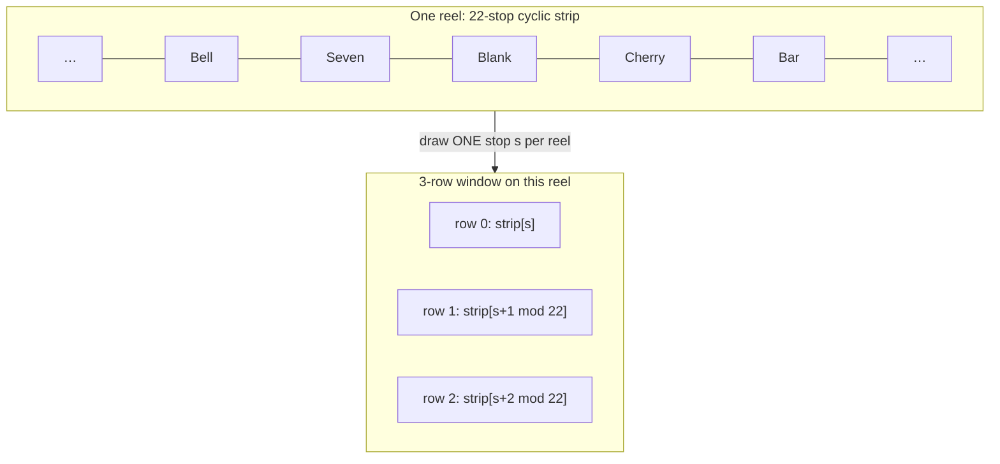

# Reels Are Strips, Not Dice: Modeling Slot Geometry

*Part 3 of a series on building a slot game engine in C#. Parts 1 and 2 covered the
system design and the foundation types. This one models the machine itself: reels,
windows, and paylines, including a modeling mistake that preserves single-cell
probabilities while breaking multi-cell probabilities.*

Ask a programmer to model a slot reel and you'll often get a weighted random
choice: Seven appears once in 22 stops, so `P(Seven) = 1/22`; roll once for every
visible cell, done. For a one-row reel game, that can be enough. It is not enough
for the strip-based, multi-row games this engine models, because the cells visible
on one reel come from neighboring positions rather than separate random draws.

That qualification matters. Modern slot games can use virtual reel maps,
independently generated symbol positions, expanding reels, cascading grids, and
many other designs. An ordered reel strip is a standard and important slot model,
but it is not the only possible slot model. This chapter explains the model used
by this engine: independently stopped reels whose visible symbols are adjacent
positions on ordered cyclic strips.

Before going further, here are the four pieces in plain language:

| Term | Meaning |
|---|---|
| **Reel strip** | The ordered loop of symbols belonging to one reel |
| **Stop** | The numbered position where that reel lands |
| **Window** | The grid of symbols visible after all reels stop. Each column belongs to one reel. |
| **Visible symbol position** | One top, middle, or bottom location in a reel's visible column |
| **Screen row** | A horizontal band across the full window, such as the top row across five reels |
| **Payline** | A path across the window. It chooses one visible symbol position from each reel. |

### Check your understanding

A cherry appears twice on a 20-stop reel. What is the chance that a chosen row shows a
cherry after the reel stops?

<details><summary>Answer</summary>

`2 ÷ 20 = 0.10`, or 10%. The positions of those two cherries also affect which symbols can
appear directly above and below them.

</details>

## What a strip-based reel is

In this engine, a reel is an **ordered cyclic strip**: a fixed sequence of symbols,
say 22 of them, joined end to end. A spin draws one uniform random *stop index* per
reel. An index is just a numbered location; if the locations are numbered 0 through
21, the stop index tells the engine where the visible part of the reel begins. The
window then shows that stop and its neighbors: for a 3-row window, positions
`s, s+1, s+2`, wrapping around the end of the strip.

> 💡 **Quick picture.** Picture a charm bracelet with 22 charms fixed in a loop.
> Spin the bracelet and stop it anywhere: three charms sit in the little display
> window at once, and they are always the same three relative to each other,
> because they are riveted to the same wire. You cannot get the crown charm in the
> middle slot without the two charms next to it on the wire showing up on either
> side. That's a reel: one random spin, three symbols that come as a fixed set.

<!-- EXPORT: render this Mermaid block to PNG before publishing -->


One random number selects the stop for this reel. That one stop produces all three
visible cells in this reel's column. Position 0 reads `strip[s]`, position 1 reads the
next symbol on this same strip, and position 2 reads the symbol after that.

This relationship is vertical and local to one reel. It does not apply across a screen
row. A five-reel game has five separate strips and draws five stop numbers, one for each
strip.

Suppose one reel contains `Seven, Blank` at neighboring strip positions. Whenever that
Seven lands in visible position 0 on this reel, the neighboring Blank must land in
visible position 1 on this same
reel. The conditional probability is 1. An incorrect model that rolls row 0 and row 1
separately would miss that fixed neighbor relationship.

The mistake is easy to miss because the symbol counts agree while the order does
not. Any
single cell shows Seven with probability 1/22 under both models, because the strip
is cyclic and every stop is equally likely, so the two models never disagree about
*how often* a symbol appears in one chosen cell. What they disagree about is *which
symbols appear together in different rows of the same reel*. A strip-based reel is one
draw that fixes its whole visible column.

One ordinary payline reads one cell from reel 1, one from reel 2, and so on. It never
reads two rows from the same reel. A V-shaped line changes its chosen row as it moves
from reel to reel, but still uses one cell per reel.

The neighbor relationship matters when a calculation examines two visible positions on
the same reel. Two paylines may choose different positions from that reel. A scatter rule
may inspect every visible position on it. Those calculations need the ordered strip, because symbol counts alone
do not say which symbols are neighbors.

That distinction is what the type below exists to preserve.

## StripReelSet

```csharp
/// <summary>
/// Each reel owns one ordered cyclic strip. A spin chooses one stop on each reel. The visible
/// symbol positions for that reel then read neighboring locations from that same strip: s, s+1, and so on,
/// wrapping at the end. Separate reels choose their stops independently.
///
/// Symbol counts can give the chance for one cell, but they do not record which symbols are
/// neighbors. Calculations that inspect two visible positions on the same reel need the ordered strip.
///
/// Reel count, per-reel stop count and window height all arrive as arguments. Strips of
/// differing lengths on the same machine are normal; Orca Dive, the fictional game this
/// project ships, has 26/29/26/29/26 stops, so each reel's length is read separately.
/// </summary>
public sealed class StripReelSet
{
    /// <summary>The window height every stock preset uses. A game definition may declare another.</summary>
    public const int DefaultRows = 3;

    /// <summary>The shortest window this version supports and tests.</summary>
    public const int MinRows = 3;

    /// <summary>The tallest window this engine currently supports and tests.</summary>
    public const int MaxRows = 5;

    private readonly Symbol[][] _strips;

    public StripReelSet(IReadOnlyList<IReadOnlyList<Symbol>> strips, int rows = DefaultRows)
    {
        if (rows < MinRows || rows > MaxRows)
            throw new ArgumentOutOfRangeException(
                nameof(rows), rows, $"A window must have {MinRows}..{MaxRows} rows.");
        // … reel and strip validation …
        // Copy the caller's arrays so later mutations cannot change an active game.
        _strips = strips.Select(strip => strip.ToArray()).ToArray();
        Rows = rows;
    }

    public int ReelCount => _strips.Length;
    public int Rows { get; }
    public int WindowSize => ReelCount * Rows;
    public int StopCount(int reel) => _strips[reel].Length;
    public ReadOnlySpan<Symbol> Strip(int reel) => _strips[reel];

    /// <summary>Marginal P(symbol at any row of this reel) = count-on-strip / S.</summary>
    public double ProbabilityOf(int reel, byte symbolId)
    {
        var strip = _strips[reel];
        var count = 0;
        foreach (var s in strip)
            if (s.Id == symbolId) count++;
        return (double)count / strip.Length;
    }

    /// <summary>Joint P(rowA shows a AND rowB shows b) on one reel, found by
    /// enumerating all S stops. This is the method the weighted-die model lacks.</summary>
    public double JointProbabilityOf(int reel, int rowA, byte aId, int rowB, byte bId)
    {
        var strip = _strips[reel];
        var n = strip.Length;
        var count = 0;
        for (var stop = 0; stop < n; stop++)
            if (strip[(stop + rowA) % n].Id == aId && strip[(stop + rowB) % n].Id == bId)
                count++;
        return (double)count / n;
    }

    /// <summary>Draw one spin window. One uniform stop per reel; rows are strip-adjacent.</summary>
    public void DrawWindow(ref SpinRng rng, Span<Symbol> window)
    {
        for (var reel = 0; reel < _strips.Length; reel++)
        {
            var strip = _strips[reel];
            var stop = rng.NextInt(strip.Length);
            for (var row = 0; row < Rows; row++)
            {
                var pos = (stop + row) % strip.Length;
                window[reel * Rows + row] = strip[pos];
            }
        }
    }

    /// <summary>The symbol shown at (reel, row) for a given stop, wrapping cyclically.</summary>
    public Symbol At(int reel, int stop, int row) => _strips[reel][(stop + row) % _strips[reel].Length];
}
```

A few choices in that listing need explaining.

**Geometry is data.** Reel count, per-reel strip length, and window height all
arrive as constructor arguments. Reels on the same game can have different strip
lengths; Orca Dive, the fictional game in article 7, has 26/29/26/29/26 stops
across five reels, so `StopCount(reel)` is per reel, never a single field.
Hardcoding "5 reels, 3 rows" would have held until the first loaded game arrived,
and again until the first 4- and 5-row window.

The public constructor accepts `IReadOnlyList<IReadOnlyList<Symbol>>`. The outer list is
the set of reels. Each inner list is one ordered strip and may have its own length. A
caller can therefore supply 26 stops for reel 1 and 36 for reel 2.

Internally, `_strips` remains a jagged `Symbol[][]` for direct indexed access. The
constructor copies every inner list. If a caller edits its original `Symbol[]` later,
the active game does not change. To use different strips, build a new `StripReelSet` for
the next run.

```csharp
IReadOnlyList<Symbol> reel26 = Build26StopStrip();
IReadOnlyList<Symbol> reel36 = Build36StopStrip();

var runA = new StripReelSet([reel26, reel26, reel26]);
var runB = new StripReelSet([reel36, reel26, reel36]);
```

This is replacement, not mutation. Workers and analytic code share one stable snapshot
during a run.

## Extending the strip for faster window reads

A stop near the end of a reel wraps to the beginning. The direct formula is easy to
recognize:

```csharp
strip[(stop + position) % strip.Length]
```

That remainder operation would run once for every visible cell. A 10-million-spin game
with five reels and three visible positions writes 150 million cells, so the inner loop
would perform 150 million remainder operations.

`StripReelSet` removes them by appending the first `Rows - 1` symbols to a private drawing
array when the reel set is constructed:

```text
physical strip:  A B C D E
drawing array:   A B C D E A B
```

For a three-position window starting at D, the engine reads `D E A` as one contiguous
slice. The spin loop becomes `drawStrip[stop + position]`, with no wrap calculation.

The engine supports windows only three to five positions tall, so this costs two to four
extra symbol references per reel. It does not double a 26-, 64-, or 128-stop strip. The
original array remains the authority for stop counts and probability calculations; the
extended array is only a lookup layout for drawing windows. Very short synthetic strips
also work because the appended entries repeat cyclically as needed.

## Why this boundary fits CUPID

- **Composable.** Callers may combine any valid reel strips. JSON games, generated presets,
  and tests all meet at the same constructor.
- **Unix philosophy.** `StripReelSet` preserves and reads reel geometry. A feature that
  decides when to change reel sets belongs in game logic.
- **Predictable.** A run's strips cannot change behind its workers. The same reel snapshot,
  seed, and worker count reproduce the same draw sequence.
- **Idiomatic.** The public API accepts read-only collections. The implementation copies
  them into arrays suited to the hot path.
- **Domain-based.** Each reel owns one strip. The model does not invent a machine-wide
  `StopsPerReel` rule when actual reels may have different lengths.

## Exact PAR strips and generated demo strips

An exact PAR strip and a symbol-count table are not the same input.

If the PAR sheet lists every stop, that order is part of the game mathematics. The
loader preserves it and passes the completed arrays directly to `StripReelSet`. No
generator runs. This matters because adjacent visible positions come from adjacent
stops. Rearranging a strip can leave each symbol's one-position probability unchanged
while changing the probability of two-symbol windows.

The historical demo presets have only symbol counts. For those presets,
`EvenlySpacedStripBuilder` must choose an order. Suppose a 10-stop reel contains two
Pearls. The marginal probability of Pearl at one position is fixed by the count:

```text
P(Pearl) = 2 / 10
```

That equation says nothing about whether the Pearls are neighbors or five stops apart.
The builder places copies at the centers of equal intervals on a temporary 0-to-1 ruler:

```text
temporary position = (copy number + 0.5) / number of copies
```

Two Pearl copies therefore receive positions 0.25 and 0.75. Three copies would receive
1/6, 3/6, and 5/6. The builder creates these marks for every symbol, sorts all marks,
and discards the marks. A symbol-id tie breaker makes the result deterministic.

Even spacing is useful for a demo because it avoids an accidental block of identical
symbols and gives the same strip on every run. It is not a reconstruction of a real
reel. Only a published stop list can supply the real adjacency. The code makes that
limit visible by keeping the policy in `EvenlySpacedStripBuilder`, called by
`StandardReelPresets`, while `ReelPreset` stores only completed strips.

A Strategy pattern would not improve this boundary today. The spin engine never chooses
between strip-building algorithms, and exact PAR data is not an algorithm. Both paths
already compose at the smaller and clearer boundary: an ordered `Symbol[]`.

`MinRows`, `MaxRows`, and `DefaultRows` are declared `const`, not `static
readonly` the way `Millicents.ScaleFactor` is in article 2. The difference is
what each number means. `ScaleFactor` is a runtime tuning value the engine reads
fresh so a future change never bakes a stale copy into a compiled consumer.
`MinRows` and `MaxRows` describe a fact about *this version of the engine*: how
tall a window the geometry and payline math have been built and tested to
support. Raising `MaxRows` to 6 someday isn't a configuration change a deployed
build could make on its own; it's a decision to extend the engine, which means
new code, new tests, and a new version, so there's nothing lost by letting the
compiler bake the current bound in everywhere it's read.

**Two probability queries, two jobs.** `ProbabilityOf` answers the marginal
question and feeds the expected-value math (article 4). `JointProbabilityOf`
answers the two-rows-one-reel question by walking every stop on the strip: S
iterations with no statistical sampling, and feeds the variance math. The counted
fraction is exact; exposing it as a `double` can still introduce the normal tiny
floating-point representation error discussed in article 2. Both queries live on
the type that owns the strips, so the analytic layer never touches a raw symbol array.

These two functions could have been written as one, `ProbabilityOf(reel, symbolA,
rowA, symbolB = null, rowB = null)`, with the joint calculation only running when
the second pair of arguments is supplied. That shape hides two facts a reader needs
up front. The two queries cost different amounts of work: marginal is a single pass
over the strip, joint is the same pass checking two positions per stop. And they ask
two different questions, one symbol's frequency versus two symbols' frequency
together. Separate names put both facts in the signature.

**The draw allocates nothing.** `DrawWindow` returns `void` and takes a
`Span<Symbol> window` parameter instead of returning a new `Symbol[]`. A `Span<T>`
is a view onto memory the caller already owns; writing through it fills the
caller's own array in place, no new object created, no data copied in or out.
A method that returns `Symbol[]` has to allocate that array somewhere, on every
single call, no matter how the caller uses the result. Filling a buffer instead is
what keeps the draw allocation-free. `Strip(int reel)` returns a
`ReadOnlySpan<Symbol>` for the same reason in the other direction: a read-only
window onto the strip array that exists already, so a caller can inspect one
reel's stops without a copy and without a chance to modify them. Both spans exist
because this method runs once per spin, tens of millions of times a run, and the
engine reuses one caller-owned window buffer per worker for the whole run.

**Symbol ids are a `byte`, not an `int`.** `ProbabilityOf` and every other symbol
lookup in this engine takes a `byte symbolId`, and `Symbol.Id` is declared `byte`
too. A real machine's symbol table, ten or twelve names, fits comfortably inside
the 256 values a `byte` can hold, so there's headroom to spare without reaching
for a wider type. A `byte` is also one-quarter the size of an `int`, so a window
array (`Symbol[]`, one entry per visible cell) holding byte-sized ids packs four
times as many symbols into the same block of memory, and more of it fits in the
CPU's cache on the hottest loop in the engine.

**One type draws and reports.** `DrawWindow` and `ProbabilityOf` read the same
strips, so the simulator and the analytic calculator cannot disagree about the
geometry. Split those into a "runtime reel" and a "math reel" and there would be two
places for the geometry to drift apart.

> 🧪 **Try it live.** The companion site's chapter 3 page (<http://localhost:5090>,
> then `#/ch03`) is built on this type. **Lab 1 — The window over the strip** walks a
> spin one stop at a time so you can watch the window slide along the strip, and
> **Lab 2 — The strip is the distribution** counts a symbol's stops and compares that
> census with the odds the engine derives from the same strip.

## From a stopped reel to a paid line, step by step

Everything the rest of this article covers is one pipeline, five steps, run once
per spin. Before the worked examples, walk it once in words.

1. **Draw one stop per reel.** `DrawWindow` picks a uniform random stop index for
   every reel, independently. Nothing about a payline has entered the picture yet;
   this step only decides where each reel physically stopped.
2. **Read the window.** Each reel's stop, plus its neighbors, fills a grid: rows
   tall and reels wide. This grid is the visible outcome of the spin.
3. **Walk each payline.** A payline is a row-index pattern, one row number per
   reel, read left to right. `Payline.Rows[0]` says which row to read on reel 0,
   `Payline.Rows[1]` says which row on reel 1, and so on. Reading a payline means
   picking exactly one cell out of the grid, per reel, and lining those cells up in
   order.
4. **Find the leftmost run.** Starting from reel 0, compare each cell on the line
   to the first one. Count how many reels in a row match before the first mismatch.
   That count is the *run length* for this line.
5. **Look up the pay, and sum across lines.** If the run is long enough, the
   paytable has an entry for that symbol at that run length; if it's too short, the
   line pays nothing. Every payline on this machine is scored separately with this
   same five-step process, and the amounts that do pay are added together for the
   spin's total. “Separately” does not mean the lines are statistically independent:
   two lines can share visible cells and therefore tend to win or lose together.

Step 5 is where a paytable's *numbers* enter the picture. In this project's stock
game generator, those numbers begin as a canonical shape: a set of ratios saying
which symbols pay more than others. One `paytableScaleFactor` resizes that shape
toward the target RTP. This is the solver used by this
project, not a rule requiring all commercial slot paytables to be designed that
way. Article 2 covers the scale factor in full; the pays used in this article's
examples are already the finished numbers used for play.

## Paylines: configured shapes, with demo defaults

A payline picks one row per reel. Center is `[1,1,1,1,1]` on a 3-row window, and a
V is `[0,1,2,1,0]`. In the games modeled here, line wins are evaluated from the
leftmost reel toward the right. Other slot games may pay right-to-left, both ways,
or use ways-to-win instead of fixed paylines, so left-to-right is a rule of this
game model rather than part of the definition of every payline. The engine accepts
the path as data. Its built-in demo presets use generated shapes, but a game file may
carry a path copied from a PAR sheet:

```csharp
public sealed record Payline
{
    public Payline(string name, IReadOnlyList<int> rows)
    {
        ArgumentException.ThrowIfNullOrWhiteSpace(name);
        ArgumentNullException.ThrowIfNull(rows);
        Name = name;
        Rows = Array.AsReadOnly([.. rows]);   // construction-time snapshot
    }

    public string Name { get; }
    public IReadOnlyList<int> Rows { get; }

}

public static class StandardPaylines
{
    public static IReadOnlyList<Payline> For(
        int reels, int lineCount, int visiblePositions) { /* … */ }
}
```

A `Payline` is a name and one visible-position index per reel: pure data, with no
catalog policy. The
constructor copies the caller's row list into a read-only snapshot, so a line's
shape is fixed the moment it is built.

There are two ways to create that record:

- `GameDefinitionBuilder` validates each explicit path transcribed from a PAR sheet,
  then calls `new Payline(name, positions)`. A path such as `[0,2,1,0,2]` does not
  need to match a built-in shape.
- `StandardPaylines` generates Center, Top, Bottom, V, Hat, and zigzag paths for the
  old demo presets. It is a convenience catalog, not a restriction on loaded games.

The same split applies to reel strips. PAR-transcribed JSON builds a `StripReelSet`
from its explicit symbol arrays. `StandardReelPresets` holds the historical demo
recipes. Either source may give each reel a different number of stops. After loading,
the spin code sees the same `Payline` and `StripReelSet` types either way.

## A single line, paid

The Orca Dive game definition used by this project declares one line, the
Center row, and pays 3-of-a-kind Seal at 20 times the total spin wager. Here is a
window where that line wins, drawn as a grid. The Center payline reads row 1 (the middle
row) on every reel; that row is marked with `←` to show which one the line actually
reads.

```
reel:        1        2        3        4        5
row 0:    Mackerel  Squid     Herring  Green7   Mackerel
row 1:     Seal      Seal     Seal    Squid    Mackerel   ← Center payline
row 2:    Squid     Herring   Mackerel Blue7    Salmon
```

The grid labels reels 1–5 for reading; the code indexes them 0–4.

Reading the Center payline, left to right: `Seal, Seal, Seal, Squid, Mackerel`. The
first three reels match Seal; the fourth breaks the run with Squid. Run length 3.
Orca Dive's paytable has an entry for Seal at a run of 3 (it pays 20), so this
line pays 20 times the wager. (Orca Dive has one line, so the total-wager basis from
article 2 and the traditional line-bet basis happen to name the same number here.)
Rows 0 and 2 are drawn in the grid because the player can see them, but the Center
payline never reads them; they have no effect on this line's payout at all. In a
multiline game the two bases diverge: ten lines at one credit per line means a
ten-credit total spin bet.

## Why doesn't this pay? Two near-misses

A common misreading of a payline is "I can see three Seals, why
didn't I win?" There are two different ways to have three of a symbol visible and
still be paid nothing, and both come straight out of the five-step pipeline above.

**Near-miss 1: the run doesn't start on reel 0.** A payline pays a *leftmost* run;
step 4 always starts counting from reel 0. If the payline's cells read
`Mackerel, Seal, Seal, Seal, Squid`, there really are three Seals in a row on the
line, but they start on the second reel rather than the first. Comparing everything to the first cell
(Mackerel), the run length is 1, because Mackerel doesn't match Seal. Three Seals sit
on the line and the line still pays nothing, because a slot payline reads like a
sentence: it always starts at the beginning, and it never skips ahead to find a
match further in.

**Near-miss 2: the symbols are visible but not on the line.** Take the same window
from the worked example above, but move the three Seals so they sit at
`(reel 1, row 0)`, `(reel 3, row 2)`, and `(reel 5, row 2)`, scattered around the
grid. All three Seals are visible on screen. None of them sit on the Center
payline's row (row 1), so the Center line reads whatever *is* in row 1, which might
be a run of length 1 or 2, and if it's below the paytable's minimum winning run,
this spin pays nothing at all, no matter how the rest of the window looks.

One thing to be precise about: this rule is about *line* symbols, not every symbol
on the machine. Scatter symbols, which article 7 covers, are a deliberate
exception; a scatter is designed to be checked *anywhere in the window*, not along
a line, which is what makes it a different kind of symbol from an ordinary paying
one.

## Several lines, one spin

Many slot games offer more than one payline. To show what happens when several
fire at once, consider an illustrative example built from the engine's five generated
5-reel, 3-row line shapes (`StandardPaylines.For(5, 5, 3)`): Center,
Top, Bottom, V, and Hat. Under this engine's total-spin-wager convention, let symbol
B pay 10 wager-multipliers for a run of 3. The round number keeps the arithmetic
easy to follow by hand.

```
reel:        1     2     3     4     5
row 0:       B     A     C     A     A     ← Top payline
row 1:       B     B     B     Y     Z     ← Center payline
row 2:       C     B     B     D     C
```

The V payline reads `(reel 1, row 0), (reel 2, row 1), (reel 3, row 2), (reel 4,
row 1), (reel 5, row 0)`.

Walking all five configured lines through the five-step pipeline:

- **Top** (row 0): `B, A, C, A, A`. Reel 1 is B, reel 2 is A: mismatch immediately.
  Run length 1. Below the minimum winning run. Top pays nothing: a third
  near-miss, on a line that never lined up.
- **Center** (row 1): `B, B, B, Y, Z`. Reels 1 through 3 match B; reel 4 breaks the
  run with Y. Run length 3. Center pays 10.
- **Bottom** (row 2): `C, B, B, D, C`. The first two symbols differ. Run length 1.
  Bottom pays nothing.
- **V** (`0,1,2,1,0`): reading those five cells gives `B, B, B, Y, A`. Reels 1
  through 3 (by position along the line, not by row) match B; the fourth position
  breaks the run with Y. Run length 3. V pays 10.
- **Hat** (`2,1,0,1,2`): `C, B, C, Y, C`. The first two symbols differ. Run
  length 1. Hat pays nothing.

Total line award for the spin: Center's 10 plus V's 10, for 20 times the total spin
wager under this engine's convention. In a traditional per-line paytable, those
amounts would first be based on each line's wager and then added. Either convention
can work, but the data and evaluator must use the same one. RTP always divides the
total award by the **total spin wager**. This is the rule
`LinePayEvaluator` below and article 7's `WinEvaluator.EvaluateWindow` both apply:
every line is scored separately by the same five-step process, and every line
that pays adds its amount to the spin's total. Center and V share two cells: reel
2's row 1 and reel 4's row 1 sit on both lines, which is why the two lines break at
the same reel (reel 4, where both read Y). Two lines sharing cells tend to pay
together, which is the correlation this article opened with. Article 4 turns that
same fact into the analytic variance formula for a multi-line game.

## How many rows can this engine's window have?

Every example so far used a 3-row window, the height every classic and stock video
slot preset uses. The engine also supports 4- and 5-row windows, declared per game
with `windowRows` in the JSON file. `StripReelSet.MinRows` is 3 and `MaxRows` is 5;
a value outside that range is rejected at load time, and the loader's message names
both bounds:

```
windowRows must be 3..5; got 2.
```

`MinRows` is 3 because the stock V and zig-zag generator expects a middle row
between the top and bottom. This is an engine design limit, not a slot-industry
minimum; games with one-row or two-row displays exist. `MaxRows` is 5 because that
is the largest window covered by this project's current game definitions and tests,
not because slot mathematics stops working past five. Every
consumer of `Rows`, from `StripReelSet` itself through the evaluator to the
analyzer, already reads the window height as a number rather than assuming 3, so
raising the ceiling later is a small, contained change.

## The geometry at 4 and 5 rows

`StandardPaylines.For` computes three position constants fresh on every call, from the window
height it's given, never from a fixed literal:

```
topRow = 0
bottomRow = rows - 1
middleRow = rows / 2        (integer division)
```

At **5 rows**, the rows are numbered 0 through 4, and `middleRow` comes out to 2,
the true center: two rows above it, two rows below. A Center payline reads row 2 on
every reel. The zig-zag shapes, which alternate between an edge row and
`middleRow`, swing the same distance on both sides: top to middle is a 2-row swing
(0 to 2), and middle to bottom is also a 2-row swing (2 to 4). Symmetric, because
5 is odd and has an exact middle.

At **4 rows**, the rows are numbered 0 through 3, and there is no row exactly in
the middle. `middleRow = 4 / 2 = 2`, which integer division rounds toward the
*bottom* half rather than the top: row 2 is the lower of the two central rows (1
and 2), not the upper one. This single rounding choice has a real, visible
consequence: a zig-zag alternating between the top row and `middleRow` swings 2
rows (0 to 2), while a zig-zag alternating between the bottom row and `middleRow`
swings only 1 row (3 to 2).

**5 rows — odd, so there is a true center:**

```
row 0  ─┐
row 1   │  top zig-zag swings 2 rows (0→2)
row 2  ─┤← middleRow
row 3   │  bottom zig-zag swings 2 rows (4→2)
row 4  ─┘
```

**4 rows — even, so there is no true center:**

```
row 0  ─┐
row 1   │  top zig-zag swings 2 rows (0→2)
row 2  ─┤← middleRow (rounds toward the bottom half)
row 3  ─┘  bottom zig-zag swings 1 row (3→2)
```

Rounding the other way would put the shorter swing on the top side instead. A 4-row
window has no single center row for any rounding rule to find.

One shape does *not* change with this rounding: a V or a Hat always spans the full
window height, top row to bottom row, regardless of how many rows there are or
whether the count is even or odd. That's because the V and Hat shapes ramp between
the two edge rows directly; the "middle" they use to decide the *ramp's turning
point* is the middle *reel*, not the middle *row*. Only the shapes that
deliberately alternate through `middleRow`, the zig-zags, ever see the row-parity
asymmetry.

## Proof from a hand-built fixture

The geometry above is pinned as expected values in `MultiRowWindowTests.cs`, checked
against a small hand-built game at both 4 and 5 rows. Here is the 5-row case worked
by hand.

The fixture is a 3-reel game with a 20-stop strip repeated on every reel. Each
strip carries 4 copies of symbol A and 2 copies of a scatter symbol, Star, placed
far enough apart that their in-window ranges never overlap. The one payline reads
`middleRow` on every reel (row 2, the true center at 5 rows), and pays A at a run
of 3.

**Line hit frequency.** Each reel independently shows A on the payline with
probability `4/20 = 0.2` (4 A's out of 20 stops). Three reels, independent:
`0.2 × 0.2 × 0.2 = 0.008`. The paytable pays 5 at a run of 3, so the line's
expected award is `5 × 0.008 = 0.04` times the wager. Because this fixture uses a
one-unit wager basis, that is also an RTP contribution of `0.04`, or 4%.

**Scatter trigger probability.** The window height enters the formula
directly. A Star at a fixed stop position shows up *somewhere in the window* for
`rows` different possible stop positions of that reel, because the window is
`rows` cells tall and any of those cells landing on the Star's position counts. With
2 Stars per reel and a 20-stop strip, the chance a given reel's window contains a
Star anywhere is:

```
(Star count × rows) / strip length  =  (2 × 5) / 20  =  0.5
```

All three reels must show a Star somewhere in their window for the bonus to
trigger, and reels are independent, so the trigger probability is `0.5³ = 0.125`.

**Bonus RTP.** The bonus in this fixture pays one prize worth 8, with one blank
that ends the round for a consolation of 2. Following article 7's symmetry
argument, the mean collected prize is `8 × 1/(1+1) = 4`, so the bonus's mean award
is `4 + 2 = 6`. The bonus's RTP contribution is `0.125 × 6 = 0.75`.

**Total.** `0.04 + 0.75 = 0.79`, matching the expected values checked by
`MultiRowWindowTests.SyntheticGame_AnalyticNumbers_MatchTheHandDerivedValues`,
along with the line hit frequency (0.008) and trigger probability (0.125) computed
above. This is an analytic calculation rather than a simulated estimate. However,
values such as `0.2`, `0.008`, and `0.79` do not have exact finite binary
floating-point representations, so the test compares them to 12 decimal places (the
preset fixtures in article 8 are pinned tighter still, at 14).

The 4-row version of the same fixture (16-stop strips instead of 20, same 4 A's and
2 Stars, same bonus) runs the identical arithmetic at a different scale: line hit
frequency `(4/16)³ = 0.015625`, line RTP `5 × 0.015625 = 0.078125`, scatter trigger
`((2×4)/16)³ = 0.5³ = 0.125` (the same 0.125 as the 5-row case, because `8/16` and
`10/20` both reduce to `0.5`), bonus RTP `0.75` unchanged, total `0.828125`. A
second test, `SyntheticGame_SimulatedRtp_ConvergesOnTheAnalyticValue`, runs both
fixtures for 3 million simulated spins each and checks the measured RTP lands
inside the analytic band, the same convergence check article 6 builds in general,
now exercised at window heights other than 3.

## What doesn't generalize automatically

`StandardPaylines.For`'s standard shapes (Center, Top, Bottom, V, Hat, and the four
zig-zags) generalize to any window height by formula, which is why the section
above could compute 4- and 5-row versions without new code. Hand-declared paylines
in a JSON game file were never built this way, and don't need to be: a game
definition's `paylines` field is always free-form row data, one row index per reel,
validated against whatever `windowRows` that file declares. Orca Dive's single
Center line, `[1,1,1,1,1]`, is a hand-typed row list, checked at load time against
a 3-row window, with no dependency on `StandardPaylines.For`'s formulas at all.
The two paths (formula-generated stock shapes, and hand-declared JSON shapes) meet
at the same `Payline` record and the same evaluator; they just arrive at their row
numbers differently.

## Evaluating a line, in code

The base-game evaluator is the five-step pipeline from earlier, written out:

```csharp
public sealed class LinePayEvaluator(IReadOnlyList<Payline> lines, ScaledPaytable paytable)
{
    private readonly Payline[] _lines = [.. lines];

    public Millicents Evaluate(ReadOnlySpan<Symbol> window, int reelCount, int rows)
    {
        var total = Millicents.Zero;
        foreach (var line in _lines)
        {
            var first = window[0 * rows + line.Rows[0]];
            var run = 1;
            for (var reel = 1; reel < reelCount; reel++)
            {
                if (window[reel * rows + line.Rows[reel]].Id != first.Id)
                    break;
                run++;
            }
            if (run >= Paytable.MinimumWinningRun)
                total += paytable.PayFor(first.Id, run);
        }
        return total;
    }
}
```

`Paytable.MinimumWinningRun` is 3, and it lives in exactly one place.
`Paytable.CanonicalFor`, the code that *generates* pay entries, never writes an
entry for a run shorter than `MinimumWinningRun`. This evaluator's `run >=` check
gates on the same constant. Two pipelines have to agree on the same number, or one
of two failures shows up: lower the evaluator's floor without lowering the
generator's and the evaluator will look up a run length the paytable never
created, paying zero for something that should pay; lower the generator's floor
without the evaluator's and the paytable grows entries the evaluator can never
reach.

This governs only the preset and solver pipeline built in these early articles. When
article 7 loads a reconstructed game from JSON, a pay category pays at whatever run
length its own data declares. A game's rules may, for example, pay a lone wild.

CUPID (Composable, Unix-philosophy, Predictable, Idiomatic, Domain-based) is the
design checklist article 1 introduced. Against it, the evaluator reads:

- **Composable.** It takes lines and a paytable at construction, a window by
  `ReadOnlySpan`, and returns `Millicents`. No logger, no config object, no side
  effects. A test can set it up in five lines.
- **Unix philosophy.** It converts windows to money. It does not draw windows
  (`StripReelSet`), does not decide pay amounts (`ScaledPaytable`), does not run
  spins (`SimulationEngine`). Four collaborators, four jobs.
- **Predictable.** Left-to-right, run length gated by one named constant, match on
  symbol id. No hidden wild logic in v1; when wilds arrive (article 7), they arrive
  as a *different evaluator*, not as flags threaded through this one.
- **Idiomatic.** `ReadOnlySpan` for the zero-copy window, a primary constructor, an
  array snapshot of the line list so the hot loop iterates a concrete type.
- **Domain-based.** Names such as `line`, `run`, and `pay` state the slot rule
  directly.

Lines are scored separately and their wins add in this game model. That common
payline rule is already visible in the multi-line worked example above, and it has a consequence
article 4 depends on: the expected value of the whole window is a plain sum of
per-line expected values, no matter how much the lines overlap. Overlap changes
the *variance* (two lines sharing a reel win together more often than independence
predicts) but never the mean. `JointProbabilityOf` supplies what that variance
calculation needs.

## Other ways to score a window

`LinePayEvaluator` is one implementation of "window to money." Ways-pays games
(the 243-ways machines that count matching symbols on adjacent reels in any row)
and cascading-reels games are different implementations of the same contract, and
the engine takes the evaluation step as a delegate. A new scoring model can supply
a different evaluator without changing the scheduler or counters. Article 6 walks through the
arrival of the first reconstructed game built this way.

Next: the paytable, the one-scalar solver that scales toward an RTP target, and the
analytic PAR-sheet math built on the joint tables this article just built.

*Source files: `Reels/StripReelSet.cs`, `Reels/Payline.cs`, `Reels/StandardPaylines.cs`,
`Reels/ReelPreset.cs`, `Reels/StandardReelPresets.cs`,
`Paylines/LinePayEvaluator.cs`, `Paytables/Paytable.cs`,
`tests/MMP.SlotGame.Tests/MultiRowWindowTests.cs`,
`games/orca-dive.json`.*

## Optimization notebook

The readable window formula uses `(stop + position) % strip.Length`. Keep it until tests
prove wrapping on short and unequal strips. A later benchmark can compare it with a short
wrapped extension and a compact byte-ID window. Both versions must draw identical symbols
from the same RNG stream before timing counts.
