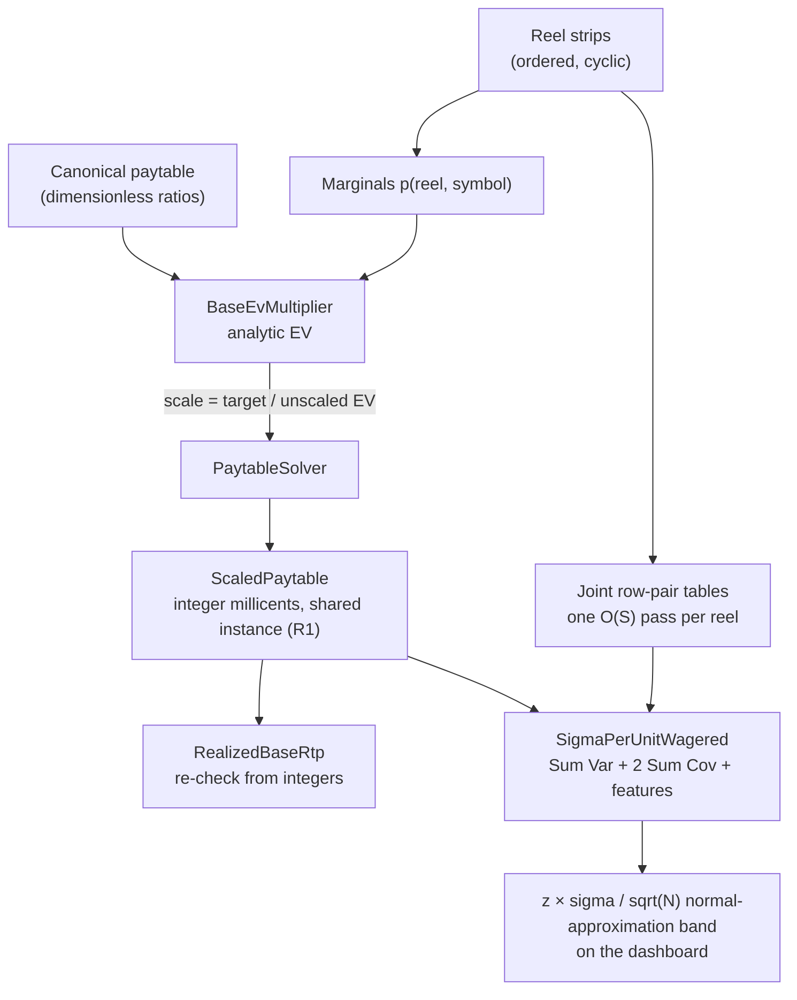

# The PAR-Sheet Math in Code: Expected RTP and Variance

*Part 4 of a series on building a slot game engine in C#. Part 3 modeled reels as
cyclic strips. This one does the math on top of them: expected value without
sampling spins, a one-scalar paytable solver, and the analytic variance that
powers the convergence chart's confidence band.*

A slot game's mathematical specification is commonly called a **PAR sheet**, short
for Probability Accounting Report. Its exact format varies, but it normally records the
reel or outcome model, awards, hit probabilities, theoretical RTP, and other game
statistics. Testing laboratories ask manufacturers for percentage calculations,
reel-strip listings, and paytables when evaluating reel games.

Traditional reel games can often be evaluated directly from those inputs. More
complex games may also require exhaustive computer evaluation or simulation, so
“PAR sheet” does not mean that simulation is forbidden. This chapter builds the
analytic worksheet for this engine's simpler strip-and-payline model. By the end,
the system can scale a base paytable toward a requested 75% RTP and calculate the
standard deviation used to judge whether a finite simulation looks reasonable.

Three terms will appear repeatedly:

| Term | Junior-high meaning |
|---|---|
| **Probability** | How likely an event is; 1 in 10 is `0.10` |
| **Expected value (EV)** | The long-run average payout per play |
| **Variance / standard deviation** | How widely individual results spread around that average |

## What one payline pays, on average

Set up the pieces. A payline shows one symbol per reel. In this engine, different
reels stop independently. Rows within one reel do not, as article 3 explained, but
a single payline reads only one cell from each reel. That means the one-cell symbol
chances, called **marginal probabilities**, are enough to calculate one line's
average payout.

This stock-game model pays for leading matches from left to right: three Sevens
starting on the leftmost reel pay one amount, four pay more, and so on. It does not
yet include wild substitution, scatters, ways-to-win, or right-to-left awards;
those require their own event rules.

The letter `k` in the probability formula below means **the number of matching
reels**. It is unrelated to the `k` that older versions of article 2 used for the
paytable scale factor. To avoid that collision, this chapter calls the latter
`paytableScaleFactor`.

The event "exactly k leading Sevens" means: reels 0 through k−1 show Seven, and
reel k does not (or there is no reel k). With per-reel marginals
`p(r, s) = count of s on strip r / strip length`:

```
P(exactly k leading s) = p(0,s) · p(1,s) · … · p(k−1,s) · (1 − p(k,s))
                          (the trailing factor is 1 when k = ReelCount)
```

Here is why the last factor matters. Suppose the chance of Seven on each reel is
`1/10`. The chance that the first three reels are Seven is `1/10 × 1/10 × 1/10`,
but that group still contains outcomes with four or five Sevens. To count
**exactly three**, reel 4 must not be Seven:

```text
P(exactly 3 leading Sevens)
    = 1/10 × 1/10 × 1/10 × 9/10
    = 0.0009
```

That “and the next reel does not match” term prevents the same four- or five-symbol
win from also being counted as a three-symbol win. Leaving it out overstates the
expected payout when the paytable lists mutually exclusive exact-run awards. The
size of the error depends on the reel probabilities and awards; it is not always
merely a few tenths of a percentage point.

The code is a direct transcription. It lives in `AnalyticMath`, declared `public
static class AnalyticMath`. A `static class` cannot be instantiated; there's no
`new AnalyticMath()` anywhere, because nothing in it needs an instance to hold
state between calls. Every method here takes its inputs as parameters and returns
an answer computed purely from them, so the class is really a namespace for
related math functions, grouped together for the reader rather than because they
share any data:

```csharp
/// <summary>
/// P(line shows exactly k leading copies of symbol s): match reels 0..k-1,
/// mismatch reel k (or k == ReelCount). Reels independent -> product of marginals.
/// </summary>
public static double ExactlyKLeading(StripReelSet reels, Payline line, byte symbolId, int k)
{
    var p = 1.0;
    for (var reel = 0; reel < k; reel++)
        p *= reels.ProbabilityOf(reel, symbolId);
    if (k < reels.ReelCount)
        p *= 1.0 - reels.ProbabilityOf(k, symbolId);
    return p;
}
```

`ExactlyKLeading` takes every piece of information it needs as a parameter
(`reels`, `line`, `symbolId`, `k`) and reads nothing else, not a field, not a
property on some ambient object. Call it twice with the same four arguments and
it returns the same answer both times, because there's nowhere for a different
answer to come from. That shape, a pure function of its inputs, is what makes a
function like this cheap to test by table: a test can list a handful of
`(reels, line, symbolId, k, expectedProbability)` rows and assert each one
independently, with no setup step to build shared state first and no teardown to
reset it after. A function that instead read from a field or a static cache would
need every test to also control whatever that state happened to be at the moment
it ran.

Expected value stacks straight on top: multiply each possible award by its chance,
then add the contributions over every symbol, run length, and payline:

```text
expected payout = (award A × chance A)
                + (award B × chance B)
                + ...
```

This is an average calculated before any spin occurs. It is not the award from one
actual spin.

Notice the loop variable shape in the listing below: `foreach (var ((symbolId,
count), pay) in canonical.Pays)`. `canonical.Pays` is a dictionary keyed by
`(byte SymbolId, int Count)`, a C# tuple, rather than by a small wrapper class
built just to hold those two fields. A tuple is the built-in way to bundle a few
values into one compound key without writing a class, giving it a constructor,
and implementing equality and a hash code by hand, work that dictionary keys
specifically require to work at all. "Which symbol, at which run length" is
naturally a pair, not a single value, and the tuple says so directly in the type
itself, `(byte SymbolId, int Count)`, with names a reader can see at the call
site instead of a positional `Item1`/`Item2`.

```csharp
public static double BaseEvMultiplier(
    StripReelSet reels, IReadOnlyList<Payline> lines, Paytable canonical)
{
    var ev = 0.0;
    foreach (var line in lines)
        foreach (var ((symbolId, count), pay) in canonical.Pays)
            ev += pay * ExactlyKLeading(reels, line, symbolId, count);
    return ev;
}
```

The work is proportional to paylines × paytable entries × reels. The largest stock
preset has `128⁵ = 34,359,738,368` possible stop
combinations; this computes the same expectation without enumerating all of them.
The analytic result is calculated before the simulation starts, so the dashboard
shows the target and its band from the first frame.

Look at the return type on both `ExactlyKLeading` and `BaseEvMultiplier`: `double`.
Article 2 spent an entire chapter banning `double` from every place money adds up,
so a careful reader of that chapter should stop here and ask why this chapter's
code is full of it. The answer is that this isn't the same kind of number, and
it isn't held to the same contract.

`Millicents` is money, and money in this engine has to survive an audit: sum a
million payouts in any order, on any thread, and the total must be the one exact
number an auditor could independently re-derive by adding the same integers. A
`double`'s tiny representation error, harmless on its own, would make that
re-derivation fail. What `ExactlyKLeading` returns is a probability, a
dimensionless ratio between 0 and 1 with no accumulation-audit contract behind it
at all; nothing sums a million probabilities end to end and hands the total to a
regulator. And these particular probabilities are unusually well-behaved doubles:
they're built from dividing small whole numbers of stops by a strip length, and
the paytable's tests pin the resulting sums to the fourteenth decimal place
against a from-scratch enumeration (article 7), so any representation error here
is already caught, not merely assumed away.

The deeper reason is what each side of the codebase is *for*. The integer
millicent path is the audit path: the number it produces has to be defensible on
its own. The analytic `double` path is the estimate path: its number only means
something in comparison to two other independent computations, the simulator's
measured result and the exhaustive enumeration's exact one. Chapter 2's rule
protects a number that has to stand alone. This chapter's `double`s are checked
against ground truth before anyone trusts them, which is a different kind of
correctness than "avoid floating point," and it's the one a probability actually
needs.

That's also why `BaseEvMultiplier` returns a bare `double`, not a `Millicents`.
Its answer, "how many bet-units does this paytable pay back on average," is a
ratio with no currency attached to it yet; the function has no wager to work
with, because none was passed in. `Millicents` couldn't hold that answer even if
the function wanted it to, since a `Millicents` is a count of a specific currency
unit, not a multiplier. Money enters the picture one function later, in `Solve`,
the moment an actual wager is available to multiply this ratio against. Returning
`Millicents` here would mean inventing a wager, or defaulting to one, either of
which would quietly bake an assumption into a function whose whole value is
being usable against any wager the caller has in mind.

## Turning a target into a paytable

Now invert the problem: given a *target* base RTP, resize the canonical paytable.
Article 2 used a recipe analogy: keep the prizes in the same proportions, but make
the whole recipe larger or smaller. The code now gives that multiplier the clearer
name `paytableScaleFactor`:

```csharp
public static ScaledPaytable Solve(
    StripReelSet reels, IReadOnlyList<Payline> lines,
    Paytable canonical, double targetBaseRtp, Millicents wager)
{
    var unscaledBaseGameEv = AnalyticMath.BaseEvMultiplier(reels, lines, canonical);
    if (unscaledBaseGameEv <= 0)
        throw new InvalidOperationException("Canonical paytable has zero EV; cannot scale.");

    var paytableScaleFactor = targetBaseRtp / unscaledBaseGameEv;

    PayoutScaler scale = raw => new Millicents(
        (long)Math.Round(
            raw * paytableScaleFactor * wager.Value,
            MidpointRounding.ToEven));

    var scaled = canonical.Pays.ToDictionary(kv => kv.Key, kv => scale(kv.Value));
    return new ScaledPaytable(scaled);
}
```

Notice what `Solve` does with `canonical`: it reads from it, `canonical.Pays`, but
never writes back into it, and it returns a brand-new `ScaledPaytable` rather than
scaling `canonical`'s own awards in place. That's a deliberate function contract,
not an oversight. `canonical`, the dimensionless shape from `Paytable.CanonicalFor`
(article 3), is meant to be scaled once per game at whatever target RTP that game
wants, and the same canonical table could in principle back several games with
different targets. A `Solve` that mutated its `canonical` argument would corrupt
that table for the very next caller who solves against it, silently, since
nothing about calling a function named `Solve` looks like it should have side
effects on the argument you handed it. Returning a new object instead means
`canonical` stays just as safe to reuse after calling `Solve` as it was before.

Read the division in words:

```text
paytable scale factor = average return wanted / unscaled average return
```

If the unscaled table averages `0.50` wager units and the target is `0.75`, the
factor is `0.75 / 0.50 = 1.5`. Every canonical award is multiplied by 1.5. Because
expected value is linear, the unrounded table's EV is multiplied by 1.5 too.

`unscaledBaseGameEv` comes from the probability sum above. A canonical paytable
with zero expected value, because every award is zero or none of its paying events
can occur, throws before the division. Otherwise the code would attempt to divide
by zero.

`PayoutScaler` is declared `public delegate Millicents PayoutScaler(double
rawPayMultiplier);`, and `scale` above is a lambda assigned to it, not a class
implementing an interface. The difference is about what's actually being passed
around: a single behavior, one raw multiplier in, one `Millicents` out, with
nothing else attached to it, no fields, no other methods, no identity beyond what
it computes. An interface such as `IPayoutScaler` with one `Scale` method would
express the same contract, but it would also demand a class to implement it, a
constructor, and a `new` at the call site, ceremony spent on a value that's really
just a function. A `delegate` is C#'s built-in name for "a variable that holds a
method," which describes `scale` here: the closure captures
`paytableScaleFactor` and `wager` from its surrounding scope, and the whole thing
is a value the rest of `Solve` can pass to `ToDictionary` like any other
argument. That's the "one behavior" `PayoutScaler` names in its own summary
comment: `scale` behaves the way a method reference does, because that's what it
is.

The `wager` in this solver is the **total spin wager**, and the resulting paytable
is normalized to that wager. This is a deliberate convention of this engine. A
traditional multiline paytable may instead quote awards in line-bet units, so real
game data must declare and convert its wager basis explicitly rather than mixing
line bet with total bet.

Each scaled award must become a whole number of millicents, so the solver rounds
each entry with round-half-to-even. The rounded paytable may land slightly above or
below the requested RTP; a single multiplier cannot guarantee the exact target
after several awards round independently.

`ScaledPaytable` is declared `public sealed record ScaledPaytable`, and that
choice of `record` over an ordinary `class` matters directly for the "constructed
once and shared" property this section is about. Its one constructor copies the
caller's award dictionary into a `ReadOnlyDictionary` and exposes it through a
get-only property, so once built, nothing in the codebase can reach in and change
one of its awards later. Sharing a single mutable object between the analytic
calculator and the spin evaluator would be a standing risk, since a bug anywhere
that touched the shared instance could shift the table underneath the other
reader. Sharing an immutable one removes that risk entirely: there is no method on
`ScaledPaytable` that could change an award after construction, so "both sides
read the same instance" is a safe thing to do rather than a hazard to watch for.

`ScaledPaytable` is constructed once and shared. The analytic calculator and the
spin evaluator both read that same rounded instance, so they cannot disagree by
using different versions of an award. The system then recomputes
`RealizedBaseRtp` from the rounded integer awards and checks both the 99% cap and a
0.01-percentage-point drift tolerance against the resulting total. The target is a
request; the recomputed realized RTP is the authoritative mathematical return.

> 🧪 **Try it live.** The companion site's chapter 4 page (<http://localhost:5090>,
> then `#/ch04`) runs this solver on demand. **Lab 1 — Solve a paytable** takes a
> target RTP and shows the scale factor, the rounded integer awards, and the realized
> RTP recomputed from them; **Lab 2 — The band, priced before any spin** turns the
> analytic sigma into the band half-width at a ladder of spin counts.

## Variance needs more than the mean

Expected value answers “where is the long-run center?” It does not say whether most
spins pay near that center or whether the game usually pays zero and occasionally
pays a huge jackpot. Variance measures that spread, and standard deviation `σ`
(the Greek letter sigma) is the square root of variance.

For `N` independent spins with the same rules and fixed wager, the standard
deviation of the measured average is `σ/√N`. The dashboard draws a normal-
approximation band with half-width:

```text
band half-width = z × σ / √N
```

Here `z` selects the advertised coverage level, such as approximately `2.576` for
a two-sided 99% band. This is a probability statement, not a promise that every run
will fall inside. Even a correct game should land outside a 99% band about 1% of
the time over repeated independent experiments if the normal approximation fits.
The band is centered on the **realized analytic RTP**, not the requested target that
existed before paytable rounding.

The normal approximation improves as `N` grows, but “large enough” depends on the
payout distribution. A game dominated by an extremely rare jackpot may need many
more spins before this band behaves well. For such games, the distribution and
jackpot cycle need separate scrutiny rather than blind trust in the formula.

The total spin return is a sum over lines, and the variance of a sum is:

```
Var(Σ Xᵢ) = Σ Var(Xᵢ) + 2 · Σᵢ<ⱼ Cov(Xᵢ, Xⱼ)
```

The covariance term is where a model that treats each visible cell as a separate
die roll would quietly fail. Two paylines can share cells or read neighboring
positions on the same reel strip. That connection may make their awards move
together, which is positive covariance, or make one line less likely to win when
the other wins, which is negative covariance. The sign and size come from the
actual ordered strips; they cannot safely be guessed.

> 💡 **Quick picture.** Two students assigned to the same group project may receive
> similar grades because both results depend on the same project. That is positive
> covariance. Two ends of a seesaw move in opposite directions; that resembles
> negative covariance. Paylines connected through the same stopped reels can behave
> either way. Treating them as unrelated can make the calculated variance too low
> or too high.

Per-line variance uses `E[X²] − E[X]²` from the same analytically calculated
probabilities as EV. In words: find the average squared award, then subtract the
square of the average award. The cross-term needs the **joint distribution of two
window cells on one reel**, which comes from enumerating the strip, the same method
`JointProbabilityOf` used in article 3:

```csharp
// Per reel, per (rowA,rowB) pair: joint distribution of the two cells' symbols,
// built by one O(S) pass over the stops. No random sampling is needed.
for (var stop = 0; stop < n; stop++)
{
    var a = strip[(stop + rowA) % n].Id;
    var b = strip[(stop + rowB) % n].Id;
    table[rowA, rowB][a, b] += 1.0 / n;
}
```

With those tables, `Cov(line i, line j)` is assembled reel by reel. For a given
pair of outcomes ("line A shows exactly runA of symbol A, line B exactly runB of
symbol B"), each reel imposes one of three conditions per line: **Match** (this
reel is inside the run), **Mismatch** (this reel terminates it), or **Any** (past
the run's end). The per-reel joint probability of the two conditions reads off the
table with inclusion-exclusion:

```csharp
return (condA, condB) switch
{
    (Cond.Any,      Cond.Any)      => 1.0,
    (Cond.Any,      _)             => Single(rowB, condB, symB),
    (_,             Cond.Any)      => Single(rowA, condA, symA),
    (Cond.Match,    Cond.Match)    => Joint(symA, symB),
    (Cond.Match,    Cond.Mismatch) => Marginal(rowA, symA) - Joint(symA, symB),
    (Cond.Mismatch, Cond.Match)    => Marginal(rowB, symB) - Joint(symA, symB),
    (Cond.Mismatch, Cond.Mismatch) =>
        1.0 - Marginal(rowA, symA) - Marginal(rowB, symB) + Joint(symA, symB),
};
```

Because reels are independent of *each other* in this model, the joint probability
across the whole line pair is the product of the per-reel factors. The underlying
fractions come from counting stops, so no Monte Carlo sampling is involved. The C#
implementation stores those fractions as `double`, however, so “analytic” does not
mean every intermediate value has an exact binary representation.

<!-- EXPORT: render this Mermaid block to PNG before publishing -->


When `rowA == rowB`, the "two cells" are the same
cell, and the table comes out diagonal automatically, no special case in the code,
because the enumeration cannot produce two different symbols at one position.

## This engine's simplified features as independent terms

The stock simulator's side features are deliberately simple independent RTP terms.
A feature triggers with fixed probability `p` fixed by its kind: `FreeSpins` triggers
on 1 spin in 120, `PickBonus` on 1 in 150. If it triggers, it chooses uniformly
from a three-award table whose average is `m`. Its expected payout per base spin is
therefore `p × m`, and its RTP contribution is:

```text
c = p × m / wager
```

If the desired contribution `c`, trigger chance `p`, and wager are known, solve
backwards for the required conditional mean award:

```text
m = c × wager / p
```

For example, if a feature should contribute 10% RTP and triggers once per 100
spins, its average award when triggered must be 10 wager units:

```text
0.10 × 1 wager / 0.01 = 10 wagers
```

```csharp
var mid = new Millicents((long)Math.Round(
    contributionBp / 10_000.0 * wager.Value / p, MidpointRounding.ToEven));
var low = new Millicents((long)Math.Round(mid.Value * 0.5, MidpointRounding.ToEven));
var high = new Millicents(2 * mid.Value - low.Value); // keeps the mean exactly mid
```

The award table is `{low, mid, high}`, where `mid = m`, `low` is approximately
half of `m`, and `high = 2m − low`. This construction makes an integer identity:

```text
low + mid + high = 3 × mid
```

Because the three awards are equally likely after a trigger, their arithmetic mean
is exactly `mid` in integer millicents even if `low` had to be rounded. Because this
stock model declares the features independent of the reel window and of one
another, their variance terms add to the base-game variance without covariance
terms.

The names `FreeSpins` and `PickBonus` are presentation skins in this preset model;
they do not actually replay the base game, retrigger, or carry state across spins.
Real free-spin and bonus features often do those things and must include those
dependencies in their RTP and variance calculations.

Tests pin the integer award-table mean, compare the realized analytic contribution
with the configured basis points, verify the hand-calculated variance, and run a
fixed-seed empirical regression. The empirical test is a regression check on the
play path, not a proof of the contribution by itself.

## What the analytic math is for

Much of this article could be approximated by simulation: run many spins and
measure the average and spread. The system does that in article 5. The analytic
calculation provides an independently derived expected value and band against which
the simulation can be compared. Agreement does not prove that every part is free of
bugs, but disagreement is strong evidence that at least one path is wrong.

For the small 22-stop, 3-reel fixture, the tests add a third path that exhaustively
enumerates all `22³ = 10,648` stop combinations. Exhaustive enumeration is practical
there, but not for the 34.4-billion-combination largest preset. That smaller ground
truth checks both RTP and variance without reusing the production evaluator's
calculation logic.

Next: the engine that plays those spins: fixed worker quotas, batched atomic
counters, and a telemetry channel that's allowed to lose.

Industry references: GLI's submission checklist asks for percentage calculations,
reel-strip listings, and paytables; GLI's RTP analysis overview says the method may
be theoretical or simulated depending on the game; Nevada requires theoretical
payback reporting on a per-paytable basis.

- [GLI gaming-software submission requirements](https://gaminglabs.com/getting-started/submit-new-software/)
- [GLI game mathematics and RTP analysis](https://gaminglabs.com/services/igaming/game-mathematics-percentage-return-to-player-rtp-analysis/)
- [Nevada Technical Standard 1](https://www.gaming.nv.gov/siteassets/content/home/features/TechnicalStandard1.pdf)

*Source files: `Rtp/AnalyticMath.cs`, `Paytables/PaytableSolver.cs`,
`Paytables/Paytable.cs`, `Features/FeatureSchedule.cs`.*
