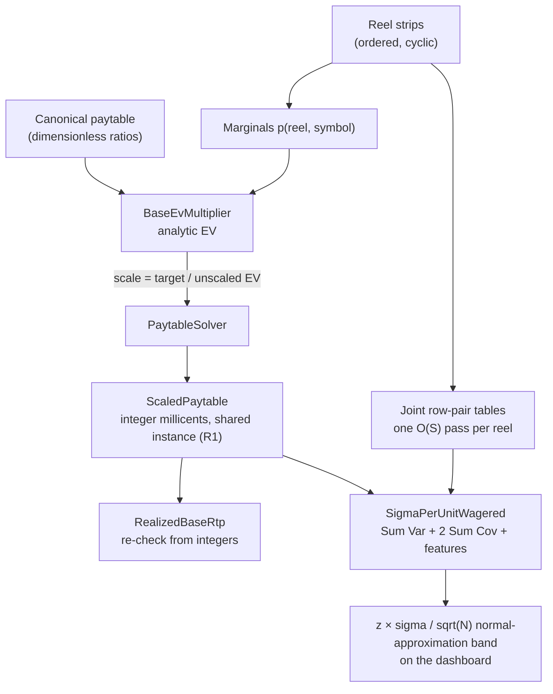

# The PAR-Sheet Math in Code: Expected RTP and Variance

*Part 4 turns reel probabilities into expected payouts. It shows how one paytable
row contributes to RTP, how the contributions add, how a target RTP scales a
paytable, and how variance produces the simulation's confidence band.*

A slot game's mathematical specification is often called a **PAR sheet**, short for
Probability Accounting Report. Its format varies, but it usually records the reel
model, payouts, hit probabilities, and theoretical RTP.

For this engine's strip-and-payline games, those inputs are enough to calculate an
average return without playing random spins. The same calculation also supplies a
range for judging a later simulation. Games with more complicated state may require
exhaustive evaluation or simulation as part of their math package.

Three terms will appear repeatedly:

| Term | Plain-language meaning |
|---|---|
| **Probability** | How likely an event is; 1 in 10 is `0.10` |
| **Expected value (EV)** | The long-run average payout per play |
| **Variance / standard deviation** | How widely individual results spread around that average |

## Start with ten equally likely results

Start with a small game that has ten equally likely outcomes. Nine outcomes pay nothing.
One outcome pays 5 credits on a 1-credit wager.

```text
expected payout = (9 × 0 + 1 × 5) ÷ 10
                = 0.5 credit
RTP             = 0.5 ÷ 1.0
                = 50%
```

The average payout is 0.5 credit per spin. Dividing by the 1-credit wager gives 50%
RTP. Expected value is this probability-weighted average.

### Check your understanding

If the one winning outcome pays 8 credits instead of 5, what is the new RTP?

<details><summary>Answer</summary>

`8 ÷ 10 = 0.8`, so the RTP is 80%. Nothing about the outcome chances changed; only the
award changed.

</details>

## Calculate one paytable row

A payline reads one symbol from each independently stopped reel. Article 3 called
the chance of one symbol in one chosen position its **marginal probability**. Those
one-position chances are enough to calculate the average payout of a single line.

The stock model pays matching symbols from the leftmost reel. Three Sevens may pay
one amount, four Sevens more, and five Sevens the most. Wilds, scatters, and
ways-to-win use different event rules.

In the formulas below, `k` is the number of matching reels.

The event "exactly k leading Sevens" means: reels 0 through k−1 show Seven, and
reel k does not (or there is no reel k). With per-reel marginals
`p(r, s) = count of s on strip r / strip length`:

```
P(exactly k leading s) = p(0,s) · p(1,s) · … · p(k−1,s) · (1 − p(k,s))
                          (the trailing factor is 1 when k = ReelCount)
```

Suppose Seven has a `1/10` chance on every reel. Three Sevens from the left require
the first three reels to show Seven. An **exactly-three** result also requires reel
4 to show something else:

```text
P(exactly 3 leading Sevens)
    = 1/10 × 1/10 × 1/10 × 9/10
    = 0.0009
```

The `9/10` term removes four- and five-Seven results from this row. Those longer
runs belong to their own paytable rows.

`ExactlyKLeading` implements that calculation:

```csharp
/// <summary>
/// P(line shows exactly k leading copies of symbol s): match reels 0..k-1,
/// mismatch reel k (or k == ReelCount). Reels independent -> product of marginals.
/// </summary>
public static double ExactlyKLeading(StripReelSet reels, Payline line, byte symbolId, int k)
{
    var p = 1.0;
    for (var reel = 0; reel < k; reel++)
        p *= reels.ProbabilityOf(reel, symbolId);
    if (k < reels.ReelCount)
        p *= 1.0 - reels.ProbabilityOf(k, symbolId);
    return p;
}
```

The function reads all of its inputs from parameters, so tests can supply a reel set,
symbol, and run length and compare the returned probability with a hand calculation.

Now price that row. Suppose exactly three Sevens pays 20 times the wager:

```text
row RTP contribution = payout x probability
                     = 20 x 0.0009
                     = 0.018, or 1.8%
```

Do the same calculation for every paytable row, then add the results:

```text
expected payout = (award A × chance A)
                + (award B × chance B)
                + ...
```

This total is the theoretical average return. It is calculated from the game rules,
not measured from a sample of spins.

```csharp
public static double BaseEvMultiplier(
    StripReelSet reels, IReadOnlyList<Payline> lines, Paytable canonical)
{
    var ev = 0.0;
    foreach (var line in lines)
        foreach (var ((symbolId, count), pay) in canonical.Pays)
            // This row contributes its payout multiplied by its exact chance.
            ev += pay * ExactlyKLeading(reels, line, symbolId, count);
    return ev;
}
```

The largest stock preset has `128^5 = 34,359,738,368` possible stop combinations.
This method avoids visiting all of them. Its work grows with the number of paylines,
paytable rows, and reels instead.

Probabilities and RTP ratios use `double`. Actual wagers, payouts, and accumulated
totals use integer `Millicents`. This keeps money exact while allowing probability
calculations to use ordinary ratios. Tests compare the formula with separate
enumeration on small games.

## Turning a target into a paytable

Suppose the canonical paytable returns `0.50` wager units on average, but the game
needs a target RTP of `0.75`. Every payout must grow by the same factor:

```text
paytable scale factor = target RTP / unscaled RTP
                      = 0.75 / 0.50
                      = 1.5
```

A canonical 20-times payout becomes 30 times the wager. Because all payouts grow by
1.5, their total expected value also grows by 1.5. The relative size of the prizes
does not change.

```csharp
public static ScaledPaytable Solve(
    StripReelSet reels, IReadOnlyList<Payline> lines,
    Paytable canonical, double targetBaseRtp, Millicents wager)
{
    var unscaledBaseGameEv = AnalyticMath.BaseEvMultiplier(reels, lines, canonical);
    if (unscaledBaseGameEv <= 0)
        throw new InvalidOperationException("Canonical paytable has zero EV; cannot scale.");

    // One factor moves the entire paytable from its current EV to the target RTP.
    var paytableScaleFactor = targetBaseRtp / unscaledBaseGameEv;

    PayoutScaler scale = raw => new Millicents(
        (long)Math.Round(
            // Convert the dimensionless payout into integer money for this wager.
            raw * paytableScaleFactor * wager.Value,
            MidpointRounding.ToEven));

    var scaled = canonical.Pays.ToDictionary(kv => kv.Key, kv => scale(kv.Value));
    return new ScaledPaytable(scaled);
}
```

`Solve` returns a new table instead of changing the canonical table. That allows one
canonical prize shape to support several approved RTP versions without one call
changing the input used by another.

`unscaledBaseGameEv` comes from the probability sum above. A canonical paytable
with zero expected value, because every award is zero or none of its paying events
can occur, throws before the division. Otherwise the code would attempt to divide
by zero.

The `wager` in this solver is the **total spin wager**, and the resulting paytable
is normalized to that wager. This is a deliberate convention of this engine. A
traditional multiline paytable may instead quote awards in line-bet units, so real
game data must declare and convert its wager basis explicitly rather than mixing
line bet with total bet.

Each scaled award must become a whole number of millicents, so the solver rounds
each entry with round-half-to-even. The rounded paytable may land slightly above or
below the requested RTP; a single multiplier cannot guarantee the exact target
after several awards round independently.

The finished `ScaledPaytable` is read-only. Both the analytic calculator and the spin
evaluator read that same rounded table. The engine then recalculates the **realized
RTP** from the integer awards. That recomputed value, not the requested target, is
the value used by the confidence band.

> 🧪 **Try it live.** The companion site's chapter 4 page (<http://localhost:5090>,
> then `#/ch04`) runs this solver on demand. **Lab 1: Solve a paytable** takes a
> target RTP and shows the scale factor, the rounded integer awards, and the realized
> RTP recomputed from them; **Lab 2: Calculate a confidence band** turns the
> analytic sigma into the band half-width at a ladder of spin counts.

## Variance needs more than the mean

Two games can both have 50% RTP and still behave very differently:

| Game | Possible payout | Average payout |
|---|---|---:|
| A | Every spin pays 0.5 credit | 0.5 credit |
| B | Nine spins pay 0; one spin in ten pays 5 credits | 0.5 credit |

Game A never moves away from its average. Game B usually pays nothing and sometimes
pays much more than its average.

RTP answers, "How much does the game return on average?" It does not answer, "What will
the ride feel like?" The second question is about **swinginess**: how far individual spin
returns jump above and below the average.

Here are ten spins from each example game:

| Game | Ten payouts | Total | Average |
|---|---|---:|---:|
| A: steady | 0.5, 0.5, 0.5, 0.5, 0.5, 0.5, 0.5, 0.5, 0.5, 0.5 | 5 | 0.5 |
| B: swingy | 0, 0, 0, 0, 0, 0, 0, 0, 0, 5 | 5 | 0.5 |

Both rows return the same total. Game A stays at its average on every spin. Game B spends
nine spins below its average, then jumps far above it. A player can feel that difference
even though both games have 50% RTP.

**Variance measures that spread.** Imagine putting the average payout at the center of a
ruler. Variance asks how far the payouts land from that center. The distances are squared
so a result below the average cannot cancel a result above it. Squaring also gives extra
weight to a result that lands far away. A payout 10 units from the average adds 100 squared
units; a payout 2 units away adds only 4.

**Standard deviation** is the square root of variance. It is often written with the Greek
letter sigma: `σ`. Taking the square root changes squared wager units back into ordinary
wager units. That makes sigma a practical ruler for swinginess. A larger sigma means the
one-spin payouts are more spread out. It does **not** promise that the next spin will land
within one sigma of RTP; slot payouts are usually lopsided because zeroes are common and
large wins are rare.

For one payline, calculate variance with:

```text
variance = average of the squared payouts - (average payout)^2
         = E[X^2] - E[X]^2
```

For the ten-spin examples:

| Game | `E[X]` | `E[X²]` | Variance | Sigma |
|---|---:|---:|---:|---:|
| A | 0.5 | 0.25 | `0.25 - 0.5² = 0` | `0` |
| B | 0.5 | 2.5 | `2.5 - 0.5² = 2.25` | `1.5` |

Game B's one 5-credit result becomes 25 when squared. That is why a rare large award can
increase swinginess sharply even when it makes only a modest contribution to RTP.

The production analyzer performs the same calculation. It first finds the average payout
and the average squared payout, then takes one square root. These variable names come
directly from `GameAnalyzer.Summarize`:

```csharp
// Divide the weighted payout totals by every possible reel-stop combination.
var meanLine = _payUnits / scale / total;
var meanLineSquared = _paySquareUnits / (scale * scale) / total;

// Variance is E[X^2] - E[X]^2. Sigma returns the answer to wager units.
var variance = Math.Max(0.0, meanLineSquared - meanLine * meanLine);
var sigma = Math.Sqrt(variance);
```

`Math.Max` only protects the square root from a tiny negative number caused by floating-
point rounding. The mathematical variance cannot be negative.

For `N` independent spins with the same rules and fixed wager, the standard
deviation of the measured average is `σ/√N`. The dashboard draws a normal-
approximation band with half-width:

```text
band half-width = z × σ / √N
```

Here `z` selects the coverage level. A two-sided 99% band uses about `2.576`. Over
many independent test runs, a correct game can still finish outside that band about
1% of the time when the normal approximation fits. The band is centered on the
realized analytic RTP calculated from the rounded payouts.

The normal approximation improves as `N` grows, but "large enough" depends on the
payout distribution. A game dominated by an extremely rare jackpot may need many
more spins before this band behaves well. For such games, the distribution and
jackpot cycle need separate scrutiny rather than blind trust in the formula.

Why divide by the square root of the spin count? Think of weighing the same object many
times on a slightly noisy scale. One reading may be high or low. Averaging many independent
readings quiets the noise. The improvement is real but gradual: 100 times as many spins
makes the band 10 times narrower, not 100 times narrower.

This is the production confidence-band calculation:

```csharp
// 2.576 is the z value used for a two-sided 99% normal-approximation band.
var halfWidth = spinCount > 0
    ? 2.576 * sigmaPerUnitWagered / Math.Sqrt(spinCount)
    : 0.0;

// The measured RTP passes this checkpoint when it falls inside the band.
var withinBand = Math.Abs(measuredRtp - analyticRtp) <= halfWidth;
```

### Why paylines cannot be treated separately

The total spin payout is the sum of all line payouts. It is tempting to calculate
each line's variance and add the answers. That works only when the line results are
independent.

Consider the Center and V paylines from Article 3. They share visible positions.
One reel stop can therefore help or hurt both lines at once. Their payouts may move
together, so the calculation needs a **covariance** term:

**Covariance measures whether two results tend to move together.** Picture two boats on
the same wave. They usually rise and fall together, like two paylines helped by the same
reel window; that is positive covariance. The two ends of a seesaw move in opposite
directions; that is negative covariance. Results with no consistent relationship have
covariance near zero.

Why is covariance needed? If the total award is `line 1 + line 2`, squaring that total
creates a middle term:

```text
(line 1 + line 2)^2 = line 1^2 + 2(line 1 x line 2) + line 2^2
```

The middle term records windows where both lines pay together. Leaving it out would act as
though the two lines came from separate spins. They do not; both lines read the same window.

```
Var(Σ Xᵢ) = Σ Var(Xᵢ) + 2 · Σᵢ<ⱼ Cov(Xᵢ, Xⱼ)
```

The ordered reel strips determine the covariance's sign and size. The code calculates
that relationship from the actual symbol positions.

To calculate covariance, the engine first counts how often two visible positions on
one reel show each pair of symbols. This is the same strip-counting method used by
`JointProbabilityOf` in Article 3:

```csharp
// Per reel, per (rowA,rowB) pair: joint distribution of the two cells' symbols,
// built by one O(S) pass over the stops. No random sampling is needed.
for (var stop = 0; stop < n; stop++)
{
    var a = strip[(stop + rowA) % n].Id;
    var b = strip[(stop + rowB) % n].Id;
    table[rowA, rowB][a, b] += 1.0 / n;
}
```

For a particular pair of line wins, each reel gives each line one of three jobs:

| Condition | What the reel must do |
|---|---|
| **Match** | Show the line's winning symbol |
| **Mismatch** | Show a different symbol and end the run |
| **Any** | Show anything because this reel is past the run |

The following code combines the two lines' jobs on one reel. `Joint` reads the
two-position table. `Marginal` reads the chance for one position:

```csharp
return (condA, condB) switch
{
    (Cond.Any,      Cond.Any)      => 1.0,
    (Cond.Any,      _)             => Single(rowB, condB, symB),
    (_,             Cond.Any)      => Single(rowA, condA, symA),
    (Cond.Match,    Cond.Match)    => Joint(symA, symB),
    // A must match, but remove the cases where B also matches.
    (Cond.Match,    Cond.Mismatch) => Marginal(rowA, symA) - Joint(symA, symB),
    (Cond.Mismatch, Cond.Match)    => Marginal(rowB, symB) - Joint(symA, symB),
    (Cond.Mismatch, Cond.Mismatch) =>
        1.0 - Marginal(rowA, symA) - Marginal(rowB, symB) + Joint(symA, symB),
    // all nine (Cond, Cond) pairs are covered by the arms above
};
```

Reels stop independently of one another, so the engine multiplies these per-reel
factors to get the probability for the complete pair of line results. The fractions
come from counting reel stops; no random spins are sampled.

<!-- EXPORT: render this Mermaid block to PNG before publishing -->


When both paylines use the same visible position, the table automatically records
the same symbol for both. No special case is needed.

## This engine's simplified features as independent terms

Start with a feature that should contribute 10% RTP. If it triggers once per 100
spins, its trigger chance is `0.01`. To return 0.10 wager units per base spin on
average, it must pay an average of 10 wager units when it triggers:

```text
average feature award = desired RTP contribution x wager / trigger chance
                      = 0.10 x 1 / 0.01
                      = 10 wagers
```

The division is necessary because the award occurs on only one of every 100 spins.
Spread 10 wager units over 100 spins and the feature contributes 0.10 wager unit per
spin.

The general formulas are:

```text
c = feature RTP contribution
p = trigger probability
m = average award when the feature triggers

c = p x m / wager
m = c × wager / p
```

The stock simulator uses this simplified model for two features. `FreeSpins`
triggers once in 120 spins, and `PickBonus` triggers once in 150. After a trigger,
the feature chooses one of three awards with equal probability:

```csharp
var mid = new Millicents((long)Math.Round(
    contributionBp / 10_000.0 * wager.Value / p, MidpointRounding.ToEven));
var low = new Millicents((long)Math.Round(mid.Value * 0.5, MidpointRounding.ToEven));
// Choose high so low + mid + high equals 3 x mid exactly.
var high = new Millicents(2 * mid.Value - low.Value);
```

The table is `{low, mid, high}`. `low` is about half of `mid`, and the code chooses
`high` so the three integer awards have an average of exactly `mid`:

```text
low + mid + high = 3 × mid
```

Because each award is equally likely, the conditional mean is exactly `mid`, even
if `low` was rounded. This stock model also declares both features independent of
the reel window and of each other. Their variance can therefore be added without
covariance terms.

The names `FreeSpins` and `PickBonus` are presentation skins in this preset model;
they do not replay the base game, retrigger, or carry state across spins.
Real free-spin and bonus features often do those things and must include those
dependencies in their RTP and variance calculations.

Tests pin the integer award-table mean, compare the realized analytic contribution
with the configured basis points, verify the hand-calculated variance, and run a
fixed-seed empirical regression. The empirical test is a regression check on the
play path, not a proof of the contribution by itself.

## What the analytic math is for

Simulation measures what happened in one sample. Analytic math predicts what should
happen from the rules. The engine keeps both paths so they can check each other.
Agreement does not prove that both are perfect, but disagreement shows that at least
one path needs investigation.

Tests add a third check for a small 22-stop, 3-reel game: visit all
`22^3 = 10,648` stop combinations and average the results. That is practical for the
small fixture but not for the 34.4-billion-combination preset. The small exhaustive
test checks both RTP and variance without reusing the production formula.

Next: weighted enumeration. Article 5 starts with 24 possible outcomes, groups repeated
symbols by count, and follows those counts through `GameAnalyzer` one method at a time.

## References

- [NIST: Measures of Scale](https://www.itl.nist.gov/div898/handbook/eda/section3/eda356.htm)
  - explains why variance squares distance from the mean and why standard deviation takes
    the square root to restore the original units.
- [NIST: Confidence Limits for the Mean](https://www.itl.nist.gov/div898/handbook/eda/section3/eda352.htm)
  - explains the `standard deviation / square root of sample size` term and how to read a
    confidence interval across repeated samples.
- [Penn State STAT 414: Covariance](https://online.stat.psu.edu/stat414/Lesson18)
  - gives the formal covariance definition and worked probability examples.
- [Penn State STAT 505: Variance of a Linear Combination](https://online.stat.psu.edu/stat505/Lesson02)
  - shows why the variance of a sum includes the covariance between its parts.

- [GLI gaming-software submission requirements](https://gaminglabs.com/getting-started/submit-new-software/)
  - the submission checklist asks for percentage calculations, reel-strip listings,
  and paytables.
- [GLI game mathematics and RTP analysis](https://gaminglabs.com/services/igaming/game-mathematics-percentage-return-to-player-rtp-analysis/)
  - the method may be theoretical or simulated depending on the game.
- [Nevada Technical Standard 1](https://www.gaming.nv.gov/siteassets/content/home/features/TechnicalStandard1.pdf)
  - theoretical payback is reported on a per-paytable basis.

*Source files: `Rtp/AnalyticMath.cs`, `Paytables/PaytableSolver.cs`,
`Paytables/Paytable.cs`, `Features/FeatureSchedule.cs`.*

## Optimization notebook

**Summary:** keep the readable dictionary at the game boundary and test a dense lookup for
the spin loop.

- **Dense execution table:** index payouts directly by symbol id and run length during a
  spin.
- **Readable public view:** retain the dictionary for construction, inspection, and PAR
  reporting.
- **Complete comparison:** require both representations to return the same money for every
  valid symbol-and-run key before benchmarking them.
