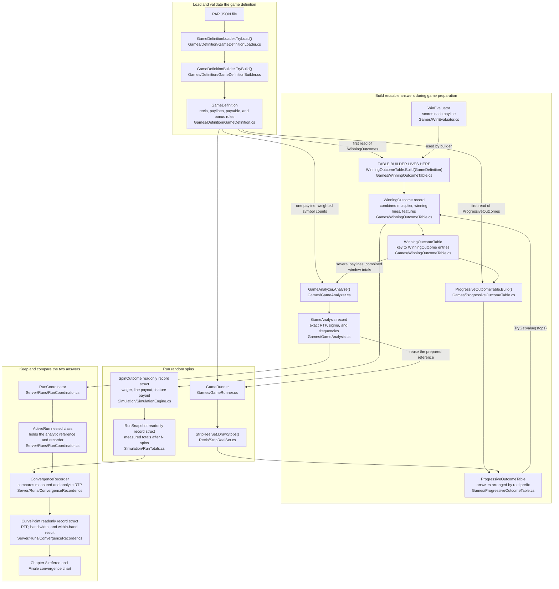
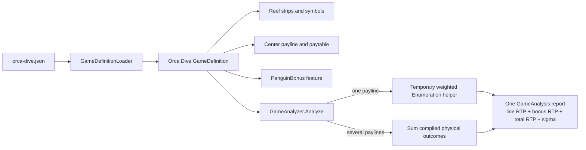
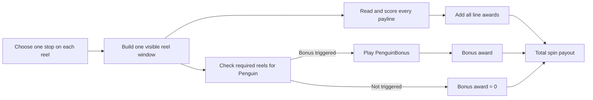
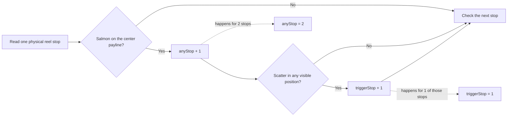

# Counting Every Outcome Without Playing Every Spin

*Part 5 in a series on building a slot game engine in C#. This article explains
`GameAnalyzer`, one method at a time. The intended reader knows basic loops and arrays but
does not need a statistics background.*

A slot simulator answers a question by sampling: play many random spins, add the payouts,
and watch the average settle. `GameAnalyzer` takes a different route. It counts the possible
outcomes and calculates the exact average.

The math becomes a little more involved in this chapter because one spin may have several
parts: more than one line can pay, and a bonus can start in the same window. The formulas
are standard probability formulas, not special slot-machine inventions. We will use them
one question at a time:

- **Expected value:** What is the long-run average return?
- **Variance:** How far do individual returns spread from that average?
- **Covariance:** Which awards tend to occur together in the same window?
- **Standard deviation, or sigma:** What is the spread in ordinary wager units?

Think of preparing a restaurant bill. Adding the food and drink prices gives the total.
Estimating how much bills vary requires more information: which items are expensive, and
which items are usually ordered together. The analyzer does the same kind of accounting
for line awards and bonuses.

The direct method would try every stop on every reel. Orca Dive has 14,781,416 stop
combinations. That is possible, but much of the work repeats. If Salmon appears at four
different stops on one reel, the payline evaluator sees the same Salmon all four times.

`GameAnalyzer` evaluates that Salmon choice once and gives it a weight of four.

## A small example

The next table is a small teaching game, not Orca Dive. It uses only Cherry and Bell so its
24 outcomes can be checked by hand. We care about one payline.

| Reel | Symbols on its stops |
|---|---|
| 1 | Cherry, Cherry, Bell |
| 2 | Cherry, Bell |
| 3 | Cherry, Cherry, Cherry, Bell |

There are `3 × 2 × 4 = 24` physical stop combinations.

Now collapse repeated symbols into counts:

| Reel | Cherry count | Bell count |
|---|---:|---:|
| 1 | 2 | 1 |
| 2 | 1 | 1 |
| 3 | 3 | 1 |

Only eight symbol combinations remain: cherry or bell on each of three reels. Each one has
a weight. Three cherries has weight `2 × 1 × 3 = 6`, so it represents six of the 24 physical
outcomes. Bell, cherry, bell has weight `1 × 1 × 1 = 1`.

Add all eight weights and the total comes back to 24. Every outcome is still there,
counted rather than estimated. The repeated work is simply grouped.

### Check your understanding

The combination Cherry / Bell / Cherry has counts 2, 1, and 3. How many physical stop
combinations does it represent?

<details><summary>Answer</summary>

`2 × 1 × 3 = 6`. The weight counts where those same visible symbols came from on the
physical strips.

</details>

An everyday analogy is counting a jar of coins. You can list every coin separately, or make
one stack of quarters, one stack of dimes, and multiply each stack's count by its value. Both
methods produce the same total. `GameAnalyzer` makes stacks of identical reel outcomes.

> 🧪 **Try it live.** Open the companion site at <http://localhost:5090/#/ch05>.
> Build one weighted combination, then add all eight weights and confirm that they still
> represent the original 24 physical outcomes.

## Three different jobs

Three classes work with the same reel outcomes, but they answer different questions:

| Component | Question it answers | When it runs |
|---|---|---|
| `WinningOutcomeTable` | What does each complete stopped window pay or trigger? | Once while the game is prepared |
| `ProgressiveOutcomeTable` | Given this spin's reel stops, can we reach its prepared result quickly? | Once per simulated spin |
| `GameAnalyzer` | Across all possible windows, what are the exact RTP and variance? | Once before the simulation |

The analyzer is not required to decide what one spin pays. Its result is the mathematical
reference used to check the simulation. The performance optimization for the spin loop is the
progressive outcome table.

### Preparing the payout answers

`WinningOutcomeTable.Build` visits every physical stop combination while the game is being
prepared. For each combination, it builds the complete visible window, scores every payline,
and checks every configured feature. It stores an entry only when the window pays, triggers a
feature, or does both.

One stored `WinningOutcome` contains:

- the sum of all line multipliers;
- the paylines that won;
- the features that triggered.

`ProgressiveOutcomeTable.Build` then rearranges those completed answers by reel-stop prefix.
This is the reel-1, then reel-2, then reel-3 narrowing you described. A prefix means "the
stops selected so far." If no completed winning or feature-triggering window begins with that
prefix, the lookup can return a loss early.

The simulation still draws **every reel stop first** so its random-number sequence stays
fixed. It then walks the prepared lookup using those stops. The first reel narrows the possible
answers, the next reel narrows them again, and the last reel identifies the final outcome.
The implementation combines reels 1 and 2 into one array lookup when there are at least three
reels, but the idea is the same.



The highlighted builder is a method on `WinningOutcomeTable`, not a separate class.
`GameDefinition` owns two lazy fields. Reading `WinningOutcomes` runs the complete-window
builder once. Reading `ProgressiveOutcomes` then converts those answers into the faster
reel-prefix lookup. Start with `GameDefinition.cs` when you want to see when either table
is created.

For a multi-payline game, the **table builder** is the code that looks at the whole window
and finds all paying lines and bonus triggers for that exact view. The analyzer reads those
prepared outcomes and totals them to calculate RTP, variance, hit frequency, and trigger
frequency.

### Where the analyzer's result goes

`GameAnalyzer.Analyze` returns a `GameAnalysis` object. It contains the expected line RTP,
bonus RTP, total RTP, and standard deviation. For a single-line game it also contains counts
for each paying category and run length.

The analyzer gets RTP by counting rather than sampling. Each paying result contributes its
award multiplied by the fraction of physical windows that produce it:

```text
result's RTP contribution = award x result count / all physical windows
total RTP = sum of all result contributions + bonus contribution
```

For the Two-Line Tide window that pays 8X once in 64 physical windows, that window contributes
`8 / 64 = 0.125`, or 12.5 percentage points, to line RTP. The other paying windows contribute
the rest. No random seed is involved in this calculation.

The multi-line production path expresses that calculation as a sum followed by a division:

```csharp
foreach (var entry in table.Entries)
{
    // This is the combined award from every winning line in one physical window.
    var lineAward = entry.Value.TotalMultiplier / scale;
    lineUnits += lineAward;
}

// Dividing by every possible window turns the payout sum into expected line RTP.
var meanLine = lineUnits / total;
```

When a server run starts, `RunCoordinator.PrepareGame` calls the analyzer **before the first
random spin**. The coordinator keeps the important values in the active run:

```text
analytic total RTP
analytic standard deviation (sigma)
line and bonus RTP breakdown
```

It also passes the prepared `GameAnalysis` to `GameRunner`, so the runner does not calculate
the same reference a second time when the spins finish.

The simulation then produces a `RunSnapshot` at each reporting point. That snapshot contains
what the random run has measured so far:

```text
measured RTP = returned money / wagered money
```

`ConvergenceRecorder` compares the two numbers. It uses the analyzer's sigma to calculate a
99% band for the current number of spins:

```text
band half-width = 2.576 x analytic sigma / square root of spins

within band when:
absolute value(measured RTP - analytic RTP) <= band half-width
```

This comparison does not change any payout. It answers a test question: "Is the random
simulation close enough to the value predicted from the game rules?"

Chapter 8 exposes the comparison as the **referee** lab: exact RTP on one side, measured RTP
on the other, and a within-band result. The Finale uses the same values for the convergence
chart while millions of spins run.

The reference is stored in memory as part of the active run and returned through the server
API and event stream. This project does not currently save it to a database.

## Who checks the game and who counts it

In this chapter, a **game** means one complete `GameDefinition`. The project currently loads
three examples:

| Game | Line game | Bonus feature |
|---|---|---|
| Classic Three Reel | One center payline with Seven, Bar, Bell, Wild, Cherry, and Lemon | None |
| Orca Dive | One center payline with Ocean symbols such as Salmon, Seal, and WildOrca | `PenguinBonus`, triggered by visible Penguin scatters |
| Two-Line Tide | Top and Center paylines with Pearl and Shell | `StarfishBonus`, triggered by visible Starfish scatters |

`PenguinBonus` is not a separate game passed to `Analyze`. It is one feature inside the
Orca Dive definition. The analyzer produces one report for Orca Dive containing line RTP,
bonus RTP, and total RTP.



The small Cherry-and-Bell table earlier is only a hand-built example of the counting
method. It is not another bonus game and is not loaded from a PAR file.

### What happens after the reels stop

One spin chooses one stop on each reel. Those stops create one visible window. The engine
then checks that same window in two ways:

1. Each payline reads one symbol from every reel and checks the paytable.
2. The bonus rule searches the required reels for visible Penguin scatters.

The two checks do not take turns and one does not cancel the other. A single window can
produce a line award, trigger the bonus, do both, or do neither. If both happen, the spin's
total payout is the line award plus the bonus award.



For example, Orca Dive can place Blue7 on the center payline of the first three reels while
the same window shows Penguin on reels 1, 3, and 5, the reels required by `PenguinBonus`.

| Visible position | Reel 1 | Reel 2 | Reel 3 | Reel 4 | Reel 5 |
|---|---|---|---|---|---|
| Top | Green7 | Squid | Green7 | Mackerel | Red7 |
| **Center payline** | **Blue7** | **Blue7** | **Blue7** | **Seal** | Blue7 |
| Bottom | **Penguin** | Herring | **Penguin** | Squid | **Penguin** |

Read the center row from left to right. The first three reels show Blue7, and Seal on reel 4
ends the run. The Blue7 on reel 5 cannot restart a left-to-right win, so this is a
three-Blue7 line award. Next, scan the full window on reels 1, 3, and 5. Each of those reels
shows Penguin, so `PenguinBonus` also triggers. The engine adds the line award and bonus
award to the same spin total.

Other code calls `Analyze` when it wants a report for one loaded game. `Analyze` first checks
that the definition exists. It then chooses a counting method based on the number of paylines:

```csharp
public static GameAnalysis Analyze(GameDefinition definition)
{
    ArgumentNullException.ThrowIfNull(definition);

    if (definition.Paylines.Count > 1)
        return AnalyzePhysicalOutcomes(definition);

    return new Enumeration(definition).Run();
}
```

For one payline, `Enumeration` groups stops that put the same symbol on that line. For two or
more paylines, `AnalyzePhysicalOutcomes` reads the compiled physical-window table. It keeps
the complete window because different paylines may use different visible positions.

Think of `Analyze` as the front desk. The front desk checks whether the request can be
handled. `Enumeration` is the worker who takes an accepted request, keeps a tally sheet,
and returns the finished report.

### A two-payline game with a bonus

`two-line-tide.json` is a 3-reel teaching game with 4 stops per reel. It has a Top payline,
a Center payline, and `StarfishBonus`. When all three reels stop at position 0, the visible
window is:

| Visible position | Reel 1 | Reel 2 | Reel 3 | Result |
|---|---|---|---|---|
| **Top payline** | **Pearl** | **Pearl** | **Pearl** | 5 times wager |
| **Center payline** | **Shell** | **Shell** | **Shell** | 3 times wager |
| Bottom | **Starfish** | Starfish | **Starfish** | Bonus triggers on required reels 1 and 3 |

The simulation's compiled lookup returns one result for this window:

```text
winning paylines = Top, Center
line multiplier  = 5 + 3 = 8
triggered feature = StarfishBonus
```

The spin loop multiplies the wager by 8 for the line award. It then plays
`StarfishBonus`, which pays either 0 or 2 times the wager in this small fixture. Finally,
it adds the line and bonus money into one `SpinOutcome`.

```text
total spin payout = Top award + Center award + bonus award
                  = 5X + 3X + either 0X or 2X
                  = either 8X or 10X
```

### Build the exact RTP

Each reel has 4 stops, so the game has `4 x 4 x 4 = 64` physical windows. Only three
windows pay a line:

| Combined line result | Physical windows | Line award | Award total added |
|---|---:|---:|---:|
| Top Pearl and Center Shell | 1 | 8X | 8 |
| Center Pearl | 1 | 5X | 5 |
| Top Shell | 1 | 3X | 3 |
| No line award | 61 | 0X | 0 |
| **Total** | **64** |  | **16** |

```text
line RTP = 16 / 64 = 0.25 = 25%
```

Starfish is visible in 3 of the 4 windows on each required reel. Reels 1 and 3 must both
show it, so the trigger chance is:

```text
bonus trigger chance = 3/4 x 3/4 = 9/16 = 56.25%
average bonus award when triggered = 1X
bonus RTP = 9/16 x 1 = 56.25%
total RTP = 25% + 56.25% = 81.25%
```

The average bonus is 1X because its two equally likely results are 0X and 2X.

### Build the exact variance

For variance, the analyzer squares the **combined** line award for each physical window.
The window that pays both lines contributes `8 x 8 = 64`, rather than treating the 5X and
3X lines as unrelated. That square already contains their shared-window relationship.

The analyzer also records whether each line-paying window triggers the bonus. The 8X window
and the 3X window trigger it; the 5X window does not. Their line-times-trigger total is 11.

```text
average squared line award = (8^2 + 5^2 + 3^2) / 64 = 98/64
average line x trigger      = (8 + 3) / 64 = 11/64
average squared bonus       = 2

E[total^2] = 98/64 + 2 x (11/64) x 1 + (36/64) x 2
           = 3

variance = E[total^2] - E[total]^2
         = 3 - (13/16)^2
```

Here is the same calculation in the production analyzer:

```csharp
// E[L], the average combined line award.
var meanLine = lineUnits / total;

// E[L^2], found by squaring each window's combined line award before averaging.
var meanLineSquared = lineSquareUnits / total;

// E[L x T], where T is 1 when the window triggers the bonus and 0 otherwise.
var meanLineTimesTrigger = lineTriggerUnits / total;

// P(T) x E[B]: trigger chance times the average award after a trigger.
var bonusRtp = triggerProbability * bonusMean;
var mean = meanLine + bonusRtp;

// Expand (L + T x B)^2. The middle term keeps line-and-bonus overlap.
var meanSquared = meanLineSquared
    + 2.0 * meanLineTimesTrigger * bonusMean
    + triggerProbability * bonusMeanSquared;

// Sigma is sqrt(E[X^2] - E[X]^2), in wager units.
var sigma = Math.Sqrt(Math.Max(0.0, meanSquared - mean * mean));
```

Why square the total? Above-average and below-average results would cancel if we merely
added their signed distances from the average. Squaring turns both directions positive and
makes far-away payouts count more. Why take the square root at the end? Variance is measured
in squared wager units; the square root brings sigma back to wager units a reader can use.

This physical-window method includes every line-to-line and line-to-bonus relationship
without writing a separate formula for each pair.

### Why the analyzer uses two counting methods

With one line and one bonus, a spin has two payout parts:

```text
total payout = line award + bonus award
```

The analyzer already counts how often those two parts happen together. With two lines and
one bonus, there are three payout parts and three pair relationships to count:

| Pair | Why they may be related |
|---|---|
| Line 1 and Line 2 | Both read the same stopped reels and may share visible positions |
| Line 1 and bonus | The same window can make Line 1 pay and show the scatter |
| Line 2 and bonus | The same window can make Line 2 pay and show the scatter |

**Variance measures how widely the total payout spreads around its average.** Calculating
that total requires each part's variance and the covariance of every pair:

```text
Var(total) = Var(line 1) + Var(line 2) + Var(bonus)
           + 2 Cov(line 1, line 2)
           + 2 Cov(line 1, bonus)
           + 2 Cov(line 2, bonus)
```

The one-payline `Enumeration` method can group stops by the single symbol read from each reel.
That saves work. Several paylines read several visible positions, so grouping by one symbol
would lose information. The multi-payline path instead visits the compiled physical-window
table and squares the total line award stored for each window. The production spin loop reads
that same table, while the analytic path sums all table entries before any random spins run.

## Preparing the counts

The `Enumeration` constructor creates a `WinEvaluator`, a reusable payline buffer, and two
count tables by calling `BuildWeights`.

`BuildWeights` checks every physical stop once. For each symbol on each reel, it records:

- `anyStop`: how many stops place that symbol on the payline;
- `triggerStop`: how many of those stops also show the bonus scatter somewhere in the
  visible window.

Use reel 1 from Orca Dive as a real example. Two stops place Salmon on the center payline.
One of those two windows also contains the Penguin scatter. `BuildWeights` therefore stores
`anyStop = 2` and `triggerStop = 1` for Salmon on that reel. Salmon is a paying symbol: three
or more Salmon from the left can produce a line award.

The diagram follows one physical stop through `BuildWeights`. A stop increments
`triggerStop` only after it has already incremented `anyStop`, so the trigger count is a
subset of the line-symbol count.

<!-- EXPORT: render this Mermaid block to PNG before publishing -->


The two qualifying reel-1 stops look like this. Stop numbers are zero-based, as they are
in the code:

| Stop | Three-symbol window | Salmon on center payline? | Penguin visible? | `anyStop` | `triggerStop` |
|---:|---|:---:|:---:|:---:|:---:|
| 11 | Blue7 / Salmon / Penguin | Yes | Yes | +1 | +1 |
| 22 | Red7 / Salmon / Green7 | Yes | No | +1 | 0 |
| **Total** |  |  |  | **2** | **1** |

Why keep both? A line win and a bonus trigger can happen on the same spin. Their relationship
is another form of covariance. Think of two boats lifted by the same wave: the same reel
window can produce the line award and reveal the Penguin that starts the bonus. The analyzer
keeps the overlap so the total payout's variance includes those shared spins.

`ScatterInWindow` performs the small check used while building the table:

```csharp
for (var row = 0; row < reels.Rows; row++)
{
    // Stop as soon as one visible position contains the scatter.
    if (reels.At(reel, stop, row).Id == scatterId) return true;
}
return false;
```

It looks through the visible rows at one reel position and returns as soon as it finds the
scatter.

## Checking the amount of work

`GuardEnumerationSize` multiplies the number of distinct symbols found on each reel. A game
with 8 choices on each of 5 reels needs `8⁵`, or 32,768 branches. Repeated physical stops do
not add branches because their counts are stored in the weights.

The analyzer refuses more than 200 million branches. This guard prevents a bad or unusually
large definition from making the application appear frozen. It is a time and memory safety
limit, not a rule of slot mathematics.

## How `Descend` builds combinations

`Descend` performs the recursive walk:

```csharp
private void Descend(int reel, long weight, long triggerWeight)
{
    if (reel == _definition.ReelCount)
    {
        Accumulate(weight, triggerWeight);
        return;
    }

    var any = _anyStop[reel];
    var trigger = _triggerStop[reel];
    for (byte symbol = 0; symbol < any.Length; symbol++)
    {
        if (any[symbol] == 0) continue;
        _cells[reel] = symbol;
        Descend(reel + 1, weight * any[symbol], triggerWeight * trigger[symbol]);
    }
}
```

Think of filling three blank boxes, one box per reel.

1. Pick a possible symbol for reel 1 and put it in box 1.
2. For that choice, pick a possible symbol for reel 2 and put it in box 2.
3. For those two choices, pick a possible symbol for reel 3 and put it in box 3.
4. With every box filled, evaluate the payline.
5. Return to the last box and try its next symbol.

This is recursion: the method handles one reel, then calls itself for the next reel. When
`reel` equals the reel count, there are no blank boxes left.

The `weight` travels with the choices. If the selected symbols appear 2, 1, and 3 times,
the final weight is six. `Accumulate` therefore adds that result six times with one
multiplication.

`if (any[symbol] == 0) continue` skips any symbol the reel never carries, so a reel
branches only on symbols it can actually show.

## What `Accumulate` records

Once `_cells` contains one symbol for every reel, `Accumulate` asks `WinEvaluator` whether
the payline wins.

It records five kinds of totals:

| Field | What it counts |
|---|---|
| `_hits` | Physical stop combinations that produce a line win |
| `_payUnits` | Weighted sum of line-pay multipliers |
| `_paySquareUnits` | Weighted sum of squared line-pay multipliers |
| `_payTriggerUnits` | Line pay on combinations that also trigger the bonus |
| `_triggerWeight` | Physical stop combinations that trigger the bonus |

The squared pay is needed for variance. The combined pay-and-trigger count is needed because
the two events can occur together.

Payout multipliers stay as scaled integers during this loop. A multiplier of 2.25 is stored
as 225 when the scale is 100. This avoids rounding on every combination. `Summarize` converts
the totals to `double` once, after all counting is finished.

## What `Summarize` calculates

`Summarize` divides each weighted total by the number of physical stop combinations.

The line RTP is:

```text
weighted line payouts ÷ multiplier scale ÷ stop combinations
```

The bonus RTP is:

```text
chance of triggering × average bonus award
```

Total RTP is the sum of those two averages.

Standard deviation needs the average squared total payout as well as the average payout.
For a random payout `X`:

```text
variance = average(X²) - average(X)²
standard deviation = square root of variance
```

The total payout can contain both a line win and a bonus award. Expanding their square creates
a cross term, which is why `_payTriggerUnits` exists. In ordinary language, the calculation
must include spins where both parts pay together.

The one-payline production method performs every conversion in one place:

```csharp
var meanLine = _payUnits / scale / total;
var meanLineSquared = _paySquareUnits / (scale * scale) / total;
var meanLineTimesTrigger = _payTriggerUnits / scale / total;

var bonusRtp = triggerProbability * bonusMean;
var mean = meanLine + bonusRtp;
var meanSquared = meanLineSquared
    + 2.0 * meanLineTimesTrigger * bonusMean
    + triggerProbability * bonusMeanSquared;

var sigma = Math.Sqrt(Math.Max(0.0, meanSquared - mean * mean));
```

The final `GameAnalysis` reports exact combination counts, RTP values, trigger frequency, and
standard deviation. "Exact" here means that every modeled outcome is counted. The last
division still uses floating-point numbers for ratios.

## How this differs from the `Rtp` directory

The project has two exact calculation paths.

`GameAnalyzer` groups identical payline-symbol outcomes when a loaded game has one line. For
several lines, it sums the compiled physical-window table so line and bonus overlaps remain
attached to the windows that produced them.

`AnalyticMath` uses probability formulas for built-in games. It handles several paylines by
calculating the covariance between each pair. Its version 1 features are independent of the
reel window.

Both avoid random sampling. They solve different game models.

## A walkthrough checklist

To re-read the code in order, hold one question in mind per method:

| Method | Question it answers |
|---|---|
| `Analyze` | Is this game supported, and where does analysis begin? |
| `Enumeration` constructor | What data must be prepared once? |
| `BuildWeights` | How many physical stops does each symbol choice represent? |
| `ScatterInWindow` | Does this reel position help trigger the bonus? |
| `GuardEnumerationSize` | Will this calculation finish in a reasonable amount of work? |
| `Run` | What are the two stages of the calculation? |
| `Descend` | How do we generate every symbol combination? |
| `Accumulate` | What does one completed combination contribute? |
| `Summarize` | How do counts become RTP and standard deviation? |

Start from the 24-outcome example: it shows why three cherries carry a weight of
six, and the production recursion repeats that counting at scale.

## Further reading

These formulas are standard tools from probability and statistics:

- [NIST: Measures of Scale](https://www.itl.nist.gov/div898/handbook/eda/section3/eda356.htm)
  explains variance, standard deviation, and why large deviations receive more weight.
- [Penn State STAT 414: Distributions of Two Discrete Random Variables](https://online.stat.psu.edu/stat414/Lesson17)
  shows expected values and the shortcut `Var(X) = E[X^2] - E[X]^2` used by the analyzer.
- [Penn State STAT 414: Covariance](https://online.stat.psu.edu/stat414/Lesson18)
  explains how covariance measures two results moving together.
- [NIST: Confidence Limits for the Mean](https://www.itl.nist.gov/div898/handbook/eda/section3/eda352.htm)
  explains the `standard deviation / square root of sample size` calculation used later to
  check the simulator.

*Source files: `CSharp/src/MMP.SlotGame.Core/Games/GameAnalyzer.cs` and
`CSharp/src/MMP.SlotGame.Core/Rtp/AnalyticMath.cs`.*

## Optimization notebook

**Summary:** weighted enumeration already removes repeated work; profile its remaining
stages before changing the recursion.

- **Grouped outcomes:** let repeated physical stops share one branch and carry their count
  as a weight.
- **Safety guard:** keep the combination limit and independent exhaustive tests in place.
- **Stage profiling:** measure branch creation, category evaluation, and dictionary
  accumulation separately if analysis becomes slow.
