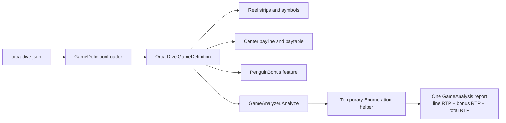
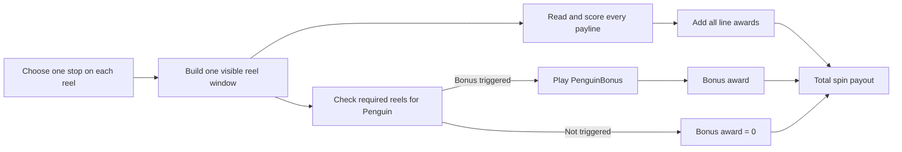
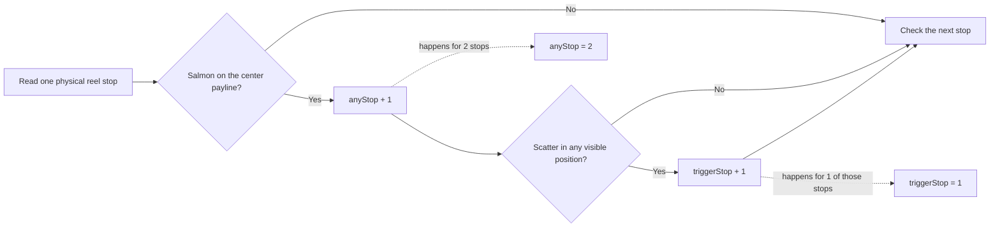

# Counting Every Outcome Without Playing Every Spin

*Part 5 in a series on building a slot game engine in C#. This article explains
`GameAnalyzer`, one method at a time. The intended reader knows basic loops and arrays but
does not need a statistics background.*

A slot simulator answers a question by sampling: play many random spins, add the payouts,
and watch the average settle. `GameAnalyzer` takes a different route. It counts the possible
outcomes and calculates the exact average.

The direct method would try every stop on every reel. Orca Dive has 14,781,416 stop
combinations. That is possible, but much of the work repeats. If Salmon appears at four
different stops on one reel, the payline evaluator sees the same Salmon all four times.

`GameAnalyzer` evaluates that Salmon choice once and gives it a weight of four.

## A small example

The next table is a small teaching game, not Orca Dive. It uses only Cherry and Bell so its
24 outcomes can be checked by hand. We care about one payline.

| Reel | Symbols on its stops |
|---|---|
| 1 | Cherry, Cherry, Bell |
| 2 | Cherry, Bell |
| 3 | Cherry, Cherry, Cherry, Bell |

There are `3 × 2 × 4 = 24` physical stop combinations.

Now collapse repeated symbols into counts:

| Reel | Cherry count | Bell count |
|---|---:|---:|
| 1 | 2 | 1 |
| 2 | 1 | 1 |
| 3 | 3 | 1 |

Only eight symbol combinations remain: cherry or bell on each of three reels. Each one has
a weight. Three cherries has weight `2 × 1 × 3 = 6`, so it represents six of the 24 physical
outcomes. Bell, cherry, bell has weight `1 × 1 × 1 = 1`.

Add all eight weights and the total comes back to 24. Every outcome is still there,
counted rather than estimated. The repeated work is simply grouped.

### Check your understanding

The combination Cherry / Bell / Cherry has counts 2, 1, and 3. How many physical stop
combinations does it represent?

<details><summary>Answer</summary>

`2 × 1 × 3 = 6`. The weight counts where those same visible symbols came from on the
physical strips.

</details>

An everyday analogy is counting a jar of coins. You can list every coin separately, or make
one stack of quarters, one stack of dimes, and multiply each stack's count by its value. Both
methods produce the same total. `GameAnalyzer` makes stacks of identical reel outcomes.

> 🧪 **Try it live.** Open the companion site at <http://localhost:5090/#/ch05>.
> Build one weighted combination, then add all eight weights and confirm that they still
> represent the original 24 physical outcomes.

## Who checks the game and who counts it

In this chapter, a **game** means one complete `GameDefinition`. The project currently loads
two examples:

| Game | Line game | Bonus feature |
|---|---|---|
| Classic Three Reel | One center payline with Seven, Bar, Bell, Wild, Cherry, and Lemon | None |
| Orca Dive | One center payline with Ocean symbols such as Salmon, Seal, and WildOrca | `PenguinBonus`, triggered by visible Penguin scatters |

`PenguinBonus` is not a separate game passed to `Analyze`. It is one feature inside the
Orca Dive definition. The analyzer produces one report for Orca Dive containing line RTP,
bonus RTP, and total RTP.



The small Cherry-and-Bell table earlier is only a hand-built example of the counting
method. It is not another bonus game and is not loaded from a PAR file.

### What happens after the reels stop

One spin chooses one stop on each reel. Those stops create one visible window. The engine
then checks that same window in two ways:

1. Each payline reads one symbol from every reel and checks the paytable.
2. The bonus rule searches the required reels for visible Penguin scatters.

The two checks do not take turns and one does not cancel the other. A single window can
produce a line award, trigger the bonus, do both, or do neither. If both happen, the spin's
total payout is the line award plus the bonus award.



For example, Orca Dive can place Blue7 on the center payline of the first three reels while
the same window shows Penguin on reels 1, 3, and 5, the reels required by `PenguinBonus`.

| Visible position | Reel 1 | Reel 2 | Reel 3 | Reel 4 | Reel 5 |
|---|---|---|---|---|---|
| Top | Green7 | Squid | Green7 | Mackerel | Red7 |
| **Center payline** | **Blue7** | **Blue7** | **Blue7** | **Seal** | Blue7 |
| Bottom | **Penguin** | Herring | **Penguin** | Squid | **Penguin** |

Read the center row from left to right. The first three reels show Blue7, and Seal on reel 4
ends the run. The Blue7 on reel 5 cannot restart a left-to-right win, so this is a
three-Blue7 line award. Next, scan the full window on reels 1, 3, and 5. Each of those reels
shows Penguin, so `PenguinBonus` also triggers. The engine adds the line award and bonus
award to the same spin total.

Other code calls `Analyze` when it wants a report for one loaded game, such as Orca Dive.
`Analyze` first checks the request. The game definition must exist, and this version of the
analyzer must receive exactly one payline. If either check fails, the method reports an
error instead of starting the calculation.

```csharp
public static GameAnalysis Analyze(GameDefinition definition)
{
    ArgumentNullException.ThrowIfNull(definition);

    if (definition.Paylines.Count != 1)
        throw new NotSupportedException(...);

    return new Enumeration(definition).Run();
}
```

If the game passes those checks, the last line creates an `Enumeration` helper and calls
`Run`. That helper counts the supported outcomes. While it works, it keeps tally marks for
wins, payouts, bonus triggers, and spins where a line award and bonus trigger happen
together. When the counting ends, it uses those totals to build the final `GameAnalysis`
report. The helper is then discarded.

Think of `Analyze` as the front desk. The front desk checks whether the request can be
handled. `Enumeration` is the worker who takes an accepted request, keeps a tally sheet,
and returns the finished report.

### Why this exact analyzer stops at one payline

The slot engine can play games with several paylines. `WinningOutcomeTable` scores every
configured line, and the simulation adds every line award. The one-payline check applies
only to `GameAnalyzer`, the code that calculates exact RTP and variance without playing
random spins.

With one line and one bonus, a spin has two payout parts:

```text
total payout = line award + bonus award
```

The analyzer already counts how often those two parts happen together. With two lines and
one bonus, there are three payout parts and three pair relationships to count:

| Pair | Why they may be related |
|---|---|
| Line 1 and Line 2 | Both read the same stopped reels and may share visible positions |
| Line 1 and bonus | The same window can make Line 1 pay and show the scatter |
| Line 2 and bonus | The same window can make Line 2 pay and show the scatter |

**Variance measures how widely the total payout spreads around its average.** Calculating
that total requires each part's variance and the covariance of every pair:

```text
Var(total) = Var(line 1) + Var(line 2) + Var(bonus)
           + 2 Cov(line 1, line 2)
           + 2 Cov(line 1, bonus)
           + 2 Cov(line 2, bonus)
```

`GameAnalyzer` currently stores one payline result per reel and one line-to-bonus overlap.
It does not yet store all line pairs and every line-to-bonus pair. The guard rejects a
multi-payline definition instead of returning an RTP band with missing covariance terms.
`AnalyticMath` handles line-to-line covariance for the simpler built-in games, whose bonus
terms are independent of their reel windows.

## Preparing the counts

The `Enumeration` constructor creates a `WinEvaluator`, a reusable payline buffer, and two
count tables by calling `BuildWeights`.

`BuildWeights` checks every physical stop once. For each symbol on each reel, it records:

- `anyStop`: how many stops place that symbol on the payline;
- `triggerStop`: how many of those stops also show the bonus scatter somewhere in the
  visible window.

Use reel 1 from Orca Dive as a real example. Two stops place Salmon on the center payline.
One of those two windows also contains the Penguin scatter. `BuildWeights` therefore stores
`anyStop = 2` and `triggerStop = 1` for Salmon on that reel. Salmon is a paying symbol: three
or more Salmon from the left can produce a line award.

The diagram follows one physical stop through `BuildWeights`. A stop increments
`triggerStop` only after it has already incremented `anyStop`, so the trigger count is a
subset of the line-symbol count.

<!-- EXPORT: render this Mermaid block to PNG before publishing -->


The two qualifying reel-1 stops look like this. Stop numbers are zero-based, as they are
in the code:

| Stop | Three-symbol window | Salmon on center payline? | Penguin visible? | `anyStop` | `triggerStop` |
|---:|---|:---:|:---:|:---:|:---:|
| 11 | Blue7 / Salmon / Penguin | Yes | Yes | +1 | +1 |
| 22 | Red7 / Salmon / Green7 | Yes | No | +1 | 0 |
| **Total** |  |  |  | **2** | **1** |

Why keep both? A line win and a bonus trigger can happen on the same spin. Their relationship
is another form of covariance. Think of two boats lifted by the same wave: the same reel
window can produce the line award and reveal the Penguin that starts the bonus. The analyzer
keeps the overlap so the total payout's variance includes those shared spins.

`ScatterInWindow` performs the small check used while building the table:

```csharp
for (var row = 0; row < reels.Rows; row++)
{
    // Stop as soon as one visible position contains the scatter.
    if (reels.At(reel, stop, row).Id == scatterId) return true;
}
return false;
```

It looks through the visible rows at one reel position and returns as soon as it finds the
scatter.

## Checking the amount of work

`GuardEnumerationSize` multiplies the number of distinct symbols found on each reel. A game
with 8 choices on each of 5 reels needs `8⁵`, or 32,768 branches. Repeated physical stops do
not add branches because their counts are stored in the weights.

The analyzer refuses more than 200 million branches. This guard prevents a bad or unusually
large definition from making the application appear frozen. It is a time and memory safety
limit, not a rule of slot mathematics.

## How `Descend` builds combinations

`Descend` performs the recursive walk:

```csharp
private void Descend(int reel, long weight, long triggerWeight)
{
    if (reel == _definition.ReelCount)
    {
        Accumulate(weight, triggerWeight);
        return;
    }

    var any = _anyStop[reel];
    var trigger = _triggerStop[reel];
    for (byte symbol = 0; symbol < any.Length; symbol++)
    {
        if (any[symbol] == 0) continue;
        _cells[reel] = symbol;
        Descend(reel + 1, weight * any[symbol], triggerWeight * trigger[symbol]);
    }
}
```

Think of filling three blank boxes, one box per reel.

1. Pick a possible symbol for reel 1 and put it in box 1.
2. For that choice, pick a possible symbol for reel 2 and put it in box 2.
3. For those two choices, pick a possible symbol for reel 3 and put it in box 3.
4. With every box filled, evaluate the payline.
5. Return to the last box and try its next symbol.

This is recursion: the method handles one reel, then calls itself for the next reel. When
`reel` equals the reel count, there are no blank boxes left.

The `weight` travels with the choices. If the selected symbols appear 2, 1, and 3 times,
the final weight is six. `Accumulate` therefore adds that result six times with one
multiplication.

`if (any[symbol] == 0) continue` skips any symbol the reel never carries, so a reel
branches only on symbols it can actually show.

## What `Accumulate` records

Once `_cells` contains one symbol for every reel, `Accumulate` asks `WinEvaluator` whether
the payline wins.

It records five kinds of totals:

| Field | What it counts |
|---|---|
| `_hits` | Physical stop combinations that produce a line win |
| `_payUnits` | Weighted sum of line-pay multipliers |
| `_paySquareUnits` | Weighted sum of squared line-pay multipliers |
| `_payTriggerUnits` | Line pay on combinations that also trigger the bonus |
| `_triggerWeight` | Physical stop combinations that trigger the bonus |

The squared pay is needed for variance. The combined pay-and-trigger count is needed because
the two events can occur together.

Payout multipliers stay as scaled integers during this loop. A multiplier of 2.25 is stored
as 225 when the scale is 100. This avoids rounding on every combination. `Summarize` converts
the totals to `double` once, after all counting is finished.

## What `Summarize` calculates

`Summarize` divides each weighted total by the number of physical stop combinations.

The line RTP is:

```text
weighted line payouts ÷ multiplier scale ÷ stop combinations
```

The bonus RTP is:

```text
chance of triggering × average bonus award
```

Total RTP is the sum of those two averages.

Standard deviation needs the average squared total payout as well as the average payout.
For a random payout `X`:

```text
variance = average(X²) - average(X)²
standard deviation = square root of variance
```

The total payout can contain both a line win and a bonus award. Expanding their square creates
a cross term, which is why `_payTriggerUnits` exists. In ordinary language, the calculation
must include spins where both parts pay together.

The final `GameAnalysis` reports exact combination counts, RTP values, trigger frequency, and
standard deviation. "Exact" here means that every modeled outcome is counted. The last
division still uses floating-point numbers for ratios.

## How this differs from the `Rtp` directory

The project has two exact calculation paths.

`GameAnalyzer` groups identical payline-symbol outcomes from a loaded game. It supports wilds
and a window-based scatter bonus, but currently requires one payline.

`AnalyticMath` uses probability formulas for built-in games. It handles several paylines by
calculating the covariance between each pair. Its version 1 features are independent of the
reel window.

Both avoid random sampling. They solve different game models.

## A walkthrough checklist

To re-read the code in order, hold one question in mind per method:

| Method | Question it answers |
|---|---|
| `Analyze` | Is this game supported, and where does analysis begin? |
| `Enumeration` constructor | What data must be prepared once? |
| `BuildWeights` | How many physical stops does each symbol choice represent? |
| `ScatterInWindow` | Does this reel position help trigger the bonus? |
| `GuardEnumerationSize` | Will this calculation finish in a reasonable amount of work? |
| `Run` | What are the two stages of the calculation? |
| `Descend` | How do we generate every symbol combination? |
| `Accumulate` | What does one completed combination contribute? |
| `Summarize` | How do counts become RTP and standard deviation? |

Start from the 24-outcome example: it shows why three cherries carry a weight of
six, and the production recursion repeats that counting at scale.

*Source files: `CSharp/src/MMP.SlotGame.Core/Games/GameAnalyzer.cs` and
`CSharp/src/MMP.SlotGame.Core/Rtp/AnalyticMath.cs`.*

## Optimization notebook

**Summary:** weighted enumeration already removes repeated work; profile its remaining
stages before changing the recursion.

- **Grouped outcomes:** let repeated physical stops share one branch and carry their count
  as a weight.
- **Safety guard:** keep the combination limit and independent exhaustive tests in place.
- **Stage profiling:** measure branch creation, category evaluation, and dictionary
  accumulation separately if analysis becomes slow.
