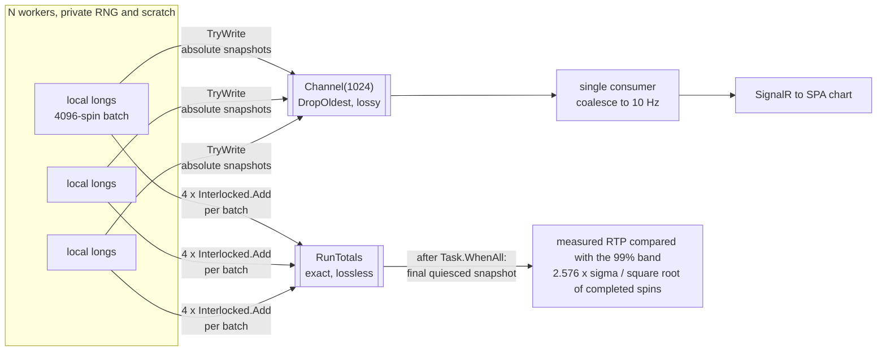

# A Replayable Parallel Simulation Engine

*Part 6 of a series on building a slot game engine in C#. Parts 4 and 5 built the analytic
math. This one builds the machine that checks it: a parallel simulation engine
whose results are reproducible bit for bit, with live telemetry that never blocks
the workers.*

The analytic calculator says the stock preset returns 98%, from the 7,500 + 1,300 +
1,000 basis points article 1 ships as defaults, with a per-spin standard deviation σ.
The engine's job is to play millions of spins and hold the measured number up against
that predicted band. It has to be fast enough to watch, lossless in its money totals,
and deterministic enough to replay. Those three requirements pull against each other.

The main pieces, before the code:

| Term | Plain-language meaning |
|---|---|
| **Worker** | One logical helper assigned part of the total spin count |
| **Quota** | The exact number of spins assigned to that worker |
| **Batch** | A small group of spins totaled privately before publishing a subtotal |
| **Snapshot** | A read of the totals at one moment |
| **Telemetry** | Progress information sent to the dashboard; it is not the accounting record |

## A twelve-spin example

Suppose four workers must play 12 spins. Give each worker three spins before the run starts:

```text
worker 0: spins 1–3
worker 1: spins 4–6
worker 2: spins 7–9
worker 3: spins 10–12
```

Each worker has its own seeded random stream. The operating system may run worker 3 first,
but worker 3 still plays its assigned three spins from its assigned stream. Repeating the
same setup therefore repeats the same work.

### Check your understanding

Why not let the next free worker take the next spin from one shared queue?

<details><summary>Answer</summary>

The result would depend on timing. A different worker could claim a spin on the next run,
which changes which random stream supplies that spin. Fixed quotas remove that timing choice.

</details>

## Determinism is also a scheduling problem

Most of "same seed, same result" is a property of the scheduler, not of the random
number generator: which spin runs on which worker. The obvious
parallel loop,

```csharp
Parallel.For(0, targetSpins, i => PlayOneSpin());   // don't
```

would be nondeterministic if each thread consumed its own mutable RNG stream,
because dynamic partitioning decides at runtime which thread executes which
iteration. Which stream plays which spin could then shift from run to run, and the
totals shift with it. `Parallel.For` can be perfectly deterministic on its own terms:
an iteration whose random input derives solely from its iteration index replays fine.
This engine picks fixed worker streams and quotas because that contract is simple to
reproduce and cheap to run.

So the engine uses N logical workers with fixed, pre-assigned quotas, one task and
one RNG stream each, all decided before the first spin runs. `Task.Run` draws on
.NET's thread pool, which is a different thing from a promise of permanently
dedicated operating-system threads. Article 2 explains fixed quotas with its
door-knocking pollster example. The code assigns them before work begins:

```csharp
var spinsPerWorker = _plan.TargetSpins / _plan.WorkerCount;
var remainder = _plan.TargetSpins % _plan.WorkerCount;

for (var w = 0; w < _plan.WorkerCount; w++)
{
    var workerId = w;
    // Deterministic quota: worker 0 absorbs the remainder.
    var quota = spinsPerWorker + (workerId == 0 ? remainder : 0);
    workers[workerId] = Task.Run(
        () => WorkerLoop(workerId, quota, telemetry, observer, ct), ct);
}
await Task.WhenAll(workers).ConfigureAwait(false);
```

Worker *i* owns its quota, its RNG state, and its scratch buffers.
`SpinRng.ForWorker(masterSeed, i)` supplies the SplitMix64-mixed stream from article 2,
which also covers why `SpinRng` is a mutable struct advanced by `ref` rather than a
class. Read-only game data is shared, and workers publish batches to shared atomic
totals. Mutable RNG and scratch state stay private to one worker.

Hold the game definition, code version, target spin count, master seed, and worker
count steady and the result reproduces. The run header records the seed and the worker
count. Change the worker count and the RNG partition changes with it, so the totals
legitimately differ, and the system says so rather than pretending the run is the same
experiment.

Two rules provide replayability: no ambient randomness, and fixed assignment of
each seeded stream to a quota. SplitMix64 serves a different purpose: it separates
nearby worker seeds to improve statistical stream quality. Poorly separated seeds
could still replay exactly; they would weaken the statistical experiment rather
than its determinism.

## The hot loop and the two-tier counter

Each worker runs up to 4,096 spins in a batch. It adds the results to local `long`
variables. No other worker can touch those local values.

```csharp
private void WorkerLoop(int workerId, long quota, /* … */)
{
    var rng  = _streamFactory(workerId);
    var play = _playFactory();     // per-worker closure with its own scratch buffers

    long done = 0;
    while (done < quota)
    {
        if (ct.IsCancellationRequested) return;   // checked per batch, not per spin

        var batch = (int)Math.Min(BatchSize, quota - done);
        long batchWagered = 0, batchReturned = 0, batchHits = 0;

        for (var i = 0; i < batch; i++)
        {
            var outcome = play(ref rng);
            batchWagered  += outcome.Wagered.Value;
            batchReturned += outcome.Total.Value;
            if (outcome.Total.Value > 0) batchHits++;
        }

        Totals.AddBatch(batch, batchWagered, batchReturned, batchHits);
        done += batch;
        telemetry?.TryWrite(new TelemetrySample(_plan.RunId, Totals.Snapshot()));
    }
}
```

A cancellation request can arrive while a worker is already inside a batch. That
worker may finish as many as 4,095 more spins before noticing cancellation. With
several workers, more than one batch may
be in flight. The exact delay is hardware- and game-dependent, so this chapter doesn't
quote a figure in microseconds. `BatchSize` is the knob trading
cancellation responsiveness against the cost of checking the token on every spin;
4,096 is the current engineering choice and should be benchmarked if workloads
change.

At the end of the batch, four `Interlocked.Add` calls publish the subtotals. Article
1 explains what an atomic addition is. Here it happens once per batch instead of
once per spin:

```csharp
public sealed class RunTotals
{
    private long _spins, _wageredMillicents, _returnedMillicents, _hits;

    public void AddBatch(long spins, long wagered, long returned, long hits)
    {
        Interlocked.Add(ref _spins, spins);
        Interlocked.Add(ref _wageredMillicents, wagered);
        Interlocked.Add(ref _returnedMillicents, returned);
        Interlocked.Add(ref _hits, hits);
    }
}
```

> 💡 **Quick picture.** A warehouse with sixteen aisles could have every worker
> radio the head-office clerk after scanning each single box: accurate, but the
> clerk's radio channel becomes the bottleneck the moment two workers key up at
> once. Instead, each worker keeps a private tally sheet for their aisle and phones
> in one subtotal every few hundred boxes. The warehouse total comes out exactly
> the same either way, because addition doesn't care how the numbers were grouped;
> only the traffic on the radio channel changes.

Per-spin publication would require four atomic operations for every spin. Batching
reduces that synchronization frequency by as much as a factor of 4,096 without
changing the integer sum. This is invariant M2 from article 2: regrouping integer
additions changes when subtotals are published, not what they add up to.

The batched total is the identical sum a per-spin accumulation would produce, because
`(a + b) + c` and `a + (b + c)` are the same value for integers, unlike the
floating-point case article 2 opens with.

One wrinkle. A mid-run `Snapshot()` reads four counters that are each atomic on their
own and are not atomic *as a set*, so it can pair a `wagered` from one batch with a
`returned` from the previous one. The skew rides on concurrent updates, and with
several fast workers publishing during the four reads it has no guaranteed bound of
one batch.

That skew touches the live display and nothing else. The final snapshot is taken after
`Task.WhenAll`, on a quiesced engine, where it is exact, and that snapshot is the one
the acceptance tests read. The tempting fix, a lock around snapshot versus add, would
put contention on the hot path to sharpen a number nobody asserts on.

## Telemetry that never blocks the workers

The engine's constructor takes a `ChannelWriter<TelemetrySample>?`, caller-owned,
optional, and written with `TryWrite`. Article 1 covers why a `Channel` and not a
plain queue. The write side does not block:

```csharp
telemetry?.TryWrite(new TelemetrySample(_plan.RunId, Totals.Snapshot()));
```

The server side creates it as a bounded channel, capacity 1,024, drop-oldest. Under
load the workers outrun the consumer and old samples vanish. The two rules that
make that loss harmless, absolute snapshots and never blocking on write, are
article 1's design, now visible as code:

<!-- EXPORT: render this Mermaid block to PNG before publishing -->


> 🧪 **Try it live.** The companion site's chapter 6 page (<http://localhost:5090>,
> then `#/ch06`) exercises both halves of this design. **Lab 1 — Same seed, same
> answer, any day** re-runs a configuration and compares the totals down to the
> millicent, including what changing the worker count does to them. **Lab 2 — Starve
> the telemetry, keep the truth** throttles the sample consumer so you can drop chart
> points on purpose and watch the counters stay exact.

## What a game supplies

`SimulationEngine` receives the spin operation as a pair of delegates. Reel,
paytable, and payline rules stay in the game code.

```csharp
/// <summary>
/// Plays one spin: draw, evaluate, award. RNG arrives by ref, so the stream advances in
/// the caller's worker.
/// </summary>
public delegate SpinOutcome SpinPlay(ref SpinRng rng);

/// <summary>
/// Builds one <see cref="SpinPlay"/> per worker. A game with its own evaluation rules
/// (wilds, scatter-triggered bonuses, picks simulated round by round) reuses the
/// determinism, quota partitioning, batching and telemetry below through this seam.
/// OrcaDive is the first such game. Each worker's play owns its own scratch buffers, so
/// this is a factory and not one shared instance.
/// </summary>
public delegate SpinPlay SpinPlayFactory();
```

The stock game wires them up with a separate scratch window for each worker:

```csharp
return () =>                                    // called once per worker
{
    var evaluator = new LinePayEvaluator(lines, paytable);
    var window = new Symbol[reels.WindowSize];  // reused for every spin

    return (ref SpinRng rng) =>                 // called per spin
    {
        reels.DrawWindow(ref rng, window);
        var basePay = evaluator.Evaluate(window, reels.ReelCount, reels.Rows);
        var featurePay = Millicents.Zero;
        for (var f = 0; f < features.Count; f++)
            featurePay += features[f].Play(ref rng);
        return new SpinOutcome(wager, basePay, featurePay);
    };
};
```

That delegate keeps the scheduling policy in one place. When article 7 loads Orca
Dive, the project's fictional worked game, it brings its own wild, scatter, and pick
rules through `SpinPlay` and inherits the quota partitioning, seeded streams, batched
counters, and telemetry unchanged. One worker loop serves both game paths, so their
scheduling behavior stays identical by construction.

The engine asks a game for a `SpinPlay` function and nothing else. Scheduling workers,
batching counters, and coalescing telemetry all run independently of the game's rules.
The worker only has to turn a `ref SpinRng` into a `SpinOutcome`. An interface would
work here too, and it would also hint that the engine might call other methods on that
object someday: session state, configuration, whatever else an `IGame` accumulated
over time. A delegate names the single call the engine makes.

The reel strips are built once and shared across workers. `StripReelSet` copies its
input arrays at construction, so outside mutation leaves the active game alone and
every worker sees byte-identical geometry. Immutable data shares freely, mutable
scratch stays per-worker, so the worker loop needs no lock of its own.

There is also an optional `SpinObserver` delegate, a per-spin diagnostic hook, null by
default, so the hot path pays a predictable null check at most. It lets the server
inspect individual spins during a small diagnostic run while the library itself stays
free of logging. Keep it to diagnostic runs: on a 10-million-spin run it costs a
callback per spin.

## Watching the estimate converge

Chapter 4 introduced the confidence band, and Chapter 5 showed where the loaded-game
analyzer calculates sigma. The simulation supplies the remaining value: how many spins
have finished.

The band comes from the standard confidence-interval formula for a mean. Chapter 4 links
to the NIST explanation of that formula. This project uses the normal approximation with
a two-sided 99% confidence level, so its `z` value is about 2.576.

The band is centered on the analytic RTP calculated from the game rules. It is not centered
on the simulation's measured RTP:

```text
lower edge = analytic RTP - band half-width
upper edge = analytic RTP + band half-width
```

Keeping the center and sigma analytic gives the simulation an independent reference. A bug
in the random play path can move measured RTP, but it cannot move the target or make the
allowed range wider.

The band half-width is:

```text
band half-width = z x sigma / square root of N
```

Each symbol has one job:

| Symbol | Meaning in this project | Where it comes from |
|---|---|---|
| `N` | Number of completed spins in the current snapshot | `RunSnapshot.Spins` |
| `sigma`, written `σ` | Standard deviation of one spin's return per unit wagered; the swinginess value from Chapters 4 and 5 | `GameAnalysis.SigmaPerUnitWagered` |
| `z` | Number selected for the desired confidence level | `NormalQuantile.TwoSided99` is about `2.576` |
| `square root of N`, written `√N` | The amount that averaging `N` independent spins reduces one-spin noise | `Math.Sqrt(snapshot.Spins)` |

The `x` signs mean multiplication. This is not a value called "z-sigma." The code
multiplies `z` by sigma, then divides by the square root of the completed spin count.

Suppose a teaching game has `sigma = 5` wager units after `N = 1,000,000` spins. The
square root of one million is 1,000:

```text
99% band half-width = 2.576 x 5 / 1,000
                    = 0.01288
                    = 1.288 percentage points of RTP
```

If that game's analytic RTP is 90%, the dashboard's 99% band runs from 88.712% to
91.288% at one million spins. A measured RTP of 90.4% is inside the band. A measured RTP
of 92% is outside it and should be investigated.

The production calculation in `ConvergenceRecorder` uses the same four values:

```csharp
var halfWidth = snapshot.Spins > 0
    ? NormalQuantile.TwoSided99
        * sigmaPerUnitWagered
        / Math.Sqrt(snapshot.Spins)
    : 0;

var withinBand = Math.Abs(snapshot.MeasuredRtp - analyticRtp) <= halfWidth;
```

The dashboard plots `snapshot.MeasuredRtp`, which is the returned money divided by the
wagered money in the random run. At low spin counts that line can move sharply. As `N`
grows, the square-root term grows and the band narrows. Multiplying the spin count by 100
narrows the band by 10 because `√100 = 10`.

The exact width at ten million spins depends on the game's sigma; wager size alone does
not determine it. Across many independent runs, about 99% should finish inside a 99% band
when the normal approximation fits the payout distribution. A single correct run can
still land outside it.

An out-of-band run is a signal to investigate, not automatic evidence of a bug. The
determinism contract makes that investigation repeatable: re-run the same complete
configuration and attach the observer to inspect the payout sequence. The current
observer receives `SpinOutcome`, not reel-stop coordinates, so deeper diagnosis may
require an additional opt-in trace at the game layer.

Next: moving compatible game rules into JSON, adding a generic win evaluator, and
reproducing the figures in a public third-party slot deconstruction.

*Source files: `Simulation/SimulationEngine.cs`, `Simulation/RunTotals.cs`,
`Simulation/SimulationConfig.cs`.*

## Optimization notebook

**Summary:** retain the existing low-allocation worker design and tune it only against a
complete Release baseline.

- **Worker-owned scratch space:** reuse one buffer per worker instead of allocating during
  each spin.
- **Batched counters:** update shared totals in groups to reduce synchronization.
- **Measured tuning:** change batch size, worker count, delegates, or telemetry cadence one
  at a time. Article 9 shows that forced inlining and manual loop unrolling were slower.
