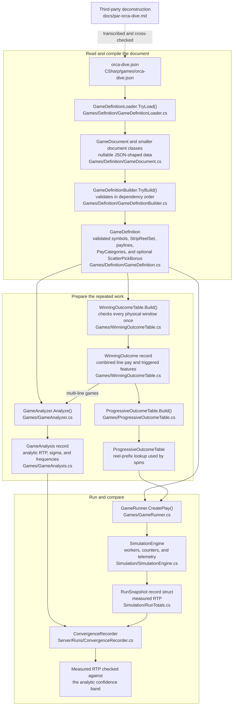

# Games as Data: Loading a Third-Party Slot Deconstruction

*Part 7 of a series on building a slot game engine in C#. Parts 3 through 6 built a
configurable slot game and the engine that runs it. This one models Orca Dive
from a public third-party deconstruction by making the game itself a JSON file.*

Everything so far has run generated games: preset reel shapes, a canonical paytable
scaled to a target. That shows the engine and the math agreeing with *each other*,
which is useful, and a skeptic can fairly call it a closed loop. Stronger evidence
comes from game data and results derived outside this codebase. The public
third-party page Orca Dive's numbers are modeled on supplies per-reel symbol COUNTS,
the visible paytable and bonus rules, and calculated returns. The strip ORDERINGS in
`games/orca-dive.json` are ours, not the source's. (The dated
citation lives in `docs/par-orca-dive.md`. This article is about the loader.)

Orca Dive is a fictional game invented for this series. Its math reproduces a published
PAR deconstruction of a real commercial machine: the source's author reconstructed the
symbol counts from 212 recorded spins and read the awards off the machine's rule
screens. Orderings were not published, so ours are chosen to reproduce the source's
figures: the scatter placement in particular was picked so the Penguin shows on 6 of
26 stops, which is what makes the trigger rate match. Order matters for scatters and
multi-row windows, so that part of the cross-check is ours rather than the source's.
Reproducing that source's combination counts and returns is a valuable independent
cross-check of this engine; it certifies nothing (and the source is not an official
manufacturer PAR sheet).

The game can live in code or in data. This chapter puts it in data.

The vocabulary for this chapter:

| Term | Plain-language meaning |
|---|---|
| **Game definition** | The JSON description of symbols, strips, lines, awards, and features |
| **Loader** | Code that reads and validates that description |
| **Pay category** | One possible interpretation of a line, such as Mackerel or Mixed Seven |
| **Wild** | A symbol allowed to continue specified categories of wins |
| **Scatter** | A symbol checked in allowed window positions rather than only on a payline |
| **Provenance** | A record of where externally supplied game data came from |

## A validation example

Suppose a JSON file says a reel has 22 stops, but its strip lists only 21 symbols. It also
puts `Whale` on that strip even though no symbol named `Whale` was declared.

A parser can read that JSON successfully. The braces and commas are valid. The game is still
invalid. The loader should report both game problems:

```text
reel 1 declares 22 stops but the strip has 21.
reel 1 stop 7 is 'Whale', which is not a declared symbol.
```

Reporting both lets the author fix the file in one editing pass.

### Check your understanding

What is the difference between parsing and validation?

<details><summary>Answer</summary>

Parsing turns JSON text into objects. Validation checks whether those objects describe a
game the engine can safely run.

</details>

## Follow one rule from JSON to a spin

Start with the Center payline in `orca-dive.json`:

```json
"paylines": [
  { "name": "Center", "rows": [1, 1, 1, 1, 1] }
]
```

The five row numbers mean: read visible position 1 on reel 1, position 1 on reel 2,
and so on through reel 5. These are zero-based positions, so position 1 is the center of
a three-position window.

That short JSON rule passes through four stages:

| Stage | Source type or method | What happens to the Center payline |
|---|---|---|
| Read JSON | `GameDefinitionLoader.TryLoad` | Text becomes a nullable `PaylineDocument` |
| Validate and compile | `GameDefinitionBuilder.BuildPaylines` | Checks five row values and creates a `Payline` |
| Prepare answers | `WinningOutcomeTable.Build` | Reads that payline for every reel-stop combination and stores useful results |
| Play a spin | `ProgressiveOutcomeTable.TryGetValue` | Uses the five drawn stop numbers to find the prepared `WinningOutcome` |

The JSON is configuration. The loader does not reread names and arrays during every spin.
It validates the descriptive form once, then builds compact objects and lookup tables for
the repeated work.

## The game definition file

Orca Dive arrives as JSON:

```jsonc
{
  "name": "Orca Dive",
  "windowRows": 3,
  "symbols": [
    { "name": "Red7" },
    { "name": "WildOrca", "wild": true,
      "substitutesFor": ["Salmon", "Herring", "Squid", "Mackerel"] },
    { "name": "Penguin", "scatter": true }
    // … 10 symbols total
  ],
  "groups": { "AnySeven": ["Red7", "Green7", "Blue7"] },
  "reelStops": [26, 29, 26, 29, 26],
  "symbolCounts": { "Red7": [1, 2, 1, 2, 1], /* … */ },
  "reels": [
    ["Penguin", "Mackerel", "Herring", "Green7", /* … the actual 26-stop strip */],
    // … five strips, in published order
  ]
  // … paytable and bonus follow
}
```

Several fields deserve explanation:

- **`source` is provenance.** The schema carries an optional `source` string, and
  `GameDefinition` keeps it, so a file can say where its numbers came from. When a
  test fails, the first question is "us, the transcription, or the source model?",
  and a definition that names its origin answers it. The shipped
  `classic-three-reel.json` fills the field in; Orca Dive's dated citation lives in
  `docs/par-orca-dive.md` instead.
- **The strips follow the published reconstruction.** Unequal lengths,
  26/29/26/29/26, in the listed order,
  because order is what drives the adjacency correlations from article 3.
- **The redundancy is deliberate.** `reelStops` and `symbolCounts` restate what the
  strips imply. The loader cross-checks them and rejects the file on any
  disagreement.

The evaluator reads the strips at runtime; `reelStops` and `symbolCounts` are a
cross-check, the way a checksum published next to a download catches a bad transfer
rather than replacing the file. For hand-transcribed data, that checksum catches the
typo that would otherwise surface three layers later as a fourth-decimal RTP
mismatch.

The loader mirrors `SimulationConfig.TryCreate` from article 1: parse, validate
everything, report all errors at once, and only then construct. A
`GameDefinition` that exists is one that passed every check: unknown symbol names,
paylines off the window, paytable rows for symbols that don't exist, geometry
disagreeing with strips, all rejected with slot-domain messages rather than parser
stack traces.

The JSON is first deserialized into `GameDocument`. Its smaller document types mirror the
sections of the file:

| JSON section | Temporary document type | Compiled type |
|---|---|---|
| `symbols` | `SymbolDocument` | `Symbol` with a byte id |
| `reels` | lists of symbol names | `StripReelSet` |
| `paylines` | `PaylineDocument` | `Payline` |
| `paytable` | `PayDocument` | `PayCategory` |
| `features` | `FeatureDocument` | `ScatterPickBonus` and `PickBonus` |

The document types are nullable because an incomplete file must be representable long
enough to produce a useful validation message. They are also `internal`, so code outside
the core assembly works with the validated `GameDefinition`, not a half-checked JSON shape.

## How fractional pays enter a game file

A JSON document can contain decimals, but this schema deliberately compiles award
multipliers to integers. A source paytable may specify 1.5X or 2.25X. The `payUnit`
field names the unit every pay in that file uses: `"units"` (the default, whole multipliers only), `"tenths"`
(15 means 1.5X), or `"hundredths"` (225 means 2.25X, the finest unit the engine
supports).

Inside the engine those three choices are an `enum PayUnit { Units, Tenths,
Hundredths }` rather than a bare string carried around and compared at every use. An
`enum` gives the three valid choices names the compiler checks, so a typo like
`Hundreths` fails to compile instead of quietly behaving like `Units` at run time.

The JSON value is text supplied by the file's author,
and the loader reads it with
`string.Equals(trimmed, "units", StringComparison.OrdinalIgnoreCase)`.
`OrdinalIgnoreCase` earns its place here: it compares raw byte values and applies no
language's casing rules, so `"Hundredths"`, `"HUNDREDTHS"`, and `"hundredths"` all
match the same way whatever locale the loading machine is set to. A culture-aware
comparison could in principle treat certain letters differently depending on system
language settings. A JSON keyword should mean the same thing everywhere the file is
loaded, and an ordinal comparison guarantees it.

> 💡 **Quick picture.** A recipe written in whole cups can't ask for a cup and a
> half unless the cook also owns a half-cup measure. Declaring `payUnit: "tenths"`
> is buying the finer measuring cup for this one file: every pay in it is now read
> in tenths, and the loader checks that every number actually fits that cup.

Whichever unit a file declares, the loader rejects any pay written with more
precision than that unit can carry, and it names the finest unit the file could
still use:

```
paytable category 'Seven' pays 1.5 at a run of 3; "units" mode allows whole-number
multipliers only. Declare "payUnit": "tenths" or "hundredths" to express 1.5X.
```

`payUnit` applies to the whole file, not per category, so one game cannot mix
unit conventions across its own paytable. Internally the loader compiles every
declared pay to hundredths of the **total spin wager** before anything else touches
it, so the evaluator and analyzer downstream see one representation regardless of
which unit the JSON author chose. This total-wager basis is this engine's file
convention. Traditional multiline paytables often quote line-bet units and require
an explicit conversion when imported. Article 2 covers the money-type side of this
same conversion; the full schema for `payUnit` lives in
`docs/game-definition-schema.md`.

The loader receives declared pays as `Dictionary<int, decimal>`. It uses `decimal`
instead of `double` because a JSON author types a pay as ordinary decimal digits,
"1.5" or "2.25," and `decimal`
holds those digits with no representation error. That is a different job from the
accumulation path article 2 rules `double` out of, and the loader converts this
`decimal` to an integer well before the number reaches any hot path.

That conversion is `checked((int)(realMultiplier * Millicents.ScaleFactor))`. A decimal-to-
integer conversion already throws `OverflowException` when the value is outside the
integer range. The `checked` keyword makes the intended boundary visible beside the cast;
it does not change decimal's overflow behavior. The builder validates practical payout
limits before a compiled value reaches the evaluator.

> 🧪 **Try it live.** The companion site's chapter 7 page (<http://localhost:5090>,
> then `#/ch07`) hands the real loader whatever you give it. **Lab 1 — The shipped
> games, read by the real loader** compiles `orca-dive.json` and
> `classic-three-reel.json` and shows what came out; **Lab 2 — Feed the loader
> anything** lets you edit a definition and read back the whole error list at once.

## An evaluator that reads the game from data

Orca Dive needs things the generated games from earlier articles didn't have: a
wild that substitutes for the four fish (but not the sevens), a "mixed sevens"
group win, a wild that pays on its *own* line from one-of-a-kind, and a scatter
that triggers a bonus. Adding each rule to the evaluator as a special case would
leave it with a growing set of game-specific flags.

Instead, the loader **compiles** the game's rules into a neutral form, pay
categories, and the evaluator interprets those:

```csharp
public sealed record PayCategory
{
    private readonly bool[] _continuesRun;
    private readonly bool[] _requires;
    private readonly int[] _paysByCount;

    public PayCategory(int index, string name, PayCategoryKind kind,
        bool[] continuesRun, bool[] requires, int[] paysByCount)
    {
        Index = index; Name = name; Kind = kind;
        _continuesRun = [.. continuesRun];
        _requires = [.. requires];
        _paysByCount = [.. paysByCount];
    }

    public int Index { get; }
    public string Name { get; }
    public PayCategoryKind Kind { get; }

    public bool Continues(byte symbolId) => _continuesRun[symbolId];
    public bool IsRequired(byte symbolId) => _requires[symbolId];
}
```

`PayCategory` is a `record`, and like article 4's `ScaledPaytable` it spells
out a constructor instead of taking a one-line positional shape. The arrays stay
`private` here too. An array property is an ordinary reference, and handing a caller
the `bool[]` would let that caller flip one entry in place, changing what the
category pays without going through any of the loader's checks. The constructor
copies each array on the way in (`[.. continuesRun]`), and the category exposes its
data through `Continues(byte)` and `IsRequired(byte)`, single-symbol lookups that
never reach the backing array. Read through those two methods, "Mackerel" has
`Continues` true for Mackerel *and* WildOrca (the wild extends fish runs), and
`IsRequired` true for Mackerel alone.

Two flat `bool[]` arrays match where this data gets read: the
evaluator's inner loop, run once per line per spin, tens of millions of times a
run. `Continues(symbolId)` and `IsRequired(symbolId)` are each one array index, no
object to unwrap first, and a `bool[]` packs one byte per entry with nothing extra
attached. A single array of paired-flag objects would cost an indirection per
lookup for a package of data the hot loop doesn't need bundled together.

> 💡 **Quick picture.** A substitute teacher can run the class and keep the lesson
> going, but the semester's official grade report still credits the class to the
> assigned teacher of record, not the substitute. A wild is the substitute: it
> keeps a Mackerel run alive from reel to reel, but a run made of nothing but wilds
> has no assigned teacher of record for Mackerel, so it doesn't satisfy the Mackerel
> category. It falls through to the Wild category instead, which requires the
> wild and pays its own, much richer, schedule.

`AnySeven` is a category whose `ContinuesRun` covers three symbols and whose
`Requires` covers the same three symbols: a group win, from the same two arrays,
no separate code path needed.

The evaluator walks every category and keeps the best win:

```csharp
public LineWin Evaluate(ReadOnlySpan<byte> cells)
{
    var best = LineWin.None;
    foreach (var category in _categories)
    {
        var run = 0; var satisfied = false;
        while (run < cells.Length && category.Continues(cells[run]))
        {
            satisfied |= category.IsRequired(cells[run]);
            run++;
        }
        if (!satisfied) continue;

        var pay = category.PayFor(run);
        if (pay == 0 || pay < best.Multiplier) continue;
        if (pay == best.Multiplier && run <= best.Count) continue;  // tie -> longer run

        best = new LineWin(category.Index, run, pay);
    }
    return best;
}
```

The method is short, and its game knowledge is two engine-wide rules: runs are
left-aligned, and the best pay wins with ties going to the longer run. The source
combination table settles the tie. A Red7 four-of-a-kind and a Mixed-7
five-of-a-kind both pay 100 there, and tied cases are assigned to Mixed 7, so
choosing the longer run reproduces those category counts. Another deterministic
precedence rule could avoid randomness too, but it would not reproduce that
published breakdown.

Run length has no minimum in this evaluator: a category pays at a length exactly
when its pay array has a non-zero entry there. That's how a wild pays from
one-of-a-kind while everything else needs three; the *data* differs, the code does
not. New pay schedules change the data without requiring evaluator subclasses.

## The bonus, simulated pick by pick

In Orca Dive, scatters on reels 1, 3, and 5 open a pick
screen, 24 prizes and 6 blanks; pick until a blank ends the round.

```csharp
/// <summary>
/// A pick-until-you-lose bonus, configured from data: a pool of prizes plus some number
/// of blanks that end the round for a fixed consolation. Orca Dive fills it with 24
/// prizes and 6 blanks, but nothing here knows that.
///
/// <see cref="Play"/> draws entries without replacement. The closed forms below provide an
/// independent analytic check of that play path.
/// </summary>
public sealed class PickBonus { /* … */ }
```

The Orca Dive screen opens one treasure chest at a time, without replacement. Its *expected value*
can be understood with a smaller bag. Suppose it contains one 10X prize and two blanks.
Shuffle the three items. The 10X prize is collected only when it appears before both blanks:

| Order | Collect 10X? |
|---|:---:|
| Prize, Blank, Blank | Yes |
| Blank, Prize, Blank | No |
| Blank, Blank, Prize | No |

The prize is collected in one of the three possible positions, so its chance is `1/3`.
With `b` blanks, the prize and those blanks occupy `b + 1` relative positions. The prize
must be first, giving a collection chance of `1 / (b + 1)`.

Orca Dive has six blanks, so each of its 24 prizes has a `1/7` chance of being collected.
Add `prize value x 1/7` for all prizes to get the average bonus award. The variance also
needs the chance that two named prizes both appear before every blank. That probability is
`2 / ((b + 2)(b + 1))`. `PickBonus.Mean` and `PickBonus.MeanSquared` use these standard
counting results, while `PickBonus.Play` shuffles and draws the actual bonus during a spin.

## Reusing the simulation machinery

Article 6's `SpinPlay` delegate lets a loaded game supply its scoring rules while
the engine keeps responsibility for scheduling, counters, and telemetry.
`GameRunner.CreatePlay` below returns a `SpinPlay` for the same reason article 6
gives: the engine asks every game, generated or loaded from JSON, for the same
one-behavior shape, so a data-loaded game plugs into the identical worker loop a
generated preset uses:

```csharp
private SpinPlay CreatePlay(ConcurrentBag<ComponentTally> tallies)
{
    var tally = new ComponentTally();
    tallies.Add(tally);

    var reels = definition.Reels;
    var progressiveOutcomes = definition.ProgressiveOutcomes;
    var bonus = definition.Bonus;
    var wager = SimulationConfig.Wager;
    // One stop number per reel. The same array is overwritten on every spin.
    var stops = new byte[reels.ReelCount];
    // The bonus reuses this worker-owned buffer when it triggers.
    var scratch = new int[bonus?.Bonus.GiftCount ?? 0];

    return (ref SpinRng rng) =>
    {
        // Five reels consume five base stop draws. No history of random numbers is stored.
        reels.DrawStops(ref rng, stops);

        // Chapter 5 built this lookup from the JSON rules. A miss means no line pays
        // and no feature starts for this complete stop combination.
        var multiplier = 0;
        if (progressiveOutcomes.TryGetValue(stops, out var outcome) && outcome is not null)
            multiplier = outcome.TotalMultiplier;
        var linePay = wager.ScaledMultiply(multiplier);

        var bonusPay = Millicents.Zero;
        if (bonus is not null && outcome?.TriggeredFeatures.Count > 0)
        {
            bonusPay = wager * bonus.Bonus.Play(ref rng, scratch);
            tally.BonusTriggers++;
        }

        if (multiplier > 0) tally.LineHits++;
        tally.LineMillicents += linePay.Value;
        tally.BonusMillicents += bonusPay.Value;

        return new SpinOutcome(wager, linePay, bonusPay);
    };
}
```

This is the current optimized path. The descriptive JSON still retains symbol names,
ordered strips, paylines, and feature rules. `WinningOutcomeTable.Build` checks those rules
during game construction. `ProgressiveOutcomeTable.Build` rearranges the useful answers for
fast reel-by-reel lookup. The spin loop therefore carries stop ids and a prepared result
instead of rebuilding a visible `Symbol[]` window and rescoring every line.

`ComponentTally` is a small class with four plain `long` fields, one instance per
worker, added to a thread-safe `ConcurrentBag` when a worker starts. Its fields need
no `Interlocked`: each worker owns its own instance, and the run sums every tally
after every worker has joined, on a quiesced engine. `RunTotals` (article 6) remains
the interlocked, shared counter; the component split rides alongside it, per worker,
with no synchronization on the spin path.

`bonusPay = wager * bonus.Bonus.Play(ref rng, scratch)` draws from the *same*
worker stream as the reels. The bonus plays inline, on the worker's own stream, which
gives each worker one RNG-consumption order to reason about. A separately and deterministically
seeded bonus stream could also be replayable, but it would define a different
contract and require its own documented partitioning rules.

`Play` also takes a `scratch` buffer as a parameter, and `CreatePlay` allocates it
once, `new int[bonus?.Bonus.GiftCount ?? 0]`, outside the returned closure rather
than inside it. Playing the pick bonus needs somewhere to hold the shuffled gifts
while it draws them, and a function that allocated that array itself, fresh, on
every call, would allocate on every single spin that triggers the bonus, tens of
thousands of times across a run. Accepting the buffer as a parameter instead
means `CreatePlay` allocates it once per worker, when the worker starts, and
`Play` reuses it. The signature says who owns the memory and when it
gets created. The `stops` array follows the same rule: one byte per reel, allocated once
per worker and overwritten on each spin.

Quota partitioning, seeded streams, batched integer counters, and lossy telemetry
remain shared. Their existing tests still run against the common engine, so both
game paths use the same worker loop and determinism rules.

<!-- EXPORT: render this Mermaid block to PNG before publishing -->


`LoadFile` and `Load` force both outcome tables to build before returning the definition,
so a deployed run pays the construction cost before its first spin. `TryLoad` is the
validation-probe path used by the editor lab; it returns the validated definition without
forcing those lazy tables.

## Where the analytic side fits

`GameAnalyzer` computes the loaded game's analytic RTP by enumeration. It groups
outcomes by the symbol shown on each reel. The weight records how many stops produce
those symbols. This reduces Orca Dive from 14,781,416 stop combinations to tens of
thousands of symbol combinations. The exact answer stays the same because line scoring
does not use the stop number.

The scatter reads the whole window rather than a single cell, so it rides through the
enumeration as a second weight per symbol: stops showing this symbol on the payline
*and* a scatter somewhere in the window. That preserves the joint distribution of line
pay and bonus trigger, which are correlated, because a scatter occupying the window
costs that reel a payline symbol. Article 8 covers the accumulator this enumeration
uses and the overflow arithmetic behind it. A single-payline game's analytic
enumeration scales with distinct symbols per reel rather than stops per reel.

For several paylines, the analyzer switches methods. One symbol per reel no longer
describes the whole window, so it sums the compiled physical outcomes instead. Each
outcome contains the combined line award and feature trigger. Squaring the combined
award keeps line-to-line covariance, and counting the triggered outcomes keeps
line-to-bonus covariance. `two-line-tide.json` is the small test fixture for that path.

## What the tests show

The deterministic analytic tests reproduce the deconstruction's 32 integer
line-win combination counts and its reported return components. Separately, the
statistical suite runs ten million spins and checks measured line return, bonus
return, **line** hit frequency (10.26% for Orca Dive — line wins only, rather than the
any-award union, which also counts bonus triggers and comes out at 11.45%), trigger
frequency, and total RTP against analytic bands.
Those are different claims: exact integer agreement for enumerated combination
counts, and probabilistic agreement for sampled simulation results.

For a game that fits the existing mechanics, most variation now lives in a validated
JSON definition. New mechanics still require code: a different evaluator or a
stateful feature needs a matching analysis path and tests.

Next, the final article: the test architecture, exhaustive ground truth,
statistical tiers, and the concurrency tests that assert bit-for-bit equality.

External comparison source: the dated, cited public third-party deconstruction in
`docs/par-orca-dive.md`, which explains that its strips were reconstructed from
recorded play. For contrast, an official laboratory submission includes percentage
calculations, reel-strip listings, paytables, source code, and other materials:
[GLI software-submission requirements](https://gaminglabs.com/getting-started/submit-new-software/).

*Source files: `games/orca-dive.json`, `Games/Definition/*.cs`,
`Games/WinEvaluator.cs`, `Games/GameRunner.cs`, `Games/GameAnalyzer.cs`.*

## Optimization notebook

**Summary:** preserve the complete game definition for people and tools, then compile a
smaller execution view for repeated spins.

- **Rich definition model:** keep symbol names, flags, validation details, and PAR data at
  the configuration boundary.
- **Compact execution model:** give workers byte ids and precomputed values when that is all
  evaluation requires.
- **Measured separation:** article 9 benchmarks the byte-id path while the full domain model
  remains available to analysis and the UI.
