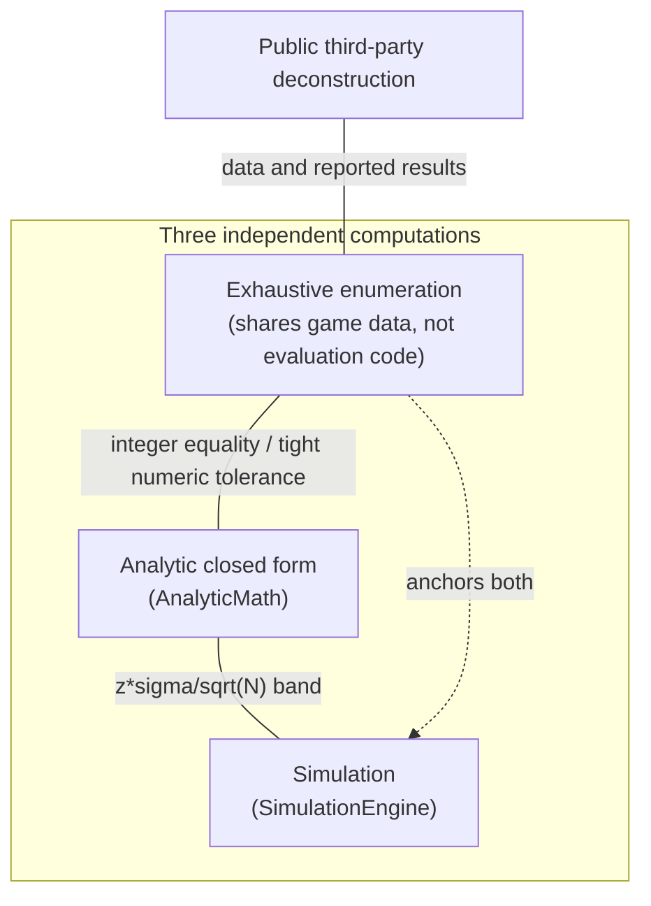

# Proving the Machine: Ground Truth, Statistics, and Bit-for-Bit Determinism

*Part 7, the last in a series on building a slot game engine in C#. The engine is
built and it loads data-defined games. This article is about trusting its results: a test
architecture where independent computations referee each other, an overflow budget
that was measured rather than assumed, and a shared constant that closed a real
drift bug before it shipped.*

A simulator that verifies itself is a circular argument. The engine says 98.01%;
the analytic calculator says 98.00% ± band; they agree, but both were written by
the same person against the same understanding of the game, and a shared
misunderstanding agrees with itself perfectly. Breaking the circle takes a referee
that shares *data* with both sides but *code* with neither. That referee is
exhaustive enumeration, and it anchors everything in this article.

Four kinds of evidence appear here:

| Evidence | Plain-language meaning |
|---|---|
| **Example test** | Checks one chosen case |
| **Exhaustive test** | Checks every outcome in a small finite game |
| **Determinism test** | Repeats the same complete setup and demands identical totals |
| **Statistical test** | Checks whether a large sample is reasonably close to analytic expectations |

## The anchor: enumerate everything

A Classic3 game has 22 stops per reel: 22³ = 10,648 possible outcomes, each equally
likely. Small enough to play every single one:

```csharp
// Exhaustive ground truth: every (stop0, stop1, stop2), no RNG, no sampling.
// Total pay over all windows / total wager IS the RTP, not an estimate of it.
for (var s0 = 0; s0 < 22; s0++)
for (var s1 = 0; s1 < 22; s1++)
for (var s2 = 0; s2 < 22; s2++)
{
    var window = BuildWindow(reels, s0, s1, s2);   // its own window builder
    totalPay += EvaluateAllLines(window);           // its own evaluation loop
}
```

The test's window construction and line evaluation are *written independently* in
the test project. That's deliberate duplication, and it would be a DRY violation
in production code. In a test, the independent route is what gives the comparison
value. This duplication is not a knowledge leak that should be consolidated. DRY
says knowledge should have one
authoritative home, but a referee, by definition, must not share its authority
with the thing it referees. Two implementations, one built from the strips and one
built from the probability formulas, and if they disagree in the fourteenth
decimal place, the test says so.

Against this anchor, two independent claims are checked:

- **The analytic calculator** (article 4): its closed-form RTP must equal the
  enumerated total to floating-point precision. `ExactlyKLeading`, the covariance
  tables, the σ: all of it collapses to "did the formula count what the loop
  counted?"
- **The evaluator** (article 3): per-window, the production `LinePayEvaluator`
  must return what the test's independent evaluation returns, for all 10,648
  windows.

The same pattern scales up through the symbol-tuple enumeration from article 6:
`Analyser_MatchesAnIndependentExhaustiveEnumeration` holds the weighted-tuple
analyzer against a raw stop-by-stop walk. Nothing statistical anywhere; these
tests are deterministic and cannot fail because of a newly unlucky random sample.
Integer combination counts can be compared exactly; floating-point RTP and sigma
are compared with tight stated tolerances. When one fails, something changed or is
wrong rather than the test merely drawing a different sample.

<!-- EXPORT: render this Mermaid block to PNG before publishing -->


> 🧪 **Try it live.** The companion site's chapter 7 page (<http://localhost:5090>,
> then `#/ch07`) puts the referee on screen. **Lab 1 — The census** runs the exact
> enumeration and lists the combination counts it produces; **Lab 2 — Simulation
> against the referee** spins the same game and shows the measured numbers walking
> toward those exact ones.

## Overflow headroom, itemized

An integer has a ceiling. The type behind every millicent count in this engine is a
signed 64-bit integer, and its largest value is 9,223,372,036,854,775,807: 9.22
quintillion. At 100,000 millicents to the credit, that ceiling sits at roughly 92
trillion credits, which at a dollar a credit is about 92 trillion dollars. Here is
what actually uses that headroom, at a 1-credit wager:

| Quantity | Millicents | Fraction of the ceiling |
|---|---|---|
| Biggest single pay (5000X) | 500,000,000 | 0.000000005% |
| 10M-spin soak, total wagered | 1.0 × 10¹² | 0.00001% |
| 10M-spin soak, total paid (86.1% RTP) | ~8.6 × 10¹¹ | 0.000009% |
| 100M spins, total paid | ~8.6 × 10¹² | 0.00009% |
| Overflow point at 86.1% RTP | 9.22 × 10¹⁸ | ~107 trillion spins |

For the documented one-credit wager, current award limits, and intended run sizes,
the running money totals have enormous headroom. Reaching the ceiling at an average
86.1% return would take roughly 107 trillion spins. That is a workload-specific
budget, not a universal promise for arbitrary wagers, jackpots, or run lengths.
Squared accumulators need a separate budget.

## Budgeting the squared-payout accumulator

Calculating variance from enumerated outcomes needs both weighted payouts and
weighted squared payouts. A streaming sample-variance algorithm would similarly
track information beyond the mean. Squaring is where integer headroom disappears
quickly because it turns a big number into a much bigger one.

Picture the alternative design, where a running total squares the *money* figure
directly. A single Red7 five-of-a-kind at a 1-credit wager pays 500,000,000
millicents. Square that:

```
500,000,000² = 250,000,000,000,000,000  (2.5 × 10¹⁷)

long ceiling / that square = 9.22 × 10¹⁸ / 2.5 × 10¹⁷ ≈ 37
```

Thirty-seven jackpot hits, squared and added into an unchecked `long`, is all it
takes to wrap the counter. No exception is guaranteed in the default unchecked
arithmetic context; the resulting variance would be invalid. Thirty-seven hits sounds safely distant until you check how often
this jackpot actually lands: 4 of 14,781,416 possible outcomes, about 2.7 hits per
10 million spins. At that rate, expecting 37 hits means expecting somewhere near
137 million spins. The stress suite configures a much larger target for its
cancellation test, although it cancels early rather than completing that many
spins. The hypothetical accumulator therefore deserves an explicit bound.

`GameAnalyzer` avoids that particular overflow by squaring the *scaled pay
multiplier* instead of the millicent award. It converts units only after its
enumeration finishes.

> 💡 **Quick picture.** Measure a football field in millimeters and its area comes
> out around 5 billion square millimeters, an awkward number that overflows a lot
> faster than it needs to. Measure the same field in yards and the area is about
> 5,300 square yards: the same field, an entirely manageable number. Nobody
> changed the field. They changed which ruler they squared. The slot engine does
> the same thing: it measures every spin in multiples of the bet, a
> small ruler, and converts to millicents exactly once, at the boundary, not ten
> million times inside the loop.

The loaded-game analyzer carries this out directly. `GameAnalyzer`'s running totals are
declared and updated in multiplier units, never in money:

```csharp
private long _hits, _payUnits, _paySquareUnits, _payTriggerUnits, _triggerWeight;

// win.Multiplier is the real multiplier x Millicents.ScaleFactor (PayCategory.PayFor),
// so every tally below is at that scale too. Summarise() divides that back out
// once, at the end, rather than converting per combination.
//
// Overflow check for _paySquareUnits, since it is quadratic in the multiplier: at
// the current ScaleFactor of 100, Orca Dive's richest pay is 5000X (500,000
// scaled), and no category can win on more combinations than the game has
// (14,781,416), so even the impossible worst case of every combination paying the
// top prize bounds this accumulator at 500,000^2 * 14,781,416 ~= 3.70e18, about
// 2.5x under long.MaxValue (~9.22e18). The real accumulation is far smaller (only 4
// combinations pay 5000X at all); this is the conservative bound, and it still
// clears with room to spare. Raising ScaleFactor narrows this margin quadratically
// (a 10x scale increase is a 100x tighter bound), so re-check this comment's numbers
// against the new ScaleFactor before changing it.
_payUnits += (long)win.Multiplier * weight;
_paySquareUnits += (long)win.Multiplier * win.Multiplier * weight;
_payTriggerUnits += (long)win.Multiplier * triggerWeight;
```

Every one of those five fields is `long`, a signed 64-bit integer, not `ulong`.
That might look like a missed opportunity: `ulong` covers the same 64 bits but
starts its range at 0 instead of a large negative number, so it could seem to
offer more headroom for a counter that should never go negative in the first
place. The reason `long` is the right choice anyway is what these fields are
actually money-adjacent counts of: spins, weighted hits, weighted pay units. Every
arithmetic operation touching them, including `Millicents.Value` itself throughout
the engine, is signed `long`, so a `ulong` field here would force a cast at every
boundary where this accumulator meets the rest of the money-typed codebase, and a
cast at a boundary is a common place for a silent truncation bug to hide. `long`'s headroom, checked against the game's real numbers in the comment
above, is already enormous; trading type consistency across the whole codebase for
one extra bit of range nobody needs is not a trade worth making.

That comment is worth reading as its own worked example: the impossible worst case
(every one of the game's 14,781,416 stop combinations paying the top 5000X prize)
still lands under long's ceiling by a factor of about 2.5, and the real
accumulation, where only 4 combinations actually pay that prize, is nowhere close.
The margin is quadratic in `ScaleFactor`: raising the scale from 100 to 1,000
wouldn't cost 10× the headroom, it would cost 100×, which is why the comment asks
the next person to re-check the arithmetic before changing that constant.

The conversion at the boundary is also a speed decision, and it's a function-shape
choice, not just a formula. `GameAnalyzer` splits the work into two functions on
purpose: `Accumulate` runs once per enumerated symbol tuple and only ever adds
whole integers into the four tallies above, and a separate function, `Summarise`,
runs exactly once at the very end and does every division: by `ScaleFactor`, by
the count of weighted outcomes, everything. Nothing stops a version of
`Accumulate` that divided each contribution down to a per-unit-wagered value
before adding it in, but that would mean doing a floating-point division inside
the loop that runs once for every symbol combination in the game, instead of once
for the whole enumeration. Because this analyzer reports returns per unit
wagered, it divides the accumulated scaled multipliers by `ScaleFactor` and the
number of weighted outcomes in `Summarise`, not before, so it never needs to
construct a millicent award for every enumerated tuple, only once, for the
finished total.

And the spin simulator, on the other road, sidesteps the whole question. Its
running counters, in `RunTotals`, hold exactly four numbers: spins, millicents
wagered, millicents returned, and hits.

```csharp
public sealed class RunTotals
{
    private long _spins;
    private long _wageredMillicents;
    private long _returnedMillicents;
    private long _hits;
    // ...
}
```

No squared term appears in `RunTotals` because the production simulation records
only totals and hit counts. The acceptance band uses independently calculated
analytic sigma. An empirical sample variance could still be useful as a diagnostic
cross-check, but it should not be the only authority defining the same simulation's
acceptance tolerance.

There are two analytic implementations in this repository. `GameAnalyzer`, for
loaded single-line games, uses bounded integer multiplier accumulators as described
above. `AnalyticMath`, for stock preset games, performs its squared-payout work in
`double`. It avoids `long` overflow through floating-point range, with the small
representation approximations already discussed in articles 2 and 4. The “square
the multiplier” argument therefore applies specifically to `GameAnalyzer`, not to
every variance calculation in the codebase.

## The constant that was drifting before anyone noticed

The confidence band in this engine, on the dashboard and in the statistical test
suite, is built from a two-sided normal quantile: `z` in `z·σ/√N`. That quantile is
a mathematical constant, the same value every time, for a given confidence level.
It should need exactly one definition.

It had two. `RunCoordinator`'s live "within band" verdict carried the 99% quantile
as `2.575829`. Three separate statistical test files carried the same quantile as
`2.5758293035489004`. Both numbers are the 99% two-sided normal quantile; one is
just rounded to six decimal places and the other isn't. The difference between them
is about one part in ten million, far below anything either site's band tolerance
could ever distinguish, which is why nobody had caught it: the two values never
disagreed loudly enough to fail a test, they just quietly weren't the same symbol.

```csharp
/// <summary>
/// Two-sided normal quantiles for convergence-band assertions. ONE home because
/// both values were independently declared, at different precisions, in production
/// code and in test code: the silent-drift risk a shared statistical constant
/// should never carry.
/// </summary>
public static class NormalQuantile
{
    public const double TwoSided99 = 2.5758293035489004;
    public const double TwoSided999 = 3.290527;
}
```

Both quantiles are declared `const double`, not `static readonly` the way
`Millicents.ScaleFactor` is in article 2. That's the opposite choice from
`ScaleFactor`, and for the opposite reason. `ScaleFactor` is a tuning value this
engine could reasonably change between versions, so it's read fresh at run time
rather than baked into every consumer at compile time. The 99% and 99.9% two-sided
normal quantiles are not a setting this project owns at all; they're properties of
the normal distribution itself, the same value in every statistics textbook,
forever. A `const` is the correct home for a number whose value is settled by
mathematics rather than by a design decision this codebase could revisit, and
declaring it that way also means the compiler bakes the literal in wherever it's
read, which costs nothing because there is nothing to keep in sync: 2.5758293035489004
is 2.5758293035489004 in every version of every consumer, always.

`RunCoordinator` and every statistical test now read `NormalQuantile.TwoSided99`
or `NormalQuantile.TwoSided999`. This is the same failure shape article 1 documents
for the RTP cap: a comment that promises one source of truth is not the same thing
as one source of truth. The promise has to be a shared symbol, or the two call
sites can drift apart at a precision too small for any single test to notice, and
stay drifted indefinitely.

## Tier by cost, gate by category

The suite uses fast tests by default and opt-in slow/stress tests for the
multi-million-spin work. On PowerShell:

```powershell
dotnet test
$env:SLOTGAME_SLOW_TESTS = '1'
dotnet test
```

In Bash, the opt-in form is `SLOTGAME_SLOW_TESTS=1 dotnet test`. The long-running
classes carry the `Category=Slow` or `Category=Stress` trait, and their custom fact
attributes skip unless the environment variable is enabled. Runtime depends on
the machine, so the article should not promise a fixed number of seconds. A team's
CI policy decides which tiers gate a merge or release; the test code itself only
defines how they are selected.

## Reproducible statistical tests

“Run ten million spins and check RTP is near 98%” still needs a justified meaning
for “near.” A fixed percentage tolerance behaves differently for low- and
high-volatility games. Article 4's analytic σ makes the tolerance a derived
quantity. The band is `z · σ/√N`, the same normal approximation the dashboard
draws, now used by a test:

```csharp
var snapshot = await engine.RunAsync(null);
var halfWidth = NormalQuantile.TwoSided99 * breakdown.SigmaPerUnitWagered / Math.Sqrt(snapshot.Spins);
Assert.InRange(snapshot.MeasuredRtp,
    breakdown.TotalRtp - halfWidth,
    breakdown.TotalRtp + halfWidth);
```

Choose `z` for the desired nominal coverage. A two-sided 99% band has about a 1%
outside rate under the model; the 99.9% quantile is larger, so it creates a wider
band and a lower nominal false-failure rate. Those rates assume independent trials
and an adequate normal approximation, and multiple tests increase the suite-wide
chance that at least one falls outside.

The tests use **fixed seeds**, so an unchanged build gets the same verdict instead
of drawing new luck on every CI run. That makes them reproducible regression tests,
but it does not turn one seeded sample into mathematical proof. A code change can move a fixed
seed outside the band even while preserving the intended distribution, and a
biased implementation can occasionally land inside. The suite therefore combines
multiple seeds, a pooled mean, analytic checks, and exhaustive fixtures.

The capstone uses an external comparison:
`OrcaDive_TenMillionSpins_ReproduceThePublishedReturns`, ten million spins of
the loaded game against the public third-party deconstruction cited in
`docs/par-orca-dive.md`. As article 6 clarifies, that source is an independent
reconstruction, not an official manufacturer PAR sheet or certification report.

## Determinism you can assert with ==

Most concurrency tests wave at correctness: run threads, hope races surface,
assert nothing crashed. This codebase's invariants (article 2's M2, integer
addition is order-independent, and article 5's fixed quotas) upgrade the whole
category, because they license *exact* assertions:

```csharp
[Theory]
[InlineData(2)] [InlineData(4)] [InlineData(8)]
public async Task ParallelRun_EqualsSequentialReplication_BitForBit(int workers)
{
    // Replicate each worker's quota sequentially, on the same seeded streams…
    // …then assert the parallel run's totals are exactly equal.
    Assert.Equal(sequential.ReturnedMillicents, parallel.ReturnedMillicents);
}
```

The test replays each worker's stream single-threaded, sums with plain arithmetic,
and demands binary equality with the full parallel engine. Any torn write, any
missed `Interlocked`, any worker touching a neighbor's stream, and the totals
differ, and the test names the run's seed for replay. Alongside it:
`SameSeedAndWorkerCount_ProducesIdenticalSnapshots` (repeatedly),
`DifferentSeed_ProducesDifferentTotals` (the test that catches "determinism"
achieved by silently ignoring the seed), and
`DifferentWorkerCounts_AllConvergeOnTheSameAnalyticRtp`: partitions differ, so
totals may differ, but every partition must converge on the same math.

What made these tests possible was decided five articles ago, not in the test
project. Integer money made bit-for-bit a theorem; `ref`-only RNG made replay
trivial; fixed quotas made "sequential replication" well-defined. Testability
wasn't sprinkled on at the end; it fell out of invariants chosen up front, which is
the CUPID *Predictable* property measured in assertions.

## Boundary tests as executable examples

The validation boundary from article 1 gets the least glamorous and most
communicative tests in the suite:

```
Aggregate_9900_IsAccepted_BoundaryIsInclusive()
Aggregate_9901_IsRejected_AndNeverClamped()
MultipleProblems_AreAllReported_NotJustTheFirst()
UnknownPreset_IsRejected_WithTheValidListInTheMessage()
MalformedJson_FailsWithASlotMessageNotAParserStackTrace()
```

Read those names top to bottom and you can infer important requirements: the cap
is inclusive at exactly 9,900 basis points; rejection never silently clamps;
errors arrive as a complete list; messages tell the user what *would* work. The
game-definition loader gets the same treatment: every malformed-file scenario
asserts on the *quality* of the error, not just its existence. Test names are close
to the behavior the code actually enforces, but tests can still be incomplete or
encode a mistaken requirement. They complement rather than replace a requirements
document.

## What each ring of tests catches

Step back and the suite is four rings, each catching what the previous can't:

| Ring | Answers | Fails when |
|---|---|---|
| Exhaustive ground truth | Does covered math match an independent enumerator? | A covered formula miscounts |
| Invariant and boundary tests | Are the contracts kept? | A cap, a rounding rule, an error message regresses |
| Determinism suite | Is the concurrency sound? | Any nondeterminism, down to the bit |
| Statistical tier | Does the whole system converge? | The assembled machine drifts from its own math |

Outside those four is an external comparison: the public Orca Dive
reconstruction. It is useful evidence independent of this implementation, but not
an official certification authority.

> 🧪 **Try it live.** The companion site closes with the proving ground at
> <http://localhost:5090>, then `#/finale`: configure a run, start it, and watch ten
> million spins land on one chart as the measured RTP walks into the analytic band
> and the band itself narrows with √N. It is every article in this series running at
> once, on the code they describe.

The finished system combines a fixed-point money type, replayable RNG streams,
ordered reel strips, analytic paytable math, lossless run totals, deliberately
lossy telemetry, data-loaded games, and independent test calculations. The public
Orca Dive reconstruction supplies an external comparison, not certification.
The strength of the design comes from these pieces agreeing on the same rules while
checking them through different calculation paths.

*Source files: `tests/MMP.SlotGame.Tests/`, especially
`ExhaustiveGroundTruthTests.cs`, `ConcurrencyTests.cs`, `GameConvergenceTests.cs`,
`OrcaDiveParSheetTests.cs`; `Games/GameAnalyzer.cs`, `Simulation/RunTotals.cs`,
`Rtp/NormalQuantile.cs`.*
