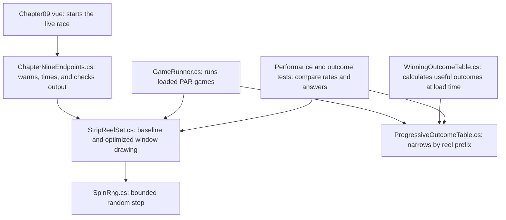

# Optimize the Machine You Proved

*Part 9 of a nine-part series on building a slot game engine in C#. The first eight
articles built and proved the machine; this one makes it faster and measures every
claim.*

The first eight articles build a correct slot simulation, out of exact money, stable
random streams, ordered reel strips, checked game definitions, analytic math, and
independent tests. Without the proven version, an optimization
benchmark only tells us which wrong answer arrives first.

This article keeps the original `DrawWindow` implementation beside the production
version and runs both from the same seed. The live lab refuses to report a speedup
unless their checksums match.

## How to read each optimization

Every change in this chapter answers the same five questions:

- **What did the original code do?** Start with code we already know is correct.
- **What work repeats?** Count the operation instead of guessing that it is expensive.
- **What moves or disappears?** Show the changed code beside the original.
- **How do we know the answer stayed the same?** Compare output from the same random seed.
- **Did it help?** Measure several trials and use the middle result, called the median.

Suppose five trials report 90M, 103M, 101M, 62M, and 99M spins per second. Sort
them to 62M, 90M, **99M**, 101M, and 103M. The median is 99M. One slow trial does
not define the result, and neither does one unusually fast trial.

## Start with a Release baseline

Measure the complete operation that matters. The project runs five samples inside one test
process, sorts their rates, and reports the median. The first sample often includes tiered-JIT
and dynamic-PGO warmup, so a single process launch is a poor benchmark.

The initial measured preset path reached about 43.5 million spins per second in one cold
Release sample. After removing remainder operations from window construction, repeated warmed
samples established a 75.5-million-spin-per-second median. These numbers describe one
development machine; they are regression markers, not hardware-independent promises.

## Initial window construction

One random stop fills several visible positions on a reel. The direct cyclic formula is:

```csharp
window[windowOffset + row] = strip[(stop + row) % strip.Length];
```

For a five-reel, three-position game, ten million spins perform 50 million random stop
selections and write 150 million visible cells. The formula therefore performs 150 million
remainder operations.

The initial path also writes complete `Symbol` values. `Symbol` contains a byte ID, a name
reference, and two flags. The simulation evaluators immediately reduce every cell back to its
ID.

Here is the complete inner part of the teaching baseline:

```csharp
for (var reel = 0; reel < _strips.Length; reel++)
{
    var strip = _strips[reel];
    var stop = rng.NextInt(strip.Length);
    var windowOffset = reel * Rows;

    for (var row = 0; row < Rows; row++)
    {
        // Remainder wraps a read from the end of the strip back to position 0.
        window[windowOffset + row] = strip[(stop + row) % strip.Length];
    }
}
```

## Extend each drawing strip by one window

`StripReelSet` now appends `Rows - 1` wrapped entries when it is constructed:

```text
physical strip:  A B C D E
drawing strip:   A B C D E A B
```

A three-position window beginning at D reads `D E A` as a contiguous slice. The physical
strip remains unchanged for stop counts, inspection, and probability calculations.

The memory cost is small because the engine supports three- to five-position windows. Each
reel gains two to four drawing entries, regardless of whether its physical strip contains 22
or 128 stops.

Construction pays that small cost once:

```csharp
var drawStrip = new Symbol[strip.Length + Rows - 1];
strip.CopyTo(drawStrip, 0);

// Copy the first few symbols after the physical end.
for (var extra = 0; extra < Rows - 1; extra++)
    drawStrip[strip.Length + extra] = strip[extra % strip.Length];
```

The production loop can then use `stop + row` directly:

```csharp
var drawStrip = _drawStrips[reel];
for (var row = 0; row < Rows; row++)
    window[windowOffset + row] = drawStrip[stop + row];
```

The remainder in the construction loop is not a mistake. It runs only two to four times
per reel when the game loads. The original remainder ran once per visible cell: 150 million
times in the ten-million-spin example.

## Give the worker the representation it uses

The UI needs symbol names and flags. The spin evaluator needs IDs. `StripReelSet` therefore
keeps two execution views:

```csharp
public void DrawWindow(ref SpinRng rng, Span<Symbol> window)
public void DrawWindowIds(ref SpinRng rng, Span<byte> window)
```

Workers allocate one byte window and overwrite it for every spin. Diagnostic and teaching
code can still request the full symbols. An equivalence test starts both methods with the
same RNG state and compares the resulting IDs.

```csharp
var drawIds = _drawIds[reel];
var windowOffset = reel * Rows;
for (var row = 0; row < Rows; row++)
    window[windowOffset + row] = drawIds[stop + row];
```

This is not an object-allocation trick. Both versions reuse one window array. The savings
come from moving less data for each position: one symbol ID instead of a complete `Symbol`.

Three repeated preset medians after this change were 104.5M, 107.3M, and 105.0M spins per
second. The middle result is roughly 39 percent above the previous 75.5M baseline. Orca Dive,
including its wild and scatter checks, reached a 92.8M median, with warmed samples above 100M.

## Move constant RNG work to construction

Lemire's bounded selection uses a range and rejection threshold. Both depend only on the
reel's stop count. Computing the threshold during every selection repeats a remainder
calculation millions of times. `StripReelSet` now calculates both values once per reel and
passes them to the RNG's internal hot-path method.

```csharp
// Game construction: calculate these values once for each reel.
var range = (ulong)strip.Length;
_rngRanges[reel] = range;
_rngThresholds[reel] = unchecked(0UL - range) % range;

// Spin loop: reuse them for every stop drawn from this reel.
var stop = rng.NextInt(_rngRanges[reel], _rngThresholds[reel]);
```

The RNG still rejects the tiny leftover region that would cause modulo bias:

```csharp
internal int NextInt(ulong range, ulong threshold)
{
    while (true)
    {
        var product = (UInt128)NextUInt64() * range;
        if ((ulong)product >= threshold)
            return (int)(product >> 64);
    }
}
```

This does not weaken the random selection. It moves a fixed calculation out of a loop. The
range and threshold depend on strip length, not on the random value, symbol, or payout.

The public `NextInt(int bound)` retains validation for general callers. Construction rejects
empty strips before the optimized path becomes available.

### The strategy pattern we didn't build

Precomputing the threshold suggests a follow-up: a per-reel *selector strategy*. A
power-of-two stop count never rejects, so the strategy would use a mask
(`raw & (stops - 1)`) for 32-, 64-, and 128-stop reels and Lemire's multiply for the
rest. We declined it on analysis, before running any benchmark, for four reasons:

1. **The win is already in the data.** For a power-of-two bound, `2⁶⁴ mod B` is zero,
   so the precomputed threshold is zero and the reject branch is dead code: always
   predicted, never taken. Video3, Video5x64, and Video5x128 already run
   rejection-free through the uniform path. The mask would swap one multiply (~3
   cycles, hidden by out-of-order execution) for one AND, inside a loop whose time
   goes to window reads and line evaluation.
2. **Dispatch costs more than it saves.** A per-reel interface or delegate in the hot
   loop is an indirect call, several times the cost of the multiply it wraps, and it
   blocks the JIT from inlining a three-instruction body. The failed-experiments list
   below shows this codebase punishing added indirection of just this kind.
3. **The game that matters can't use it.** Orca Dive's strips are 26/29/26/29/26.
   Every power-of-two beneficiary is a stock preset that already runs free under
   point 1.
4. **The mapping changes.** A mask keeps the raw value's low bits. Lemire's method
   keeps the scaled high half. Both are fair, and they pick different stops from the
   same seed, so a recorded run stops replaying when a reel switches selector.
   That buys a determinism asterisk with no measured win attached.

The current design is the data-driven form of the same idea. The "strategy" is the
`(range, threshold)` pair per reel, and threshold zero is the fast path, selected by
data, with no dispatch and one code path to prove correct. This one stayed unbuilt on
analysis alone, with no benchmark behind the decision. Anyone curious is welcome to
run it through the paired harness below. The prediction on record is that it joins the
list that follows.

## Compile a dense payout view

The preset paytable remains a dictionary because `(symbol, run length) -> money` is readable
and convenient to inspect. The spin loop uses a small dense array built from that dictionary:

```text
index = symbolId * countStride + runLength
```

```csharp
// Construction: turn the readable dictionary into a compact lookup array.
_countStride = maxCount + 1;
_densePays = new Millicents[(maxSymbol + 1) * _countStride];
foreach (var (key, value) in pays)
    _densePays[key.SymbolId * _countStride + key.Count] = value;

// Evaluation: calculate the same slot number and read it.
var index = symbolId * _countStride + count;
return (uint)index < (uint)_densePays.Length
    ? _densePays[index]
    : Millicents.Zero;
```

Think of the dictionary as a labeled filing cabinet and the array as numbered slots in a
parts tray. The cabinet is easier to inspect. The tray is faster when the code already
knows the slot number. The project keeps both views.

This replaces tuple hashing with bounds checks and an array read. The improvement was modest:
three medians were 101.2M, 107.2M, and 111.7M spins per second after the byte-window change.
The representation stayed because it improved the center result and preserved the dictionary
as the public source of truth.

## Precompute PAR outcomes by reel stop

A loaded PAR game does not change after construction. Its reel strips, paylines, paytable,
and feature rules are fixed. That lets construction calculate the useful stop combinations
once instead of rebuilding and evaluating a visible window on every spin.

Each reel stop occupies one byte in a 64-bit key. Five reels use 40 bits:

```text
stops:  12   28   4   17   25
bytes:  0C   1C   04  11   19
key:    0x0C1C041119
```

This encoding gives every reel a separate byte, so two different stop combinations
cannot share a key. A byte holds stop numbers 0 through 255, which allows as many as
256 stops on each reel. Eight reels fit in one `ulong`.

The first lookup packed the key while reading the stops:

```csharp
ulong key = 0;
for (var reel = 0; reel < stops.Length; reel++)
    key = (key << 8) | stops[reel];

if (_outcomes.TryGetValue(key, out var outcome))
    return outcome;
```

Packing is cheap. Measurement showed that looking around a large dictionary was not cheap
on this machine. The idea of precomputing answers was sound; its first storage layout was
not.

`WinningOutcomeTable` examines the complete stop cycle during game construction. It stores
an entry when at least one payline pays or a feature starts. The value contains the final
line-pay multiplier, the paylines that contributed to it, and the triggered features.
Combinations that do nothing are absent.

The feature information earns its place even when the payout is zero. Orca Dive's key
`0x0000000000` shows Penguin on each required reel. No payline wins there, and
`PenguinBonus` starts anyway. Drop the zero-pay entries and that minigame quietly
disappears.

Orca Dive has 14,781,416 stop combinations. Construction stores 1,516,294 line-winning
combinations and recognizes 181,656 feature-triggering combinations. Outcomes with the same
payout, paylines, and feature state share one value object; the table does not allocate a
new payline list for every key.

The first implementation drew five stops, packed their bytes, and performed one dictionary
lookup. It was correct and slow. A same-work benchmark measured 2.14 million outcomes per
second, compared with 16.07 million for the original rule evaluator. The 1.5-million-entry
dictionary sent the CPU to widely separated memory locations often enough to cost more than
the arithmetic it removed.

### Narrow the result one reel at a time

The second implementation stores flat transition arrays. After reel 0 and reel 1, their two
stop numbers index a 754-entry array. The returned state selects the portion of the reel-2
array to read, and the process repeats through reel 4. A `-1` state means no remaining reel
can produce a payout or feature trigger from that prefix.

For Orca Dive, 181 of the 754 two-reel prefixes can still produce a line payout. Feature
geometry keeps another 155 prefixes alive, for 336 useful prefixes in all. The other 418
prefixes are dead after two reels. The RNG still draws the remaining stops to preserve its
stream, but outcome evaluation does no more work for them.

The first lookup combines reel 0 and reel 1 into an ordinary array index:

```csharp
state = _firstPairStates[stops[0] * _stopCounts[1] + stops[1]];
if (state < 0)
{
    outcome = null;       // This prefix can never become a win or feature trigger.
    return false;
}
```

If that pair survives, each later stop narrows the possibilities again:

```csharp
for (var reel = firstTransitionReel; reel < _transitions.Length; reel++)
{
    var stop = stops[reel];
    state = _transitions[reel][state * _stopCounts[reel] + stop];
    if (state < 0)
    {
        outcome = null;
        return false;
    }
}
```

This is like following folders inside folders. Reels 0 and 1 choose the first folder.
Each later reel chooses a smaller folder inside it. A `-1` means the folder is empty.
The final answer still includes every winning payline and any triggered feature.

The running spin code is short because construction already did the larger calculation:

```csharp
// Reuse the same five-byte buffer for every spin.
reels.DrawStops(ref rng, stops);

var multiplier = 0;
if (progressiveOutcomes.TryGetValue(stops, out var outcome) && outcome is not null)
    multiplier = outcome.TotalMultiplier;

var linePay = wager.ScaledMultiply(multiplier);
```

Orca Dive can pay after one reel, because a single `WildOrca` pays 2x. Reel-0 stops 7
and 20 put that symbol on the center payline. Those two stops are the immediate-pay
list, and they fall well short of a complete first table: 22 other reel-0 stops can
still grow into longer line wins, and the remaining two can still begin the Penguin
feature. All 26 first-reel stops stay useful. So the first table combines reels 0 and
1, which is where real pruning begins.

The same-work Release benchmark used ten million outcomes per sample and required identical
payout/feature checksums:

| Outcome path | Median outcomes/second | Relative to rules |
|---|---:|---:|
| Visible window plus rule evaluator | 16.07M | 1.00x |
| Packed 40-bit key plus dictionary | 2.14M | 0.133x |
| Progressive transition arrays | 20.53M | 1.277x |

The progressive table was 27.7 percent faster than direct evaluation and 9.59 times faster
than the packed dictionary in this test.

The complete multicore loaded-game benchmark moved from a 14.03M median with the dictionary
runner to 158.64M with pair-first progressive narrowing. Its five progressive samples were
19.1M, 37.6M, 165.5M, 174.4M, and 158.6M spins per second. The first two show tiered JIT and
dynamic PGO warming the new path; the final three range from 158.6M to 174.4M. This benchmark includes feature
play, worker accounting, and telemetry, so it must not be compared directly with the earlier
92.8M window-drawing measurement.

`TryLoad` remains a validation operation. Tests use it thousands of times with damaged PAR
documents, so it creates a lazy table holder without enumerating the stop cycle. `Load` and
`LoadFile` are the construction paths used for playable games; they materialize the table
before returning, so the first spin does not inherit the setup cost.

## Experiments that ran slower

Several plausible changes lost:

- Separate unrolled methods for three-, four-, and five-position windows fell to about 72M
  spins per second.
- One flattened drawing array with reel offsets produced inconsistent 71M-76M medians and
  did not beat the jagged arrays reliably.
- Forced `AggressiveInlining` reduced medians to about 71M-72M.
- Copying common fields into locals also ran slower in the whole simulation.
- Removing only the positive-bound validation was neutral.

The current strips are tiny and cache-friendly. Extra offset tables and larger
generated code cost more than the indirections they set out to remove. Modern .NET's
JIT also made better inlining decisions than the manual hints did.

That is the lesson from the losing code: a change can look simpler in source and still
create worse machine code or worse memory access. Keep the measurement; remove the losing
implementation.

## Try the paired benchmark

Open `#/ch09`. Choose a preset or PAR-loaded game, a seed, and a window count. The server:

1. Warms both implementations.
2. Alternates which version runs first.
3. Uses the same seed and work count.
4. Compares checksums.
5. Reports five samples and their medians.

The page displays random selections and visible-cell writes so the scale remains concrete.
Run it more than once. Laptop power state, other processes, thermals, and the JIT can move a
short benchmark substantially.

The harness checks correctness before it returns either rate:

```csharp
if (first.Checksum != second.Checksum)
    return new RaceResult(..., OutputsMatch: false);
```

A checksum is a compact fingerprint of every symbol ID drawn. Matching fingerprints are a
fast test that both paths produced the same stream. Direct equivalence tests remain part of
the test suite; the checksum does not replace them.

### Source map



## Branch after the proven system

The clean teaching history is one commit holding articles 1-8 and their verified
initial implementation, followed by an optimization branch such as
`codex/optimization-lab`. Each optimization lands as a small commit carrying its
benchmark result. Losing experiments get reverted while their measurements stay in the
article and the teaching notes.

Do not create that branch in a worktree containing unrelated active edits. Establish the
initial-system commit first, then branch from that commit.

*Source files: `Reels/StripReelSet.cs`, `Games/WinningOutcomeTable.cs`,
`Games/ProgressiveOutcomeTable.cs`, `Simulation/SpinRng.cs`,
`Paytables/Paytable.cs`, `tests/MMP.SlotGame.Tests/PerformanceBaselineTests.cs`, and
`SlotDemo.Server/Chapters/ChapterNineEndpoints.cs`.*
