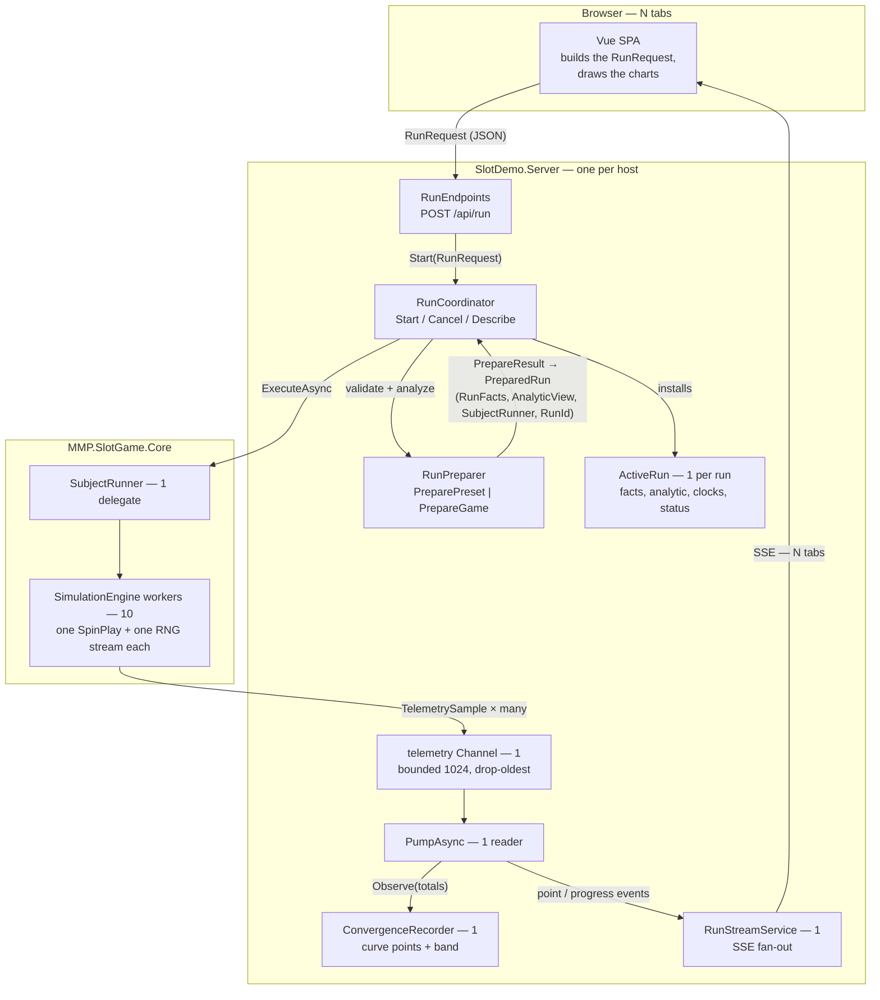

# Run Orchestration: Records, Classes, and the Funnel

How one simulation run flows through the types in
`CSharp/src/SlotDemo.Server/Runs/`. The client starts everything by posting a
`RunRequest`; from there the flow is a funnel into one reader, then a
megaphone out to every watching browser tab.

The counts for a 10-worker run:

**10 workers → 1 channel → 1 pump → 1 recorder → 1 stream service → N browser tabs**

Workers never touch the stream service, and the stream service never knows
how many workers ran. Contention on the spin path is zero by construction:
each worker owns its tally and buffers, and everything display-facing goes
through exactly one reader.

## Which type does what, in request order

| Step | Type | Kind | Role |
|---|---|---|---|
| 1 | `RunRequest` | public record | What the client posts to `/api/run` to start the run: preset or game file, seed, workers, target spins, stride |
| 2 | `RunCoordinator` | class | The lifecycle. Refuses a second concurrent run, spawns the run task, publishes every event |
| 3 | `RunPreparer` | class | Turns the request into a subject: validates, loads or solves, enumerates the analytic reference |
| 4 | `PrepareResult` | record | Preparation's answer: a `PreparedRun`, or the HTTP status and body refusing the request |
| 5 | `PreparedRun` | record | The subject ready to run: `RunFacts` + `AnalyticView` + `SubjectRunner` + run id |
| 6 | `ActiveRun` | class (mutable) | The one live run: facts, recorder, cancellation, clocks, status, `Describe()` |
| 7 | `SubjectRunner` | delegate | The one execution contract both subject kinds satisfy; the coordinator cannot tell them apart |
| 8 | `TelemetrySample` | Core record | A cumulative snapshot a worker drops into the channel; absolute, so a dropped one leaves no hole |
| 9 | `ConvergenceRecorder` | class | Turns snapshots into curve points by spin stride, and checks the band |
| 10 | `RunStreamService` | class | Fan-out to browsers: `started`, `point`, `progress`, `completed` / `cancelled` |

## Testing the flow without Core

`SubjectRunner` is the seam. The internal
`RunCoordinator.Start(PreparedRun, stride)` overload skips preparation, so a
test hands the coordinator a hand-built `PreparedRun` whose runner is a fake:
it writes synthetic `TelemetrySample`s and returns totals without one real
spin. `tests/SlotDemo.Server.Tests/RunCoordinatorFlowTests.cs` drives the
whole orchestration this way — start, funnel, recorder, stream events,
the second-start refusal, and both cancellation paths — with no engine, no
game files, and no dependency on Core being ready.

One contract a fake runner must honor: complete the telemetry writer before
returning, the same contract the real engine honors. The pump drains until the writer
completes.
